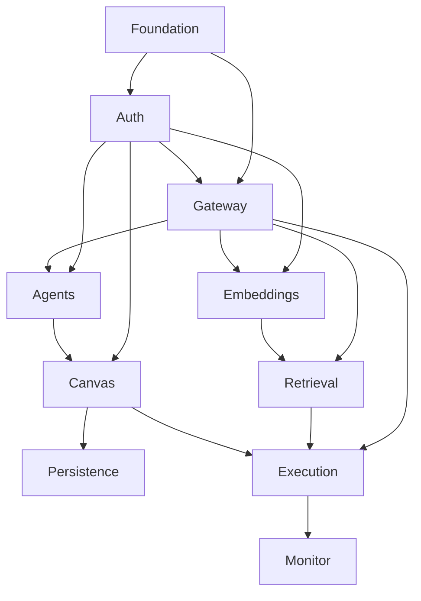

# Agent Maker Flow — Multi-Agent Flow Orchestrator & Chat System

## 1. Executive Summary

Agent Maker Flow is a node-based, visual orchestration platform that lets developers and engineers compose chains of autonomous LLM-powered agents and run them against real-time conversational input. Instead of hand-coding prompt chains, users define reusable agents in a registry, drag them onto a directed-graph canvas, wire outputs to downstream inputs, designate a root agent, and dispatch a single "Run Flow" command. Each agent's response feeds forward into its connected downstream nodes, and the full execution streams back into a chat monitor where individual agent blocks light up with intermediate reasoning, status, and final output as they run.

The product targets developers, prompt engineers, and applied-AI teams who need to prototype and operate multi-step agent pipelines without building bespoke orchestration code. Its core value is the combination of a visual DAG editor, a centralized agent registry with granular per-agent LLM configuration, retrieval-augmented context via pgvector, and a real-time streaming chat that makes the otherwise opaque internals of a multi-agent run observable turn by turn.

Under the hood, a ReactJS frontend (React Flow canvas + chat UI) talks to a Rust Axum backend over REST and Server-Sent Events. The backend routes all model calls through a LiteLLM proxy (with Redis for prompt caching and usage/cost accounting), persists agents, flows, and embeddings in PostgreSQL with the `pgvector` extension, and uses cosine-similarity retrieval to inject contextually relevant memory into agent execution. Authentication and per-user data isolation are handled by Clerk.

## 2. Problem and Opportunity

### The Problem

**Multi-agent pipelines are coded by hand, slowly and inconsistently**
- Wiring several LLM calls into a forwarding chain requires bespoke glue code for every experiment.
- Changing the order, model, or prompt of a step means editing and redeploying code rather than reconfiguring.
- There is no shared, reusable definition of an "agent" — prompts and settings are copy-pasted across scripts.

**Agent runs are opaque**
- When a chain produces a bad result, engineers cannot easily see which step failed or what each step emitted.
- Intermediate reasoning, per-step status, and token/cost consumption are invisible without manual logging.
- Debugging a five-step chain means reconstructing state from scattered print statements.

**Provider and model sprawl is hard to manage**
- Each LLM provider (OpenAI, Anthropic, Groq, Ollama) has its own SDK, auth, and model naming.
- Switching a step from one model to another for cost or quality reasons is friction-heavy.
- Teams lack a single place to see which models are available and route to them uniformly.

**Context and memory do not persist across steps or runs**
- Relevant prior knowledge is not retrieved automatically; engineers paste context manually.
- There is no semantic memory layer that surfaces the right records for a given prompt.
- Repeated identical generations waste tokens and money with no caching layer.

### The Opportunity

Agent Maker Flow replaces hand-coded chains with a **visual DAG editor** backed by a **reusable agent registry**, so reordering, re-modeling, and re-prompting a pipeline becomes a drag-and-drop or form edit. A **real-time SSE chat monitor** makes every step observable — node-by-node status, intermediate reasoning, and final output stream live — directly solving the opacity problem. A **LiteLLM gateway** unifies all providers behind one interface with dynamic model discovery and a Redis cache that prevents duplicate generations. A **pgvector retrieval layer** with configurable embedding models injects semantically relevant memory into execution automatically. Together these turn an ad-hoc scripting task into a configurable, observable, reusable system.

## 3. Target Audience

### Primary Users

**Applied-AI / LLM Engineer**
- Builds and iterates on multi-step agent pipelines as a core part of their job.
- Needs fine control over per-step provider, model, system prompt, memory depth, and retrieval breadth.
- Values being able to swap models and reorder steps without touching code.

**Backend / Platform Developer**
- Integrates agent workflows into larger products and wants a predictable REST/SSE contract.
- Cares about per-user isolation, caching, and cost/usage accounting behind the scenes.
- Uses the canvas to prototype flows that will later be triggered programmatically.

**Prompt Engineer / Technical Designer**
- Focuses on crafting agent behavior via preambles and system prompts rather than infrastructure.
- Relies on the visual canvas and live chat feedback to test how prompts behave in a chain.
- Wants to save, reload, and refine flows across sessions.

### Behavioral Profile

- Technically fluent: comfortable with model names, tokens, and graph concepts; expects precise controls, not abstractions.
- Iteration-driven: runs the same flow repeatedly with small changes and needs fast, observable feedback.
- Reliability-conscious: expects clear error messages when a model call, connection, or graph is invalid, rather than silent failure.
- Privacy-aware: assumes their agents and flows are private to their account by default.

## 4. Objectives

**Enable** visual composition of multi-agent flows without writing orchestration code.
- A user can build, connect, and run a 3-node flow end to end in under 5 minutes from an empty canvas.
- 100% of agent ordering, model selection, and prompt changes are made through the UI with zero code edits.

**Make** every agent run observable in real time.
- Each agent node reflects its live status (idle → running → complete/error) within 1 second of the state change.
- Intermediate output for every executed node is visible in the chat stream for 100% of runs.

**Unify** access to multiple LLM providers behind one configurable interface.
- Provider and model dropdowns reflect the live LiteLLM catalog with model lists filtered to the selected provider in 100% of cases.
- Switching an agent's model requires at most 2 clicks and no restart.

**Persist** reusable agents and flows per user.
- A saved flow reloads with 100% of its nodes, edges, and root assignment intact.
- Agents and flows created by one user are never visible to another user (0 cross-tenant leakage).

**Augment** execution with semantically relevant memory.
- Retrieval returns the top-K most similar records by cosine similarity for any node with retrieval enabled.
- Identical generation requests are served from cache instead of re-billed in 100% of exact-match cases.

## 5. User Stories

### F01. Platform Foundation
- As the system, I want a single backend service that exposes REST and SSE endpoints so that the frontend has one contract to integrate against.
- As the system, I want PostgreSQL with the pgvector extension and Redis initialized at startup so that persistence, retrieval, and caching are available to all features.
- As a developer, I want a base React application shell with navigation between the Agents Dashboard and the Flow Dashboard so that I can move between the core workspaces.

### F02. Authentication & Access Control
- As a user, I want to sign in with Clerk so that I can access my private workspace.
- As a user, I want my session validated on every API and SSE request so that only I can read or modify my agents and flows.
- As a user, I want to be redirected to sign-in when my session is missing or expired so that protected screens never load without auth.

### F03. LLM Gateway Integration
- As the system, I want to route all model calls through the LiteLLM proxy so that every provider is reached through one interface.
- As the system, I want to discover available providers and their models from LiteLLM so that the UI can offer an accurate, current catalog.
- As the system, I want to serve exact-duplicate generation requests from a Redis cache so that identical calls are not re-billed.

### F04. Agents Dashboard
- As a user, I want to create an agent with a name, preamble, system prompt, provider, model, recent-N, and top-K so that I can define a reusable behavior profile.
- As a user, I want the model dropdown to show only models for the provider I selected so that I cannot pick an invalid combination.
- As a user, I want to edit, duplicate, and delete agents so that I can manage my registry over time.
- As a user, I want to see a list of all my agents with their key settings so that I can choose which to use in a flow.

### F05. Embedding & Semantic Memory Configuration
- As a user, I want to choose a global embedding model so that all retrieval uses a consistent vector space by default.
- As a user, I want to attach a separate embedding/semantic profile to a specific agent so that that node can retrieve from its own memory configuration.
- As a user, I want to add memory records (text blocks) that get embedded and stored so that they become retrievable context.

### F06. Vector Retrieval (RAG)
- As the system, I want to embed the incoming prompt and run a cosine-similarity search so that the most relevant memory records are retrieved.
- As the system, I want to return the top-K matches honoring each agent's override so that retrieval breadth is controllable per node.
- As a user, I want retrieved context injected into an agent's input so that its response is grounded in relevant memory.

### F07. Flow Canvas
- As a user, I want to drag agents from my registry onto the canvas as nodes so that I can compose a flow.
- As a user, I want to connect an upstream node's output port to a downstream node's input port so that responses forward along edges.
- As a user, I want to mark one node as the Root Agent via a toggle so that incoming chat input maps to it.
- As a user, I want to delete, duplicate, and detach nodes so that I can restructure the flow freely.
- As a user, I want invalid connections (cycles, self-loops) rejected so that the graph stays a valid DAG.

### F08. Flow Persistence
- As a user, I want to save the current canvas as a named flow so that I can reuse it later.
- As a user, I want to see a list of my saved flows so that I can choose one to open.
- As a user, I want to reload a saved flow so that its nodes, edges, and root assignment reappear exactly as saved.
- As a user, I want to rename and delete saved flows so that I can keep my registry tidy.

### F09. Flow Execution Engine
- As a user, I want to click "Run Flow" so that my prompt is dispatched into the pipeline starting at the root agent.
- As the system, I want to translate the canvas graph into a DAG and execute nodes in dependency order so that each node runs after its upstream nodes complete.
- As the system, I want each agent's output forwarded as input context to its connected downstream nodes so that the chain propagates correctly.
- As the system, I want to emit execution events (node started, partial output, node completed, node failed, run finished) so that the monitor can render progress.

### F10. Conversational Monitor & Real-time Streaming
- As a user, I want a prompt input bar to submit my initial message so that I can start a run.
- As a user, I want to see turn-based conversation history so that I can follow the back-and-forth.
- As a user, I want each agent block to light up and stream its intermediate reasoning and final output live via SSE so that I can watch the run unfold.
- As a user, I want the final aggregated response rendered as the assistant turn so that I get the pipeline's result in the chat.

## 6. Functionalities

### F01. Platform Foundation

**Provides:**
- Backend REST + SSE service base and database/cache connections (used by F02, F03, F04, F05, F06, F07, F08, F09, F10)
- Application shell with navigation between Agents Dashboard and Flow Dashboard (used by F04, F07, F10)

**Capabilities:**
- Single Rust Axum (v0.8.9) service exposing a versioned REST base path (`/api/v1`) and an SSE endpoint base, running on the Tokio async runtime.
- PostgreSQL connection pool with the `pgvector` extension enabled at startup; schema migrations applied automatically on boot.
- Redis connection pool established at startup for caching and counters.
- React (Vite SPA) application shell with a top-level layout, persistent navigation, and two primary routes: `/agents` and `/flows`.
- Health endpoint returns service, database, and cache connectivity status.

**Experience:**
- On startup the backend verifies database and cache connectivity and refuses to serve traffic if either is unreachable, logging which dependency failed.
- The frontend loads the shell with a left/top navigation; selecting a destination routes without full page reload.
- Unconfigured or unreachable dependencies surface a clear boot-time error in logs rather than failing silently at first request.

### F02. Authentication & Access Control

**Provides:**
- Authenticated user identity for scoping all records (used by F04, F05, F07, F08)

**Capabilities:**
- Clerk-based sign-in with JWT session tokens validated on every REST and SSE request via edge/middleware protection.
- Every persisted record (agent, flow, embedding/memory record) is tagged with the owning user ID; all reads and writes are filtered by the authenticated user.
- Expired or missing tokens yield a 401 and a frontend redirect to sign-in.

**Experience:**
- Unauthenticated visitors hitting any protected route are redirected to the Clerk sign-in screen.
- After sign-in, the user lands on the Agents Dashboard by default.
- API and SSE calls automatically attach the session token; a mid-session expiry triggers a redirect to re-authenticate rather than a broken screen.

**Error Handling:**
- Missing/invalid token on an API request → 401 with message "Session expired or invalid. Please sign in again." and redirect to sign-in.
- Token valid but record belongs to another user → 404 "Not found" (never reveals existence of other users' data).
- Clerk service unreachable during validation → 503 "Authentication service unavailable. Please try again shortly."
- SSE stream opened without a valid token → connection refused before any event is emitted.

### F03. LLM Gateway Integration

**Consumes:**
- F01: backend service base and Redis connection

**Provides:**
- Provider catalog and provider-filtered model lists (used by F04, F05)
- Model completion/execution service (used by F09)
- Prompt-embedding generation service (used by F06)

**Core Scope:**
- Route completion requests through LiteLLM, discover providers/models, and serve exact-match cached responses from Redis.

**Full Scope additions:**
- Fallback/exception handling across providers and usage/cost trace logging persisted to Redis counters.

**Capabilities:**
- All model and embedding calls are issued to the LiteLLM proxy (local Docker in dev, Railway-deployed in prod) through a single internal gateway client.
- Provider discovery returns the live list of configured providers (e.g., OpenAI, Anthropic, Groq, Ollama); model discovery returns models scoped to a given provider (e.g., `gpt-4o`, `claude-3-5-sonnet`).
- Exact-match request caching: a normalized hash of (model, messages, parameters) keys a Redis entry; an identical subsequent request returns the cached completion without re-billing.
- Redis-backed usage/cost counters increment per request (token in/out, cost) for backend accounting; not surfaced in the UI in this version.
- Provider fallback: when the primary provider call errors, the gateway applies configured fallback handling and surfaces a structured error if all options fail.

**Experience:**
- The frontend requests the provider catalog and provider-specific model list on demand; results reflect the current LiteLLM configuration.
- During execution the gateway is the single path for completions; cache hits return near-instantly while misses call the provider.

**Error Handling:**
- LiteLLM proxy unreachable → "Model gateway unavailable. Check the LiteLLM proxy and try again." returned to the caller; the run is marked failed at the affected node.
- Provider returns rate-limit/quota error → structured error with provider name and reason propagated to the execution event for that node.
- Invalid model/provider combination requested → 422 "Selected model is not available for this provider."
- Embedding request fails → retrieval is skipped for that node and the node proceeds without injected context, with the degradation noted in the execution event.

### F04. Agents Dashboard

**Consumes:**
- F03: provider catalog and provider-filtered model lists

**Provides:**
- Agent configuration profiles — name, preamble, system prompt, provider, model, recent-N, top-K (used by F07, F09)

**Capabilities:**
- Create/edit/duplicate/delete agents scoped to the authenticated user.
- Configuration form fields with validation:
  - **Name** — text, required, unique per user, 1–64 characters.
  - **Preamble** — text, optional, up to 2,000 characters; injected before system execution parameters.
  - **System Prompt** — large text area, required, up to 32,000 characters.
  - **LLM Provider** — dropdown populated from the F03 provider catalog.
  - **LLM Model** — dropdown filtered to models of the selected provider; disabled until a provider is chosen.
  - **Recent-N Override** — integer, 0–100, default 10; caps historical conversational turns passed in memory.
  - **Top-K Override** — integer, 0–50, default 5; caps retrieval results injected as context for this agent.
- Registry list view shows each agent's name, provider, model, recent-N, and top-K.

**Experience:**
- The create form validates inline: empty name, duplicate name, out-of-range integers, and a model selected before its provider all show field-level messages.
- Selecting a provider repopulates and enables the model dropdown; changing the provider clears an incompatible model selection.
- Duplicating an agent prefills the form with "(copy)" appended to the name for quick variants.
- Deleting an agent that is used in a saved flow prompts for confirmation and warns which flows reference it.

**Error Handling:**
- Save with duplicate name → "An agent named '{name}' already exists." on the name field.
- Save with out-of-range recent-N or top-K → "Value must be between {min} and {max}." on the field.
- Save while provider catalog cannot be loaded → form blocks submission with "Provider list unavailable; cannot validate model. Try again."
- Delete fails server-side → "Could not delete agent. Please retry." with the agent restored in the list.

### F05. Embedding & Semantic Memory Configuration

**Consumes:**
- F03: provider catalog and embedding-model list

**Provides:**
- Global and per-agent embedding model selection plus stored, embedded memory records (used by F06)

**Capabilities:**
- A global embedding model setting per user (e.g., `text-embedding-3-small`), used by default for all retrieval.
- Optional per-agent semantic profile: override the embedding model and memory scope for a specific agent node.
- Memory records: user-supplied text blocks (up to 8,000 characters each) that are embedded on save and stored in PostgreSQL via `pgvector`.
- Each stored record retains its source text, embedding vector, embedding model used, and owner.

**Experience:**
- A settings panel exposes the global embedding model (dropdown from F03) and a list of memory records with add/edit/delete.
- Attaching a semantic profile to an agent is a per-agent option that, when set, overrides the global embedding model for that node's retrieval.
- Saving a memory record shows an embedding-in-progress state, then a stored/ready state once the vector is persisted.

**Error Handling:**
- Embedding generation fails on save → record is not stored; "Could not embed this record. Check the embedding model and retry."
- Embedding model changed while records exist → user is warned that existing records remain in the prior vector space and may need re-embedding.
- Memory record exceeds size limit → "Memory record must be 8,000 characters or fewer."

### F06. Vector Retrieval (RAG)

**Consumes:**
- F03: prompt-embedding generation service
- F05: embedding model selection and stored memory vectors

**Capabilities:**
- At execution, the active node's input prompt is embedded (using the agent's semantic profile model if set, else the global model) and matched against stored vectors via cosine similarity.
- Returns the top-K most similar records, where K honors the agent's Top-K override (0–50; 0 disables retrieval for that node).
- Retrieved record texts are concatenated and injected into the agent's input context ahead of the forwarded upstream output.

**Experience:**
- Retrieval is transparent: a node with retrieval enabled automatically receives relevant memory; a node with top-K of 0 runs without retrieval.
- The number of records retrieved for a node is included in that node's execution event for observability.

**Error Handling:**
- Similarity query fails → node proceeds without retrieved context; the execution event flags "retrieval skipped (search error)" rather than failing the run.
- Embedding-space mismatch (record embedded with a different model) → mismatched records are excluded from results and the exclusion is noted in the event.

### F07. Flow Canvas

**Consumes:**
- F02: authenticated user identity
- F04: agent configuration profiles

**Provides:**
- Graph state — nodes (agent references), edges (output→input connections), and root assignment (used by F08, F09)

**Capabilities:**
- React Flow canvas rendering a directed graph of agent nodes with input and output ports.
- Drag an agent from the registry onto the canvas to instantiate a node; a node references an agent by ID.
- Connect an upstream node's output port to a downstream node's input port to create a forwarding edge.
- Exactly one node may be marked Root Agent via a per-node toggle; setting a new root clears the previous one.
- Node operations: delete, duplicate, detach (remove connected edges).
- Graph validation enforces a DAG: self-loops and any connection that would create a cycle are rejected; the result must remain acyclic with a single designated root.
- A floating global toolbar contains the "Run Flow" control (execution handled by F09).

**Experience:**
- Dragging onto the canvas drops a labeled node showing the agent's name and model.
- Attempting an invalid edge (cycle or self-loop) is rejected with an inline message and the edge is not drawn.
- Marking a node as root visibly badges it; only one badge exists at a time.
- Deleting or detaching a node updates connected edges immediately.
- "Run Flow" is disabled until a root agent is assigned and at least one node exists.

**Error Handling:**
- Connect attempt that forms a cycle → "Connection rejected: flows must be acyclic." edge not created.
- "Run Flow" with no root assigned → toolbar shows "Assign a Root Agent before running."
- Node references an agent that was deleted from the registry → node is flagged "Agent missing" and blocks execution until replaced or removed.

### F08. Flow Persistence

**Consumes:**
- F07: graph state — nodes, edges, root assignment

**Capabilities:**
- Save the current canvas as a named flow (name required, 1–80 characters, unique per user) scoped to the authenticated user.
- Persist the complete graph: node list (with agent references and positions), edges, and root assignment.
- List, open (reload), rename, and delete saved flows.
- Reloading restores nodes, edges, positions, and root assignment exactly as saved.

**Experience:**
- Saving prompts for a name (or updates the open flow); a success state confirms the save.
- The saved-flows list shows name and last-updated indicator; opening one replaces the current canvas after an unsaved-changes confirmation.
- Renaming validates uniqueness; deleting asks for confirmation.

**Error Handling:**
- Save with duplicate flow name → "A flow named '{name}' already exists."
- Open a flow whose referenced agent no longer exists → flow loads with the affected node flagged "Agent missing" and a banner listing missing agents.
- Save fails server-side → "Could not save flow. Your canvas is unchanged; please retry." with local state preserved.
- Open with unsaved changes on the current canvas → "Discard unsaved changes to this flow?" confirmation before replacing.

### F09. Flow Execution Engine

**Consumes:**
- F03: model completion/execution service
- F06: retrieved memory context for the active node
- F07: graph state — nodes, edges, root assignment

**Provides:**
- Execution event stream — node started, partial output, node completed, node failed, run finished (used by F10)

**Core Scope:**
- Translate the canvas graph to a DAG, ingest the user prompt at the root, execute nodes in dependency order, forward outputs to downstream inputs, and emit execution events.

**Full Scope additions:**
- Parallel execution of independent branches and partial-failure handling that continues unaffected branches.

**Capabilities:**
- On "Run Flow", the chat prompt is mapped to the designated Root Agent as its entry context.
- The backend translates the React Flow graph state into a DAG topology and validates it is acyclic with exactly one root before executing.
- Nodes execute in dependency order: a node runs only after all its upstream nodes complete; its generated text is forwarded as entry context to every connected downstream node.
- Each node executes via the F03 gateway using its agent's provider, model, system prompt, preamble, recent-N (history depth), and top-K (retrieval breadth via F06).
- The final node(s) — those with no outgoing edges — produce the run's aggregated result.
- Throughout the run the engine emits ordered execution events per node: started, partial output (streaming chunks), completed (with final text), failed (with error), and a terminal run-finished event.

**Experience:**
- Execution begins immediately on dispatch; the engine streams events as each node transitions and produces output.
- A node failure stops the affected downstream path and emits a failed event; the run-finished event reports overall success or failure.

**Error Handling:**
- Graph is not a valid DAG at run time (cycle or no root) → run rejected before any node executes: "Flow is not a valid DAG; fix the graph and rerun."
- A node's model call fails via F03 → that node emits a failed event with the gateway error; downstream nodes depending on it are skipped and reported.
- Run dispatched while another run is in progress for the same flow → new run is queued or rejected with "A run is already in progress for this flow."
- Backend loses the SSE client mid-run → execution completes server-side and the terminal state is recoverable on reconnect.

### F10. Conversational Monitor & Real-time Streaming

**Consumes:**
- F09: execution event stream

**Capabilities:**
- Right-split panel with a user prompt input bar and a turn-based conversation stream.
- Submitting a prompt and pressing "Run Flow" opens an SSE connection to the backend and renders live execution.
- As events arrive, the corresponding agent block on the canvas/monitor lights up by state (idle → running → complete/error) and streams its intermediate reasoning and partial output into the feed.
- The run's aggregated final output renders as the assistant turn in the conversation.
- Conversation history accumulates turns within the session.

**Experience:**
- Each agent block reflects its live status within ~1 second of the event; running nodes show a streaming indicator.
- Intermediate output appears progressively per node; the final assistant turn appears when the run-finished event arrives.
- A node failure is shown in-line in the stream with the error message, and the run is marked failed.

**Error Handling:**
- SSE connection drops mid-run → the UI shows "Reconnecting…" and resumes rendering on reconnect; if the run already finished, it fetches and renders the terminal result.
- Run rejected by the engine (invalid DAG, run in progress) → the rejection message is shown in the chat instead of a partial stream.
- No output produced by the terminal node → "The flow completed but produced no output." is shown as the assistant turn.

## 7. Out of Scope

**Collaboration & sharing**
- Team/workspace sharing of agents or flows; all data is private to the individual user.
- Real-time multi-user co-editing of a canvas.
- Role-based permissions or organization management.

**Graph topology**
- Conditional/branch routing where an output decides which downstream path runs.
- Loops, retries-as-graph-edges, or cyclic flows of any kind.

**Observability surface**
- User-facing token usage, cost dashboards, or billing views (usage is tracked in Redis for backend accounting only).
- Historical run analytics, run replay, or run comparison views.

**Model & provider management**
- In-app configuration of LiteLLM providers/keys (managed in LiteLLM/Railway, not in this product).
- Fine-tuning, model hosting, or custom model deployment.

**Execution features**
- Scheduled, triggered, or programmatic API execution of flows (v1 runs are user-initiated from the chat).
- Long-running/background jobs that outlive the session beyond terminal-state recovery.

**Memory management**
- Bulk import/ETL of memory records from external sources.
- Automatic re-embedding/migration when the embedding model changes (flagged to the user, performed manually).

## 8. Dependency Graph

### Part 1: Dependency Table

| # | Feature | Priority | Dependencies |
|---|---------|----------|--------------|
| F01 | Platform Foundation | 1 | None |
| F02 | Authentication & Access Control | 1 | F01 |
| F03 | LLM Gateway Integration | 1 | F01, F02 |
| F04 | Agents Dashboard | 1 | F02, F03 |
| F05 | Embedding & Semantic Memory Configuration | 2 | F02, F03 |
| F06 | Vector Retrieval (RAG) | 2 | F03, F05 |
| F07 | Flow Canvas | 1 | F02, F04 |
| F08 | Flow Persistence | 2 | F07 |
| F09 | Flow Execution Engine | 1 | F03, F06, F07 |
| F10 | Conversational Monitor & Real-time Streaming | 1 | F09 |

### Foundation Features
These features set up shared project infrastructure. In a greenfield project they must be implemented sequentially before or alongside any feature that depends on them:
- **F01 Platform Foundation** — scaffolds the Axum backend (REST + SSE base, Tokio runtime), the React (Vite) app shell and routing, and initializes PostgreSQL/pgvector and Redis connections that every later feature relies on.
- **F02 Authentication & Access Control** — wires Clerk session validation as cross-cutting middleware and establishes per-user record scoping used by all data features.
- **F03 LLM Gateway Integration** — sets up the single LiteLLM gateway client and Redis cache layer that the agent, embedding, retrieval, and execution features consume.

### Execution Waves
Features within the same wave can be built in parallel. A wave starts only after every feature in earlier waves is complete.

**Note:** Foundation features (see "Foundation Features" above) cannot run in parallel in a greenfield project even if they appear together in a wave — they share scaffolding files and must be implemented sequentially until the base is in place.

- **Wave 1**: F01
- **Wave 2**: F02
- **Wave 3**: F03
- **Wave 4**: F04, F05
- **Wave 5**: F07, F06
- **Wave 6**: F09, F08
- **Wave 7**: F10

### Priority levels
- **1** = Essential — product does not work without it
- **2** = Important — significant value addition
- **3** = Desirable — incremental improvement

## 9. Acceptance Criteria

### F01. Platform Foundation
- [ ] Backend exposes a versioned REST base (`/api/v1`) and an SSE endpoint base reachable by the frontend.
- [ ] On startup the service confirms PostgreSQL (with pgvector enabled) and Redis connectivity, and refuses to serve traffic if either is unreachable, logging which failed.
- [ ] The React shell loads with navigation and routes between `/agents` and `/flows` without a full page reload.
- [ ] The health endpoint reports service, database, and cache status.

### F02. Authentication & Access Control
- [ ] An unauthenticated user is redirected to Clerk sign-in on any protected route.
- [ ] Every REST and SSE request is rejected with 401 when the token is missing or expired.
- [ ] A request for another user's record returns 404, never revealing its existence.
- [ ] After sign-in the user lands on the Agents Dashboard.

### F03. LLM Gateway Integration
- [ ] Provider discovery returns the live LiteLLM provider list; model discovery returns only models for the requested provider.
- [ ] An exact-duplicate completion request (same model, messages, parameters) is served from Redis without a new provider call.
- [ ] When the LiteLLM proxy is unreachable, callers receive a clear gateway-unavailable error.
- [ ] Usage/cost counters in Redis increment per request (not shown in the UI).

### F04. Agents Dashboard
- [ ] A user can create an agent with all seven fields, and validation blocks empty/duplicate names and out-of-range recent-N/top-K.
- [ ] The model dropdown is disabled until a provider is selected and only lists models for that provider.
- [ ] Agents can be edited, duplicated (name suffixed "(copy)"), and deleted.
- [ ] The registry list shows each agent's name, provider, model, recent-N, and top-K.
- [ ] Agents created by one user are not visible to any other user.

### F05. Embedding & Semantic Memory Configuration
- [ ] A user can set a global embedding model from the provider catalog.
- [ ] A user can attach a per-agent semantic profile that overrides the global embedding model for that node.
- [ ] Saving a memory record embeds and stores it with its source text, vector, and embedding model; oversized records (>8,000 chars) are rejected.
- [ ] If embedding generation fails, the record is not stored and an error is shown.

### F06. Vector Retrieval (RAG)
- [ ] At execution, the node's prompt is embedded and matched against stored vectors by cosine similarity.
- [ ] The number of returned records honors the agent's top-K override (0 disables retrieval).
- [ ] Retrieved texts are injected into the node's input context ahead of forwarded upstream output.
- [ ] A retrieval/search failure lets the node proceed without context and is flagged in the execution event rather than failing the run.

### F07. Flow Canvas
- [ ] Dragging a registry agent onto the canvas creates a labeled node referencing that agent.
- [ ] Connecting an upstream output port to a downstream input port creates a forwarding edge.
- [ ] Exactly one node can be marked Root Agent; assigning a new root clears the previous one.
- [ ] Self-loops and cycle-forming connections are rejected with an inline message and no edge is drawn.
- [ ] "Run Flow" is disabled until a root is assigned and at least one node exists.

### F08. Flow Persistence
- [ ] Saving stores the full graph (nodes with agent references and positions, edges, root) under a unique per-user name.
- [ ] The saved-flows list shows the user's flows; opening one restores nodes, edges, positions, and root exactly as saved.
- [ ] Flows can be renamed (uniqueness enforced) and deleted (with confirmation).
- [ ] Opening a flow whose referenced agent was deleted loads with the affected node flagged "Agent missing" and a banner listing missing agents.

### F09. Flow Execution Engine
- [ ] On "Run Flow", the chat prompt maps to the Root Agent and the graph is translated to a DAG before execution.
- [ ] Nodes execute only after all upstream nodes complete, and each node's output is forwarded as input to connected downstream nodes.
- [ ] Each node executes with its agent's provider, model, preamble, system prompt, recent-N, and top-K.
- [ ] The engine emits ordered events (started, partial output, completed, failed, run finished); a non-DAG graph is rejected before any node runs.
- [ ] A node model-call failure emits a failed event, skips dependent downstream nodes, and is reported in the terminal run state.

### F10. Conversational Monitor & Real-time Streaming
- [ ] Submitting a prompt and running opens an SSE stream and renders live execution.
- [ ] Each agent block reflects its live status (idle → running → complete/error) within ~1 second of the corresponding event.
- [ ] Intermediate reasoning/partial output streams per node, and the aggregated final output renders as the assistant turn.
- [ ] A dropped SSE connection shows "Reconnecting…" and resumes or fetches the terminal result if the run already finished.

### Cross-Feature Integration
- [ ] Provider/model catalog from the gateway (F03) populates and filters the Agents Dashboard dropdowns (F04) so invalid provider/model combinations cannot be saved.
- [ ] Provider/embedding-model catalog from the gateway (F03) populates the embedding model selectors in memory configuration (F05).
- [ ] The embedding generation service (F03) and stored memory vectors plus selected embedding model (F05) are used by retrieval (F06) to return cosine-similarity matches.
- [ ] Agent configuration profiles from the registry (F04) appear as draggable nodes carrying their settings on the canvas (F07).
- [ ] The canvas graph state — nodes, edges, root (F07) — is persisted and restored intact by flow persistence (F08).
- [ ] The graph state (F07), gateway completion service (F03), and retrieved context (F06) are consumed by the execution engine (F09) to run nodes in dependency order with per-agent settings and injected memory.
- [ ] The execution event stream from the engine (F09) drives the live node states and streamed output rendered by the monitor (F10).
- [ ] Authenticated user identity (F02) scopes all agents (F04), memory records (F05), and flows (F07, F08) so no cross-user data is ever returned.
