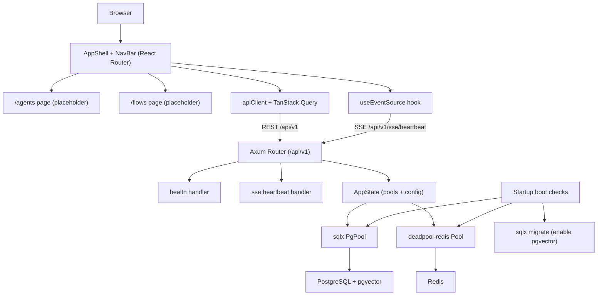

# Technical Specification: F01 Platform Foundation

## 1. Technical Overview

**What:** A greenfield scaffold for the Agent Maker Flow platform consisting of (a) a Rust Axum (v0.8.9) backend service exposing a versioned REST base path (`/api/v1`) and an SSE endpoint base, wired to a PostgreSQL/`pgvector` connection pool and a Redis connection pool, with startup connectivity checks, automatic migration application, structured logging, a typed configuration layer, and a JSON error envelope; and (b) a React (Vite + TypeScript) SPA shell with a persistent layout, navigation, and client-side routing between the `/agents` and `/flows` workspaces, plus the API client, query client, and SSE hook scaffolding that every later feature consumes.

**Why:** Every subsequent feature (F02–F10) depends on this shared infrastructure — auth middleware mounts onto the Axum router, agent/flow/embedding persistence uses the same `sqlx` pool and migration pipeline, caching and retrieval use the Redis pool and `pgvector`, and all UI features render inside this shell and route through this API/SSE client. Establishing one consistent contract (response envelope, error format, connection management, boot fail-fast, folder conventions) here prevents divergence later and makes the platform observable and reproducible from the first commit.

**Scope:**

**Included:**
- Backend service base: Axum router under `/api/v1`, Tokio runtime, graceful bind, layered middleware (CORS, tracing).
- PostgreSQL pool via `sqlx` with the `pgvector` extension enabled through an initial migration; migrations applied automatically at startup.
- Redis pool via `redis-rs` + `deadpool-redis`.
- Startup connectivity verification for PostgreSQL and Redis; service refuses to serve traffic if either is unreachable, logging which dependency failed.
- Health endpoint reporting service, database, and cache status.
- SSE endpoint base (heartbeat) establishing the streaming contract for later features.
- Typed configuration from environment, structured logging (`tracing`), and a JSON error envelope (`AppError` → `IntoResponse`).
- Frontend SPA shell: Vite + React + TypeScript, persistent layout with navigation, client-side routes `/agents` and `/flows`, TanStack Query client, REST API client (envelope-aware), and a reusable `EventSource` SSE hook.
- Local development orchestration (`docker-compose`) for PostgreSQL (pgvector image) and Redis.

**Excluded (provided by later features):**
- Clerk authentication and session middleware (F02) — the router and shell expose mount points but no auth wiring.
- LiteLLM gateway client and caching semantics (F03).
- Any domain tables (agents, flows, memory records) and their endpoints (F04, F05, F07, F08).
- Real execution streaming payloads over SSE (F09, F10) — only the heartbeat contract is established here.

## 2. Architecture Impact

**Affected components (all new — greenfield):**

- Backend (`backend/`): `main.rs`, `app.rs`, `config.rs`, `state.rs`, `error.rs`, `db.rs`, `cache.rs`, `telemetry.rs`, `routes/`, `sse.rs`, `migrations/`.
- Frontend (`frontend/`): `main.tsx`, router, `AppShell`, `NavBar`, placeholder pages, `apiClient`, `queryClient`, `useEventSource`.
- Local infra: `docker-compose.yml`.



## 3. Technical Decisions

| Decision | Chosen Approach | Alternative Considered | Trade-off |
|----------|----------------|------------------------|-----------|
| Repository layout | Two top-level folders `backend/` (Cargo) and `frontend/` (Vite) | Cargo workspace with multiple crates; flat root | Simple separation and independent tooling now; a single-crate backend may need splitting into a workspace as F03–F09 grow. |
| PostgreSQL access | `sqlx` (async, compile-time-checked SQL) + `pgvector` crate + `sqlx` migrations | SeaORM; Diesel | Minimal abstraction and native async/pgvector fit; we hand-write SQL and manage mapping ourselves rather than getting an ORM's conveniences. |
| Redis client | `redis-rs` + `deadpool-redis` pool | `fred` | Standard, well-understood client with a thin pool; we forgo `fred`'s built-in pipelining/reconnection niceties. |
| Frontend routing + data | React Router v6 + TanStack Query; native `EventSource` for SSE | React Router + hand-rolled fetch hooks | Caching/refetch/loading states handled by the library; we accept an extra dependency and its conventions. |
| Configuration (assumption) | Typed `AppConfig` loaded from environment via `dotenvy` in dev | `figment`/`config` multi-source layering | Smallest surface for a foundation; richer layered config can be added later if needed. |
| Error handling (assumption) | `thiserror`-based `AppError` implementing `IntoResponse`, emitting a JSON error envelope; `anyhow` for internal context | Per-handler ad-hoc responses | One consistent error shape across all features; a small amount of boilerplate to map internal errors. |
| Boot behavior | Fail-fast: verify DB + Redis (and run migrations) before binding the listener | Lazy connect on first request | Misconfiguration surfaces at startup with a clear log instead of as runtime 500s; startup is slightly slower. |
| SSE base (assumption) | A minimal heartbeat endpoint `GET /api/v1/sse/heartbeat` to establish the streaming contract | Defer all SSE to F09/F10 | Later features inherit a proven SSE pattern and the F01 acceptance criterion is testable; the heartbeat is throwaway demo surface. |
| Local infra (assumption) | `docker-compose.yml` running a pgvector-enabled Postgres image and Redis | Expect locally installed services | Reproducible one-command local stack; contributors need Docker. |

## 4. Component Overview

**Backend:**

| File Path | New/Modified | Purpose | Key Responsibilities |
|-----------|--------------|---------|----------------------|
| `backend/Cargo.toml` | New | Crate manifest | Pin `axum` 0.8.9, `tokio`, `sqlx` (postgres, migrate), `pgvector`, `redis` + `deadpool-redis`, `tower-http`, `tracing`, `thiserror`, `anyhow`, `serde`, `dotenvy` |
| `backend/src/main.rs` | New | Entrypoint | Init telemetry + config, build state, run boot checks + migrations, bind listener, serve router |
| `backend/src/app.rs` | New | Router assembly | Compose `/api/v1` routes, attach SSE base, apply CORS/tracing layers, inject `AppState` |
| `backend/src/config.rs` | New | Typed configuration | Parse env into `AppConfig` (DB URL, Redis URL, bind addr, frontend origin); fail with a clear message on missing vars |
| `backend/src/state.rs` | New | Shared app state | Hold `PgPool`, Redis pool, and `AppConfig`; cloneable handle for handlers |
| `backend/src/error.rs` | New | Error envelope | `AppError` enum + `IntoResponse` producing the standard JSON error body; conversions from `sqlx`/redis/anyhow |
| `backend/src/db.rs` | New | Postgres setup | Build `PgPool`, run `sqlx::migrate!`, verify connectivity and that the `vector` extension is present |
| `backend/src/cache.rs` | New | Redis setup | Build deadpool-redis pool, `PING` to verify connectivity |
| `backend/src/telemetry.rs` | New | Observability | Initialize `tracing-subscriber` (env-filtered, structured logs) |
| `backend/src/routes/mod.rs` | New | REST router | Mount feature route modules under `/api/v1`; reserve mount points for F02–F10 |
| `backend/src/routes/health.rs` | New | Health handler | `GET /api/v1/health` aggregating service/db/cache status |
| `backend/src/sse.rs` | New | SSE base | `GET /api/v1/sse/heartbeat` emitting periodic `ping` events via Axum `Sse` |
| `backend/migrations/0001_init.sql` | New | Bootstrap migration | `CREATE EXTENSION IF NOT EXISTS vector` and any shared schema prerequisites |
| `backend/.env.example` | New | Config template | Document required env vars (DB URL, Redis URL, bind addr, frontend origin) |

**Frontend:**

| File Path | New/Modified | Purpose | Key Responsibilities |
|-----------|--------------|---------|----------------------|
| `frontend/package.json` | New | Manifest | Pin `react`, `react-dom`, `react-router-dom`, `@tanstack/react-query`, `vite`, `typescript`, `vitest`, `@testing-library/react` |
| `frontend/vite.config.ts` | New | Build config | React plugin, dev server proxy to backend `/api`, test (vitest) config |
| `frontend/index.html` | New | HTML entry | Root mount node |
| `frontend/src/main.tsx` | New | App bootstrap | Mount React, wrap in `QueryClientProvider` and `RouterProvider`; reserve provider slot for Clerk (F02) |
| `frontend/src/routes/router.tsx` | New | Route config | Define layout route with `AppShell` and child routes `/agents`, `/flows`; default redirect to `/agents` |
| `frontend/src/components/AppShell.tsx` | New | Layout | Persistent shell rendering `NavBar` + `<Outlet/>` |
| `frontend/src/components/NavBar.tsx` | New | Navigation | Links to Agents and Flows; active-route styling; client-side navigation |
| `frontend/src/pages/AgentsPage.tsx` | New | Placeholder page | Renders the Agents workspace container (filled by F04) |
| `frontend/src/pages/FlowsPage.tsx` | New | Placeholder page | Renders the Flows workspace container (filled by F07/F10) |
| `frontend/src/lib/apiClient.ts` | New | REST client | Base-URL fetch wrapper, attaches headers, parses success/error envelope into typed results |
| `frontend/src/lib/queryClient.ts` | New | Query client | Configured TanStack `QueryClient` (defaults for retries/staleness) |
| `frontend/src/lib/health.ts` | New | Health query | `useHealth` query hook hitting `/api/v1/health` |
| `frontend/src/hooks/useEventSource.ts` | New | SSE hook | Open/close an `EventSource`, expose connection state and last event, auto-reconnect scaffolding |

**Local infra:**

| File Path | New/Modified | Purpose | Key Responsibilities |
|-----------|--------------|---------|----------------------|
| `docker-compose.yml` | New | Local stack | Run pgvector-enabled Postgres and Redis with mapped ports and volumes for development |

**Database:**

| Migration File | Tables Affected | Operation | Notes |
|----------------|-----------------|-----------|-------|
| `backend/migrations/0001_init.sql` | (extension only) | CREATE EXTENSION | Enables `vector`; no domain tables yet. `_sqlx_migrations` is auto-managed by sqlx. |

## 5. API Contracts

This feature establishes two contracts that every later feature reuses: the standard JSON envelopes and the REST/SSE base paths.

**Standard success envelope:** `{ "status": "success", "data": <object|array> }`
**Standard error envelope:** `{ "status": "error", "error": { "code": "<CODE>", "message": "<human message>" } }`

### Endpoint: Health Check
- **Method:** GET
- **Path:** `/api/v1/health`
- **Authentication:** None (public; readiness/liveness probe)

**Request:** none.

**Response (Success - 200):**

| Field | Type | Description |
|-------|------|-------------|
| `status` | `string` | Always `"success"` |
| `data.service` | `string` | `"up"` when the service is serving |
| `data.database` | `string` | `"up"` or `"down"` based on a live connectivity check |
| `data.cache` | `string` | `"up"` or `"down"` based on a Redis `PING` |
| `data.pgvector` | `boolean` | `true` when the `vector` extension is present |

**Response Example:**
```json
{
  "status": "success",
  "data": {
    "service": "up",
    "database": "up",
    "cache": "up",
    "pgvector": true
  }
}
```

**Response (Degraded - 503):** Returned when a dependency check fails at request time after a successful boot (transient outage). Body uses the error envelope.

**Error Codes:**

| Code | HTTP Status | Description |
|------|-------------|-------------|
| `HEALTH001` | 503 | One or more dependencies (database/cache) are unreachable |

### Endpoint: SSE Heartbeat (streaming base)
- **Method:** GET
- **Path:** `/api/v1/sse/heartbeat`
- **Authentication:** None in F01 (auth is layered in F02 for protected streams)
- **Content-Type:** `text/event-stream`

**Behavior:** Emits a named `ping` event approximately every 15 seconds with an incrementing counter payload, establishing the SSE event/encoding contract reused by F09/F10.

**Event Example:**
```
event: ping
data: {"seq": 1}

event: ping
data: {"seq": 2}
```

**Error Codes:**

| Code | HTTP Status | Description |
|------|-------------|-------------|
| `SSE001` | 503 | Stream could not be established (server shutting down) |

## 6. Data Model

F01 creates no domain tables; it provisions the database **capability** that later features build on.

**Bootstrap migration:** enables the `pgvector` extension so F05/F06 can declare `vector` columns, and ensures `pgcrypto`/`gen_random_uuid()` availability for UUID primary keys used across later features.

**Migration Example (`backend/migrations/0001_init.sql`):**
```sql
-- Enable pgvector for embedding storage and similarity search (used by F05, F06)
CREATE EXTENSION IF NOT EXISTS vector;

-- Ensure UUID generation is available for primary keys across features
CREATE EXTENSION IF NOT EXISTS pgcrypto;
```

**Cross-Database Notes:**
- Target database is PostgreSQL; `vector` is PostgreSQL-only, so SQLite is not a supported runtime target for this platform.
- Domain features should use `uuid` PKs with `gen_random_uuid()` defaults and `timestamptz` for timestamps to keep conventions consistent.
- The `_sqlx_migrations` bookkeeping table is created and managed automatically by `sqlx::migrate!`.

## 7. Testing Strategy

**Test File Structure:**

| Test File | Test Type | Target | Coverage Goal |
|-----------|-----------|--------|---------------|
| `backend/tests/health_test.rs` | Integration | `/api/v1/health` | 90% of handler branches |
| `backend/tests/boot_test.rs` | Integration | Startup boot checks | Key fail-fast paths |
| `backend/tests/sse_test.rs` | Integration | `/api/v1/sse/heartbeat` | Event contract |
| `frontend/src/components/AppShell.test.tsx` | Unit (Vitest + RTL) | Shell + routing | 85% |
| `frontend/src/lib/apiClient.test.ts` | Unit (Vitest) | Envelope parsing | 90% |

**Backend test functions:**

| Test Function | Description | Assertions |
|---------------|-------------|------------|
| `health_returns_up_when_dependencies_healthy` | Healthy stack | 200; `data.database == "up"`, `data.cache == "up"`, `data.pgvector == true` |
| `health_returns_503_when_database_down` | DB connectivity lost at request time | 503; error envelope with code `HEALTH001` |
| `health_returns_503_when_cache_down` | Redis unreachable at request time | 503; error envelope with code `HEALTH001` |
| `boot_aborts_when_database_unreachable` | Invalid DB URL at startup | Process aborts before binding; log names the database as the failed dependency |
| `boot_aborts_when_redis_unreachable` | Invalid Redis URL at startup | Process aborts before binding; log names the cache as the failed dependency |
| `boot_applies_migrations_and_enables_pgvector` | Fresh database | After boot, `vector` extension exists and `_sqlx_migrations` records `0001` |
| `heartbeat_emits_ping_events` | Open SSE stream | Content-Type is `text/event-stream`; at least one `event: ping` with JSON `seq` is received |

**Frontend test functions:**

| Test Function | Description | Assertions |
|---------------|-------------|------------|
| `renders_shell_with_navigation` | Mount app at `/` | NavBar renders Agents and Flows links; default route redirects to `/agents` |
| `navigates_between_routes_without_reload` | Click Flows then Agents | URL changes to `/flows` then `/agents`; correct placeholder page renders; no full-page reload |
| `apiclient_parses_success_envelope` | Mocked success response | Returns `data` payload; no error thrown |
| `apiclient_maps_error_envelope` | Mocked error envelope | Throws/returns a typed error carrying `code` and `message` |

**Acceptance tests (from PRD Section 9, F01):**
- Backend exposes `/api/v1` REST base and an SSE base reachable by the frontend → covered by `health_returns_up_*` and `heartbeat_emits_ping_events`.
- Startup confirms PostgreSQL (pgvector enabled) and Redis connectivity and refuses to serve if either fails, logging which → covered by `boot_aborts_when_*` and `boot_applies_migrations_and_enables_pgvector`.
- React shell loads with navigation and routes between `/agents` and `/flows` without full reload → covered by `renders_shell_with_navigation` and `navigates_between_routes_without_reload`.
- Health endpoint reports service, database, and cache status → covered by `health_returns_up_when_dependencies_healthy`.

**Integration tests (foundation contract for downstream features):**
- Downstream features can obtain a working `PgPool` and Redis pool from `AppState` and reach Postgres/Redis through them → covered transitively by `boot_applies_migrations_and_enables_pgvector` and health checks; later feature specs assert their own table migrations run on top of `0001_init`.

## Assumptions & Decisions

The following were not specified by the PRD and were resolved via interview or best-practice defaults; review and override as needed:

- **Repo layout:** `backend/` + `frontend/` (interview).
- **DB access:** `sqlx` + `pgvector` crate + `sqlx` migrations (interview).
- **Redis:** `redis-rs` + `deadpool-redis` (interview).
- **Frontend stack:** React Router v6 + TanStack Query, native `EventSource` for SSE, TypeScript (interview).
- **Configuration:** typed `AppConfig` from environment via `dotenvy`; required vars documented in `.env.example` (best-practice default).
- **Error handling:** `thiserror` `AppError` → `IntoResponse` with a JSON error envelope; `anyhow` internally (best-practice default).
- **Observability:** `tracing` + `tracing-subscriber` with env-based filtering (best-practice default).
- **Response/error envelope:** `{status, data}` / `{status, error:{code,message}}` adopted platform-wide (best-practice default).
- **SSE base:** a heartbeat endpoint `GET /api/v1/sse/heartbeat` to make the streaming contract concrete and testable (best-practice default).
- **Local infra:** `docker-compose.yml` providing pgvector Postgres + Redis (best-practice default).
- **Auth boundary:** Clerk wiring is intentionally deferred to F02; F01 leaves a provider slot in `main.tsx` and unguarded router mount points.
