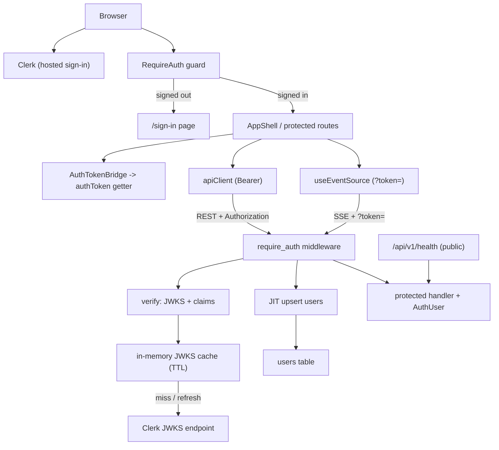

# Technical Specification: F02 Authentication & Access Control

## 1. Technical Overview

**What:** Clerk-based authentication and per-user access control layered onto the F01 foundation. On the backend, an Axum middleware validates Clerk-issued RS256 session JWTs on every protected REST and SSE request — verifying the signature against Clerk's JWKS (fetched and cached in-memory), checking issuer / authorized-party / expiry claims, just-in-time provisioning the caller into a local `users` table, and exposing the authenticated identity to handlers through an `AuthUser` extractor plus an ownership-guard helper. On the frontend, the React shell is wrapped in Clerk's provider, unauthenticated visitors to protected routes are redirected to a sign-in page, and the API client and SSE connections automatically attach the current session token.

**Why:** Every data feature (F04 agents, F05 memory, F07/F08 flows) must scope records to their owner and reject cross-user access. Centralizing token verification, identity extraction, and the ownership primitive here means later features consume a single, consistent `AuthUser` contract instead of re-implementing auth. F01 deliberately left a Clerk provider slot in `main.tsx` and unguarded router mount points in `app.rs`; F02 fills both.

**Scope:**

**Included:**
- Backend Clerk JWT verification: JWKS fetch + in-memory cache (TTL + refetch on unknown `kid`), RS256 signature check, and validation of `iss`, `azp` (authorized parties), and `exp`.
- Token sourcing from the `Authorization: Bearer` header for REST and from a `?token=` query parameter for SSE (EventSource cannot set headers).
- `require_auth` Axum middleware that validates the token, JIT-upserts the user, and injects an `AuthUser` into request extensions.
- `AuthUser` extractor and an `ensure_owner` guard returning 404 on ownership mismatch.
- Local `users` table keyed by the Clerk user id, upserted on first authenticated request.
- Split routing: `/api/v1/health` stays public; `/api/v1/me` and `/api/v1/sse/heartbeat` become protected.
- Standard auth error envelopes: 401 (`AUTH001`), 503 (`AUTH002`), 404 (`NOT_FOUND`).
- Frontend: `ClerkProvider`, sign-in/sign-up pages, a `RequireAuth` route guard with redirect, automatic Bearer attachment in the API client, token attachment for SSE URLs, and a user button in the nav.

**Excluded (later features / out of scope):**
- Any domain tables or per-record ownership columns (added by F04/F05/F07/F08; F02 provides the `users` target and the `ensure_owner` primitive they will use).
- Team/workspace sharing, roles, or organizations (PRD Out of Scope).
- Clerk webhook-driven user sync and backend Clerk API calls (JIT upsert from the token is sufficient; richer sync is deferred).

## 2. Architecture Impact

**Affected components:**
- Backend new: `auth/` module (`jwks`, `verify`, `middleware`, `extractor`, `user`), `routes/me.rs`, `migrations/0002_users.sql`.
- Backend modified: `config.rs`, `state.rs`, `error.rs`, `routes/mod.rs`, `app.rs`, `main.rs`, `Cargo.toml`.
- Frontend new: `auth/RequireAuth.tsx`, `auth/AuthTokenBridge.tsx`, `lib/authToken.ts`, `pages/SignInPage.tsx`, `pages/SignUpPage.tsx`, `.env.example`.
- Frontend modified: `main.tsx`, `routes/router.tsx`, `lib/apiClient.ts`, `components/NavBar.tsx`, `package.json`.



## 3. Technical Decisions

| Decision | Chosen Approach | Alternative Considered | Trade-off |
|----------|----------------|------------------------|-----------|
| JWT verification | `jsonwebtoken` crate with manual JWKS fetch + claim validation | `clerk-rs` SDK | Explicit control over claims and a small dependency surface; we own the JWKS/cache code instead of getting it from the SDK. |
| SSE authentication | Clerk token passed as `?token=` query parameter, validated identically to a Bearer header | Clerk httpOnly session cookie with credentialed CORS | Works with native `EventSource` and keeps one verification path; the token appears in the URL (mitigated by short Clerk token lifetime and TLS). |
| User identity persistence | JIT `users` table keyed by Clerk `sub`, upserted on first authenticated request | Bare `user_id` string on each domain table | Gives later features a clean FK target and a place for synced metadata; costs one extra upsert per request (cheap, indexed PK). |
| JWKS cache | In-memory `RwLock<HashMap<kid, DecodingKey>>` with TTL and refetch-on-unknown-kid | Redis-backed shared cache | No extra round-trip on the auth hot path; each instance maintains its own copy (acceptable — keys are small and rotate rarely). |
| Token sources | Bearer header for REST, `?token=` for SSE; middleware accepts both | Header-only (breaks SSE) | One middleware covers both transports. |
| Public vs protected split | `health` public; `me` and `sse/heartbeat` protected behind the middleware layer | Protect everything | Health stays usable as a probe; SSE requires a token per the PRD. |
| Email claim handling (assumption) | Read optional `email` custom claim if present, else store NULL | Always call Clerk backend API for email | Avoids a secret-key dependency and an extra network call; email is best-effort until a webhook sync is added. |
| Frontend guard (assumption) | `RequireAuth` using Clerk `useAuth()` (`isLoaded`/`isSignedIn`) + `<Navigate to="/sign-in">` | Clerk `<RedirectToSignIn>` | Deterministic and unit-testable by mocking `useAuth`; equivalent redirect behavior. |

## 4. Component Overview

**Backend:**

| File Path | New/Modified | Purpose | Key Responsibilities |
|-----------|--------------|---------|----------------------|
| `backend/Cargo.toml` | Modified | Dependencies | Add `jsonwebtoken`; promote `reqwest` to a runtime dependency for JWKS fetch |
| `backend/src/auth/mod.rs` | New | Auth module root | Re-export submodules; define `AuthState` (JWKS cache + Clerk config) |
| `backend/src/auth/jwks.rs` | New | JWKS cache | Fetch Clerk JWKS, map `kid → DecodingKey`, TTL refresh, refetch on unknown kid |
| `backend/src/auth/verify.rs` | New | Token verification | Decode header for `kid`, look up key, validate RS256 signature + `iss`/`azp`/`exp`, return `Claims` |
| `backend/src/auth/middleware.rs` | New | `require_auth` layer | Extract token (Bearer or `?token=`), verify, JIT-upsert user, insert `AuthUser` into extensions |
| `backend/src/auth/extractor.rs` | New | Identity + ownership | `AuthUser` `FromRequestParts`; `ensure_owner(owner, &AuthUser) -> Result<(), AppError>` |
| `backend/src/auth/user.rs` | New | Users repository | `upsert_user(pool, sub, email)`, `get_user(pool, id)` |
| `backend/src/config.rs` | Modified | Config | Add `clerk_issuer`, `clerk_jwks_url`, `clerk_authorized_parties` |
| `backend/src/state.rs` | Modified | Shared state | Add `auth: Arc<AuthState>` to `AppState` |
| `backend/src/error.rs` | Modified | Error envelope | Add `Unauthorized` (`AUTH001`/401), `AuthServiceUnavailable` (`AUTH002`/503), `NotFound` (`NOT_FOUND`/404) |
| `backend/src/routes/me.rs` | New | `GET /me` | Return the authenticated user from `AuthUser` + users table |
| `backend/src/routes/mod.rs` | Modified | Routing split | `public_router` (health) and `protected_router` (me, sse/heartbeat) with `require_auth` |
| `backend/src/app.rs` | Modified | Router assembly | Mount public + protected sub-routers; apply auth middleware to the protected group |
| `backend/src/main.rs` | Modified | Boot | Build `AuthState`, warm the JWKS cache at startup, inject into `AppState` |
| `backend/migrations/0002_users.sql` | New | Users schema | Create the `users` table |

**Frontend:**

| File Path | New/Modified | Purpose | Key Responsibilities |
|-----------|--------------|---------|----------------------|
| `frontend/package.json` | Modified | Dependencies | Add `@clerk/clerk-react` |
| `frontend/src/main.tsx` | Modified | Bootstrap | Wrap providers in `ClerkProvider` (publishable key from env) and mount `AuthTokenBridge` |
| `frontend/src/auth/RequireAuth.tsx` | New | Route guard | Redirect unauthenticated users to `/sign-in`; render children when signed in |
| `frontend/src/auth/AuthTokenBridge.tsx` | New | Token wiring | Register Clerk `getToken` into the API client's token getter |
| `frontend/src/lib/authToken.ts` | New | Token registry | `setTokenGetter` / `getAuthToken` module-level bridge between Clerk hooks and the non-hook API client |
| `frontend/src/lib/apiClient.ts` | Modified | REST client | Attach `Authorization: Bearer` from the token getter; surface 401 as a typed error |
| `frontend/src/pages/SignInPage.tsx` | New | Sign-in | Render Clerk `<SignIn>` |
| `frontend/src/pages/SignUpPage.tsx` | New | Sign-up | Render Clerk `<SignUp>` |
| `frontend/src/routes/router.tsx` | Modified | Routes | Public `/sign-in`, `/sign-up`; wrap the protected layout in `RequireAuth` |
| `frontend/src/components/NavBar.tsx` | Modified | Nav | Add Clerk `<UserButton>` for session/sign-out |
| `frontend/.env.example` | New | Config template | Document `VITE_CLERK_PUBLISHABLE_KEY` |

**Database:**

| Migration File | Tables Affected | Operation | Notes |
|----------------|-----------------|-----------|-------|
| `backend/migrations/0002_users.sql` | `users` | CREATE | Keyed by Clerk user id; JIT-upserted; FK target for later features |

## 5. API Contracts

Auth applies to all **protected** endpoints. Token is read from `Authorization: Bearer <jwt>` (REST) or `?token=<jwt>` (SSE). Public endpoints (`/api/v1/health`) require no token.

### Endpoint: Current User
- **Method:** GET
- **Path:** `/api/v1/me`
- **Authentication:** Required (Bearer)

**Request:** none.

**Response (Success - 200):**

| Field | Type | Description |
|-------|------|-------------|
| `status` | `string` | Always `"success"` |
| `data.user_id` | `string` | Clerk user id (`sub`) |
| `data.email` | `string \| null` | Email from the `email` claim if present, else null |

**Response Example:**
```json
{
  "status": "success",
  "data": {
    "user_id": "user_2abcDEF1234",
    "email": "joao@example.com"
  }
}
```

**Error Codes:**

| Code | HTTP Status | Description |
|------|-------------|-------------|
| `AUTH001` | 401 | Missing, malformed, or expired/invalid token |
| `AUTH002` | 503 | Authentication service (JWKS) unavailable |

**401 Example:**
```json
{
  "status": "error",
  "error": { "code": "AUTH001", "message": "Session expired or invalid. Please sign in again." }
}
```

### Protected behavior applied across the protected router

| Scenario | HTTP Status | Code | Message |
|----------|-------------|------|---------|
| No `Authorization` header and no `?token=` | 401 | `AUTH001` | Session expired or invalid. Please sign in again. |
| Signature/claim validation fails (bad `iss`/`azp`, expired, unknown kid after refetch) | 401 | `AUTH001` | Session expired or invalid. Please sign in again. |
| JWKS endpoint unreachable when a fetch is required | 503 | `AUTH002` | Authentication service unavailable. Please try again shortly. |
| Authenticated request for a record owned by another user (later features, via `ensure_owner`) | 404 | `NOT_FOUND` | Not found |

### Endpoint: SSE Heartbeat (now protected)
- **Method:** GET
- **Path:** `/api/v1/sse/heartbeat`
- **Authentication:** Required via `?token=<jwt>`
- **Behavior:** When the token is missing/invalid the connection is refused with 401 (`AUTH001`) before any `event:` line is written. With a valid token, behavior is unchanged from F01 (named `ping` events).

## 6. Data Model

**Table: `users`**

| Column | Type | Nullable | Default | Description |
|--------|------|----------|---------|-------------|
| `id` | `text` | No | - | Clerk user id (`sub`), e.g. `user_2ab...`; primary key |
| `email` | `text` | Yes | `NULL` | Email from the token's `email` claim when present |
| `created_at` | `timestamptz` | No | `now()` | First seen |
| `updated_at` | `timestamptz` | No | `now()` | Last authenticated request (refreshed on upsert) |

**Constraints:**

| Constraint | Type | Definition | Purpose |
|------------|------|------------|---------|
| `pk_users` | PRIMARY KEY | `id` | Unique user identity; FK target for later features |

**Upsert (JIT provisioning):**
```sql
INSERT INTO users (id, email)
VALUES ($1, $2)
ON CONFLICT (id) DO UPDATE
SET email = COALESCE(EXCLUDED.email, users.email),
    updated_at = now();
```

**Migration (`backend/migrations/0002_users.sql`):**
```sql
CREATE TABLE users (
    id         TEXT PRIMARY KEY,
    email      TEXT,
    created_at TIMESTAMPTZ NOT NULL DEFAULT now(),
    updated_at TIMESTAMPTZ NOT NULL DEFAULT now()
);
```

**Cross-Database Notes:**
- `id` is a text PK (Clerk ids are opaque strings), not a UUID.
- `timestamptz` used for both timestamps, consistent with F01 conventions.

## 7. Error Handling

| Scenario | Detection | Response |
|----------|-----------|----------|
| Missing token | No Bearer header and no `?token=` | 401 `AUTH001` "Session expired or invalid. Please sign in again." |
| Malformed / bad-signature / expired token | `jsonwebtoken` decode or claim check fails | 401 `AUTH001` (same message; no detail leak) |
| Unknown `kid` | Not in cache after a forced refetch | 401 `AUTH001` |
| Wrong issuer or authorized party | Claim mismatch against config | 401 `AUTH001` |
| JWKS endpoint unreachable | `reqwest` error during a required fetch | 503 `AUTH002` "Authentication service unavailable. Please try again shortly." |
| Cross-user record access | `ensure_owner` mismatch (later features) | 404 `NOT_FOUND` "Not found" (existence not revealed) |
| SSE without valid token | Middleware runs before the stream handler | 401 `AUTH001`; connection refused before any event |
| Frontend 401 from any API call | `apiClient` sees 401 / `AUTH001` | Clear session and redirect to `/sign-in` |

## 8. Testing Strategy

**Test File Structure:**

| Test File | Test Type | Target | Coverage Goal |
|-----------|-----------|--------|---------------|
| `backend/tests/auth_test.rs` | Integration | Middleware, `/me`, SSE auth, JIT upsert | 85% |
| `backend/src/auth/extractor.rs` (inline `#[cfg(test)]`) | Unit | `ensure_owner` | 100% |
| `frontend/src/auth/RequireAuth.test.tsx` | Unit (Vitest + RTL) | Route guard | 90% |
| `frontend/src/lib/apiClient.test.ts` | Unit (Vitest) | Bearer attachment + 401 | 90% |

**Backend test functions** (the suite injects a test RSA key into the JWKS cache and points `clerk_issuer`/`authorized_parties` at test values, so a locally signed JWT verifies without contacting Clerk; tests needing the `users` upsert soft-skip when no database is reachable, consistent with F01's `health_test`):

| Test Function | Description | Assertions |
|---------------|-------------|------------|
| `me_without_token_returns_401` | No Authorization header | 401; envelope code `AUTH001` |
| `me_with_malformed_token_returns_401` | Garbage Bearer value | 401; `AUTH001` |
| `me_with_expired_token_returns_401` | Valid signature, `exp` in the past | 401; `AUTH001` |
| `me_with_wrong_azp_returns_401` | Valid signature, `azp` not in authorized parties | 401; `AUTH001` |
| `me_with_valid_token_returns_user` | Locally signed valid JWT; key injected into cache | 200; `data.user_id` equals the token `sub`; user row upserted |
| `health_remains_public` | No token | 200 (health unaffected by auth) |
| `sse_heartbeat_without_token_refused` | Open SSE without `?token=` | 401 `AUTH001`; no `event:` bytes received |
| `sse_heartbeat_with_valid_token_streams` | SSE with `?token=<valid>` | 200; first chunk contains `event: ping` |
| `ensure_owner_rejects_other_user` (unit) | Owner ≠ caller | Returns `AppError::NotFound` (404 / `NOT_FOUND`) |
| `ensure_owner_allows_owner` (unit) | Owner == caller | Returns `Ok(())` |

**Frontend test functions:**

| Test Function | Description | Assertions |
|---------------|-------------|------------|
| `redirects_to_sign_in_when_signed_out` | `useAuth` mocked → `isLoaded: true, isSignedIn: false` | Renders the `/sign-in` location, not the protected child |
| `renders_children_when_signed_in` | `useAuth` mocked → signed in | Protected child is rendered |
| `apiclient_attaches_bearer_when_token_present` | Token getter returns a JWT | `fetch` called with `Authorization: Bearer <jwt>` |
| `apiclient_maps_401_to_error` | Mocked 401 `AUTH001` | Throws `ApiClientError` with code `AUTH001` |

**Acceptance tests (from PRD Section 9, F02):**
- Unauthenticated user redirected to sign-in on any protected route → `redirects_to_sign_in_when_signed_out`.
- Every REST and SSE request rejected with 401 when token missing/expired → `me_without_token_returns_401`, `me_with_expired_token_returns_401`, `sse_heartbeat_without_token_refused`.
- Request for another user's record returns 404 → `ensure_owner_rejects_other_user` (the primitive; full record-level coverage arrives with F04+).
- After sign-in the user lands on the Agents Dashboard → covered by the existing F01 index redirect to `/agents` plus `renders_children_when_signed_in` (guard admits the signed-in user to the shell whose default route is `/agents`).

**Integration tests (Cross-Feature Integration, PRD Section 9 — F02 as provider):**
- "Authenticated user identity (F02) scopes all agents (F04), memory records (F05), and flows (F07, F08) so no cross-user data is ever returned." F02 supplies the mechanism; `me_with_valid_token_returns_user` proves identity extraction + JIT upsert, and `ensure_owner_rejects_other_user` proves the scoping primitive. Record-level cross-user integration tests are authored by the consuming features (F04/F05/F07/F08) against their own tables.

## Assumptions & Decisions

Resolved via interview unless marked best-practice:
- **JWT verification:** `jsonwebtoken` + manual JWKS cache (interview).
- **SSE auth:** `?token=` query parameter (interview).
- **User identity:** JIT `users` table keyed by Clerk `sub` (interview).
- **JWKS cache:** in-memory `RwLock` + TTL, refetch on unknown kid (interview).
- **JWKS TTL** of 1 hour with refetch-on-unknown-kid (best-practice default; covers Clerk key rotation).
- **Email claim** is optional; stored when a custom `email` claim is present, else NULL — no Clerk backend API call (best-practice default).
- **Authorized parties / issuer** come from `clerk_authorized_parties` (comma-separated) and `clerk_issuer`; `clerk_jwks_url` defaults to `${issuer}/.well-known/jwks.json` when unset (best-practice default).
- **Public endpoints:** only `/api/v1/health` remains public; everything else added later is protected by default (best-practice default).
- **Frontend guard** uses Clerk `useAuth()` + `<Navigate>` for testability rather than `<RedirectToSignIn>` (best-practice default).
- **New env vars:** backend `CLERK_ISSUER`, `CLERK_JWKS_URL` (optional), `CLERK_AUTHORIZED_PARTIES`; frontend `VITE_CLERK_PUBLISHABLE_KEY`. These require a Clerk instance to run end to end; unit/integration tests stub the keys.
