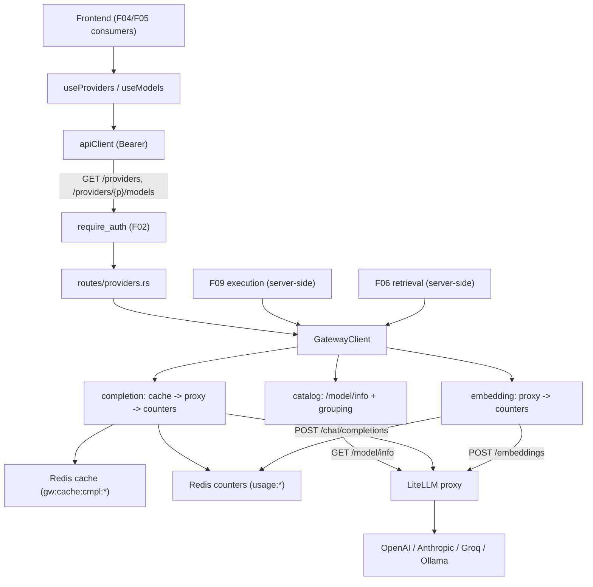

# Technical Specification: F03 LLM Gateway Integration

## 1. Technical Overview

**What:** A single internal gateway that routes every model and embedding call through the LiteLLM proxy. On the backend, a `GatewayClient` (built on the existing `reqwest` dependency) wraps the proxy's OpenAI-compatible API: it discovers providers and their models from LiteLLM's `/model/info`, runs chat completions and embeddings, serves exact-match completion responses from a Redis cache, and increments per-model + global usage/cost counters in Redis on every billed request. Two protected REST endpoints expose the provider catalog and provider-filtered model lists to the frontend; completion and embedding are internal client functions consumed server-side by later features (F09 execution, F06 retrieval). A `litellm` service is added to the dev docker-compose stack so the gateway is reachable locally.

**Why:** Every model-touching feature (F04 dropdowns, F05 embedding config, F06 retrieval, F09 execution) must reach providers through one uniform interface rather than per-provider SDKs. Centralizing discovery, completion, embedding, caching, and accounting here means later features consume a single `GatewayClient` contract and a stable `/providers` REST shape instead of re-implementing provider plumbing. Redis exact-match caching prevents re-billing identical generations; the counters give backend cost accounting without a UI surface. F01 already established the Redis pool and the `/api/v1` router split; F02 established `require_auth` — F03 builds on both.

**Scope:**

**Included:**
- `GatewayClient` over the LiteLLM proxy (base URL + optional master key), built once and carried in `AppState`.
- Provider/model discovery via LiteLLM `/model/info`, grouping models by provider and exposing each model's `mode` (chat vs embedding) so F04/F05 can filter.
- Protected REST endpoints: `GET /api/v1/providers`, `GET /api/v1/providers/{provider}/models`.
- Internal completion service with exact-match Redis caching (SHA-256 of canonical `model + messages + params`, 24h TTL).
- Internal embedding service.
- Redis usage/cost counters (per-model + global) incremented per billed request; cache hits increment a hit counter only.
- Integrated from Full Scope additions:
  - Provider fallback delegated to LiteLLM proxy config; the gateway surfaces a structured error when the proxy exhausts all options.
  - Usage/cost trace logging persisted to Redis counters.
- Dev infrastructure: a `litellm` service + `litellm/config.yaml` in docker-compose; new backend env `LITELLM_BASE_URL` / `LITELLM_MASTER_KEY`.
- Frontend catalog client: `lib/models.ts` with types and `useProviders` / `useModels(provider)` TanStack Query hooks.

**Excluded (later features / out of scope):**
- Streaming completions (F03's `complete()` is non-streaming; F09 adds a streaming path for partial-output events).
- Public completion/embedding REST endpoints (internal client only; F09/F06 call it server-side).
- In-app configuration of LiteLLM providers/keys (managed in `litellm/config.yaml` and the proxy, per PRD Out of Scope).
- User-facing usage/cost dashboards (counters are backend accounting only).
- The Agents Dashboard dropdowns themselves (F04) and the embedding-model selectors (F05) — F03 only provides the catalog API + hooks.

## 2. Architecture Impact

**Affected components:**
- Backend new: `gateway/` module (`mod`, `types`, `catalog`, `completion`, `embedding`, `cache`, `usage`), `routes/providers.rs`.
- Backend modified: `config.rs`, `state.rs`, `error.rs`, `routes/mod.rs`, `main.rs`, `Cargo.toml`.
- Infra new: `litellm/config.yaml`; modified: `docker-compose.yml`, `backend/.env.example`.
- Frontend new: `lib/models.ts` (+ test).



## 3. Technical Decisions

| Decision | Chosen Approach | Alternative Considered | Trade-off |
|----------|----------------|------------------------|-----------|
| Provider/model discovery | Call LiteLLM `/model/info` and group by provider (`model_info.litellm_provider`, else the `provider/` prefix of `litellm_params.model`) | OpenAI-compatible `/v1/models` + an app-maintained provider→model map | Single live source of truth that tracks the proxy config; `/v1/models` is a flat list that doesn't reliably expose provider and the static map drifts. |
| Execution surface | Completion + embedding are internal `GatewayClient` methods consumed server-side by F09/F06 | Public `/chat/completions` + `/embeddings` REST in F03 | Avoids an unauthenticated/early model-proxy surface; matches "Provides ... used by F09/F06". Streaming is deferred to F09. |
| Completion caching | Exact-match: SHA-256 hex of canonical JSON `(model, messages, params)`, value = serialized result, 24h TTL | No cache; or cache without expiry | Prevents re-billing identical generations while bounding memory/staleness; canonicalization makes the key order-independent. |
| Cache scope | Completions only | Completions + embeddings | Matches the PRD's "identical generation requests"; embedding caching can be added with F06 if needed. |
| Usage/cost accounting | Per-model + global Redis counters (`HINCRBY`/`HINCRBYFLOAT`); cost from the `x-litellm-response-cost` response header | Per-user counters; or compute cost from a local price table | Simple backend accounting per the PRD (not surfaced in UI); the proxy already computes cost, so no local price table to maintain. |
| Provider fallback (Full Scope) | Delegated to LiteLLM proxy config; gateway maps an exhausted-fallback proxy error to a structured `ProviderError` | In-app ordered cross-provider retry | Keeps provider/key configuration in LiteLLM (PRD Out of Scope for in-app provider config) instead of duplicating it. |
| Gateway state | One `GatewayClient` (reqwest client + base URL + master key + Redis pool clone) behind `Arc` in `AppState` | Build a client per request | Reuses connection pools; cheap to clone; consistent with `AuthState`/pool handles already in `AppState`. |
| Dev gateway | `litellm` service + `litellm/config.yaml` in docker-compose | Assume an externally running proxy | Turnkey local stack consistent with F01's compose workflow; provider API keys are injected into the container via env. |
| Test isolation (assumption) | Integration tests point `GatewayClient` at a small in-process axum mock proxy; Redis-dependent tests soft-skip when Redis is unreachable | Require a live LiteLLM in CI | Deterministic, dependency-free gateway tests (no new test crate); follows F01/F02's soft-skip pattern for Redis. |

## 4. Component Overview

**Backend:**

| File Path | New/Modified | Purpose | Key Responsibilities |
|-----------|--------------|---------|----------------------|
| `backend/Cargo.toml` | Modified | Dependencies | Add `sha2` for the cache-key hash (`reqwest` already present) |
| `backend/src/gateway/mod.rs` | New | Gateway module root | Define `GatewayClient` (http client, base URL, master key, Redis pool) and `GatewayConfig`; re-export submodules; constructor |
| `backend/src/gateway/types.rs` | New | DTOs | `Provider`, `Model` (id, label, mode), `ChatMessage`, `CompletionRequest`/`CompletionResult`, `EmbeddingRequest`/`EmbeddingResult`, and the LiteLLM wire structs |
| `backend/src/gateway/catalog.rs` | New | Discovery | Fetch `/model/info`, parse provider per model, group; `list_providers()`, `list_models(provider)` |
| `backend/src/gateway/completion.rs` | New | Completion service | `complete(req)`: check cache → POST `/chat/completions` → store cache + increment counters; map errors |
| `backend/src/gateway/embedding.rs` | New | Embedding service | `embed(req)`: POST `/embeddings` → increment counters; return vector; map errors |
| `backend/src/gateway/cache.rs` | New | Exact-match cache | Canonicalize request, SHA-256 key, `GET`/`SETEX` (24h) the completion result |
| `backend/src/gateway/usage.rs` | New | Usage counters | Increment per-model + global token/cost/request counters; cache-hit counter |
| `backend/src/config.rs` | Modified | Config | Add `GatewayConfig { base_url, master_key }` (`LITELLM_BASE_URL` required, `LITELLM_MASTER_KEY` optional) |
| `backend/src/state.rs` | Modified | Shared state | Add `gateway: Arc<GatewayClient>` to `AppState` |
| `backend/src/error.rs` | Modified | Error envelope | Add `GatewayUnavailable` (`GW001`/503), `InvalidModelForProvider` (`GW002`/422), `ProviderError` (`GW003`/502) |
| `backend/src/routes/providers.rs` | New | Discovery endpoints | `GET /providers`, `GET /providers/{provider}/models` handlers (protected) |
| `backend/src/routes/mod.rs` | Modified | Routing | Mount the provider routes under the protected router |
| `backend/src/main.rs` | Modified | Boot | Build `GatewayClient` from config + Redis pool and inject into `AppState` |

**Infrastructure:**

| File Path | New/Modified | Purpose | Key Responsibilities |
|-----------|--------------|---------|----------------------|
| `docker-compose.yml` | Modified | Dev stack | Add a `litellm` service (port 4000) mounting the config and reading provider keys from env |
| `litellm/config.yaml` | New | LiteLLM config | `model_list` for the supported providers and proxy settings (master key, fallbacks) |
| `backend/.env.example` | Modified | Config template | Document `LITELLM_BASE_URL`, `LITELLM_MASTER_KEY`, and the provider keys consumed by the proxy container |

**Frontend:**

| File Path | New/Modified | Purpose | Key Responsibilities |
|-----------|--------------|---------|----------------------|
| `frontend/src/lib/models.ts` | New | Catalog client | `Provider`/`Model` types; `useProviders()` and `useModels(provider)` TanStack Query hooks over the new endpoints |
| `frontend/src/lib/models.test.ts` | New | Unit test | Assert the hooks request the right paths and `useModels` is disabled until a provider is selected |

**Database:** None. F03 persists only to Redis (cache + counters); no relational schema or migration.

## 5. API Contracts

Both endpoints are **protected** (F02 `require_auth`): the request must carry `Authorization: Bearer <jwt>`. Responses use the platform success/error envelope.

### Endpoint: List Providers
- **Method:** GET
- **Path:** `/api/v1/providers`
- **Authentication:** Required (Bearer)

**Request:** none.

**Response (Success - 200):**

| Field | Type | Description |
|-------|------|-------------|
| `status` | `string` | Always `"success"` |
| `data.providers` | `array` | One entry per discovered provider |
| `data.providers[].id` | `string` | Provider id used to filter models (e.g. `openai`) |
| `data.providers[].model_count` | `integer` | Number of models configured for the provider |

**Response Example:**
```json
{
  "status": "success",
  "data": {
    "providers": [
      { "id": "openai", "model_count": 3 },
      { "id": "anthropic", "model_count": 2 },
      { "id": "ollama", "model_count": 1 }
    ]
  }
}
```

### Endpoint: List Models for a Provider
- **Method:** GET
- **Path:** `/api/v1/providers/{provider}/models`
- **Authentication:** Required (Bearer)

**Request:**

| Field | Type | Required | Validation | Description |
|-------|------|----------|------------|-------------|
| `provider` | `string` (path) | Yes | must be a discovered provider | Provider id to scope models to |

**Response (Success - 200):**

| Field | Type | Description |
|-------|------|-------------|
| `status` | `string` | Always `"success"` |
| `data.provider` | `string` | Echoed provider id |
| `data.models` | `array` | Models for the provider |
| `data.models[].id` | `string` | Model id to use in completion/embedding requests |
| `data.models[].label` | `string` | Display label (defaults to the id) |
| `data.models[].mode` | `string` | `"chat"` or `"embedding"` (lets F04 show chat models, F05 embedding models) |

**Response Example:**
```json
{
  "status": "success",
  "data": {
    "provider": "openai",
    "models": [
      { "id": "gpt-4o", "label": "gpt-4o", "mode": "chat" },
      { "id": "gpt-4o-mini", "label": "gpt-4o-mini", "mode": "chat" },
      { "id": "text-embedding-3-small", "label": "text-embedding-3-small", "mode": "embedding" }
    ]
  }
}
```

**Error Codes (both endpoints):**

| Code | HTTP Status | Description |
|------|-------------|-------------|
| `AUTH001` | 401 | Missing/invalid token (F02 middleware) |
| `GW001` | 503 | LiteLLM proxy unreachable during discovery |
| `NOT_FOUND` | 404 | Unknown provider (`/providers/{provider}/models`) |

**503 Example:**
```json
{
  "status": "error",
  "error": { "code": "GW001", "message": "Model gateway unavailable. Check the LiteLLM proxy and try again." }
}
```

### Internal service contracts (not REST; consumed by F06/F09)

| Function | Input | Output | Notes |
|----------|-------|--------|-------|
| `complete(CompletionRequest)` | `model`, `messages[]` (`role`,`content`), `params` (temperature, max_tokens, top_p, …) | `CompletionResult { content, prompt_tokens, completion_tokens, cost_usd, cached, model }` | Cache lookup → proxy `POST /chat/completions` → cache store + counters. Non-streaming. |
| `embed(EmbeddingRequest)` | `model`, `input` | `EmbeddingResult { embedding: number[], model, prompt_tokens, cost_usd }` | Proxy `POST /embeddings` → counters. On failure returns `GW*` error for the caller (F06) to degrade gracefully. |

## 6. Data Model

No relational tables. F03 uses two Redis key families.

**Completion cache**

| Key | Type | Value | TTL | Notes |
|-----|------|-------|-----|-------|
| `gw:cache:cmpl:{sha256hex}` | string | JSON of `CompletionResult` | 86400s (24h) | `{sha256hex}` = SHA-256 of the canonical JSON of `{ model, messages, params }` with object keys sorted so ordering does not affect the key |

**Usage/cost counters** (incremented on each billed request; cache hits touch only the hit counter)

| Key | Type | Fields | Operation |
|-----|------|--------|-----------|
| `usage:model:{model}` | hash | `prompt_tokens`, `completion_tokens`, `requests` | `HINCRBY` |
| `usage:model:{model}` | hash | `cost_usd` | `HINCRBYFLOAT` |
| `usage:global` | hash | `prompt_tokens`, `completion_tokens`, `requests`, `cache_hits` | `HINCRBY` |
| `usage:global` | hash | `cost_usd` | `HINCRBYFLOAT` |

**Canonicalization (cache key):** the request is normalized to `{ "model": <string>, "messages": [{"role","content"}...], "params": {<sorted keys>} }` and serialized with sorted keys before hashing, so semantically identical requests (e.g. params supplied in a different order) map to the same key.

**Cost source:** `cost_usd` is parsed from the LiteLLM `x-litellm-response-cost` response header; absent header → `0.0` with a logged warning.

## 7. Error Handling

| Scenario | Detection | Response |
|----------|-----------|----------|
| LiteLLM proxy unreachable | `reqwest` transport error on any proxy call | `GW001` / 503 "Model gateway unavailable. Check the LiteLLM proxy and try again." (discovery endpoints return it directly; `complete`/`embed` return it to the caller) |
| Invalid model/provider combination | Requested model not present for the provider in the catalog, or proxy 400 for unknown model | `GW002` / 422 "Selected model is not available for this provider." |
| Provider rate-limit / quota / exhausted fallback | Proxy returns an error status after its configured fallbacks | `GW003` / 502 structured error carrying the provider name and reason (propagated by F09 into the node's execution event) |
| Unknown provider on models endpoint | Provider id not in the discovered catalog | `NOT_FOUND` / 404 |
| Embedding request fails | `embed()` returns a `GW*` error | Caller (F06) skips retrieval for that node and proceeds without injected context (degradation noted in the F09 execution event) |
| Cache read/write error | Redis error during get/set | Treated as a miss/no-op (log + proceed with a live proxy call); never fails the request |
| Missing token | F02 middleware | `AUTH001` / 401 before the handler runs |

## 8. Testing Strategy

**Test File Structure:**

| Test File | Test Type | Target | Coverage Goal |
|-----------|-----------|--------|---------------|
| `backend/tests/gateway_test.rs` | Integration | Discovery endpoints, completion cache, counters, error mapping (via in-process mock proxy) | 85% |
| `backend/src/gateway/cache.rs` (inline `#[cfg(test)]`) | Unit | Cache-key canonicalization/stability | 100% |
| `backend/src/gateway/catalog.rs` (inline `#[cfg(test)]`) | Unit | Provider parsing/grouping from `/model/info` | 100% |
| `frontend/src/lib/models.test.ts` | Unit (Vitest) | `useProviders` / `useModels` request paths + disabled state | 90% |

**Backend integration tests** (a small axum mock proxy serves canned `/model/info`, `/chat/completions`, `/embeddings`; the `GatewayClient` is pointed at it. Tests that assert caching/counters require Redis and soft-skip when `REDIS_URL` is unreachable, consistent with F01/F02):

| Test Function | Description | Assertions |
|---------------|-------------|------------|
| `providers_endpoint_requires_auth` | No token | 401 `AUTH001` (F02 integration) |
| `lists_providers_grouped_from_model_info` | Mock `/model/info` with mixed providers | 200; providers grouped with correct `model_count` |
| `lists_models_for_provider_with_mode` | `GET /providers/openai/models` | 200; only OpenAI models; `mode` present (chat + embedding) |
| `unknown_provider_returns_404` | `GET /providers/nope/models` | 404 `NOT_FOUND` |
| `discovery_when_proxy_down_returns_GW001` | Client pointed at a dead port | 503 `GW001` |
| `completion_cache_miss_calls_proxy` | First `complete()` for a request | Mock proxy hit once; result content returned; `cached=false` |
| `completion_exact_match_served_from_cache` | Identical second `complete()` | Mock proxy still hit once total; second result `cached=true` |
| `completion_counters_increment_per_billed_request` | One miss + one hit | `usage:model:{m}` tokens/cost increased once; `usage:global.cache_hits` = 1 |
| `invalid_model_for_provider_returns_GW002` | `complete()` with a model absent for the provider | `GW002` (422) |
| `embedding_returns_vector` | `embed()` against mock `/embeddings` | Non-empty vector; counters incremented |

**Backend unit tests:**

| Test Function | Description | Assertions |
|---------------|-------------|------------|
| `cache_key_is_order_independent` | Same request, params in different orders | Identical key |
| `cache_key_differs_on_model_or_messages` | Change model or a message | Different key |
| `provider_parsed_from_litellm_model` | `litellm_params.model = "anthropic/claude-3-5-sonnet"` | Provider parsed as `anthropic` |

**Frontend unit tests:**

| Test Function | Description | Assertions |
|---------------|-------------|------------|
| `use_providers_requests_providers_path` | Render `useProviders` with mocked `apiGet` | Calls `/providers` |
| `use_models_requests_provider_path` | `useModels("openai")` | Calls `/providers/openai/models` |
| `use_models_disabled_without_provider` | `useModels(null)` | Query disabled; no fetch |

**Acceptance tests (from PRD Section 9, F03):**
- Provider discovery returns the live list; model discovery returns only that provider's models → `lists_providers_grouped_from_model_info`, `lists_models_for_provider_with_mode`.
- Exact-duplicate completion served from Redis without a new provider call → `completion_exact_match_served_from_cache`.
- LiteLLM proxy unreachable → clear gateway-unavailable error → `discovery_when_proxy_down_returns_GW001`.
- Usage/cost counters increment per request (not in UI) → `completion_counters_increment_per_billed_request`.

**Integration tests (Cross-Feature Integration, PRD Section 9 — F03 as provider):**
- Provider/model catalog (F03) populates F04 dashboard dropdowns — F03 supplies `GET /providers` + `GET /providers/{provider}/models` and the `useProviders`/`useModels` hooks; `lists_models_for_provider_with_mode` proves the contract. F04 authors the dropdown-level test.
- Provider/embedding-model catalog (F03) populates F05 selectors — the `mode` field distinguishes embedding models; covered by `lists_models_for_provider_with_mode`.
- Embedding generation service (F03) used by F06 retrieval — `embed()` proven by `embedding_returns_vector`; F06 authors the retrieval integration.
- Gateway completion service (F03) consumed by F09 execution — `complete()` proven by the completion tests; F09 authors the execution integration.

## Assumptions & Decisions

Resolved via interview unless marked best-practice:
- **Scope:** Core + Full Scope additions — caching + discovery + provider fallback + usage/cost counters (interview).
- **Discovery source:** LiteLLM `/model/info`, grouped by provider (interview).
- **REST shape:** `/providers` + `/providers/{provider}/models`, both protected by F02 `require_auth` (interview).
- **Execution surface:** internal `GatewayClient` only; no public completion/embedding REST in F03 (interview).
- **Caching:** completions only, SHA-256 canonical key, 24h TTL (interview).
- **Counters:** per-model + global Redis counters; cost from `x-litellm-response-cost` (interview + best-practice for the cost source).
- **Fallback:** delegated to LiteLLM proxy config (interview).
- **Dev infra:** `litellm` service + `litellm/config.yaml` added to docker-compose (interview).
- **Frontend:** ship `useProviders`/`useModels` hooks + types (interview).
- **Streaming completion** is out of scope for F03 — `complete()` is non-streaming; F09 adds the streaming path (best-practice default to keep caching coherent).
- **Provider parsing** prefers `model_info.litellm_provider`, falling back to the `provider/` prefix of `litellm_params.model` (best-practice default).
- **New env vars:** `LITELLM_BASE_URL` (required, e.g. `http://localhost:4000`) and `LITELLM_MASTER_KEY` (optional Bearer for the proxy). Provider API keys (`OPENAI_API_KEY`, etc.) are consumed by the LiteLLM container, not the backend.
- **New dependency:** `sha2` (cache-key hashing). Tests reuse `axum`/`reqwest` for the mock proxy — no new test crate.
- **Test isolation:** integration tests run against an in-process mock proxy; cache/counter assertions soft-skip when Redis is unreachable.
