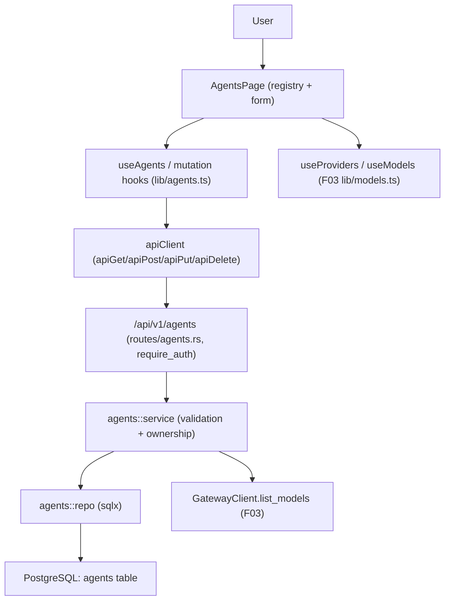

# Technical Specification: F04 Agents Dashboard

**Complexity:** medium

## Section 1: Technical Overview

**What:** A full CRUD surface for *agents* — reusable LLM behavior profiles owned by the authenticated user. The backend adds an `agents` table, a repository + service layer, and five protected REST endpoints (`create`, `list`, `get`, `update`, `delete`) plus a duplicate convenience built on create. The frontend replaces the placeholder Agents page with a registry list view and a create/edit form whose provider/model dropdowns are populated from the F03 catalog, with inline field-level validation.

**Why:** F07 (Flow Canvas) and F09 (Flow Execution Engine) consume agent configuration profiles (name, preamble, system prompt, provider, model, recent-N, top-K). F04 is the system of record for those profiles. All persistence must be scoped to the owning user via the F02 identity (`AuthUser`) and the existing `ensure_owner`/`NotFound` ownership pattern so no cross-tenant data leaks. Provider/model validity is enforced against the live F03 gateway catalog so invalid combinations cannot be saved.

**Scope:**

**Included** (full feature scope — F04 has no Core/Full split):
- `agents` table + migration `0003_agents.sql`, owned by `users.id` (FK).
- Agent repository (sqlx) and service (validation + uniqueness + provider/model validation against the F03 gateway).
- Protected REST endpoints: create, list, get-by-id, update, delete — all under `/api/v1/agents`, behind `require_auth`, scoped to the caller.
- Duplicate: client prefills the create form with `(copy)` appended to the name; no dedicated endpoint.
- Server-side validation matching the PRD field rules; server is the source of truth, client mirrors for inline UX.
- Frontend: `AgentsPage` registry list, `AgentForm` (create/edit/duplicate), provider/model dropdowns reusing `useProviders`/`useModels` (F03), inline validation, delete confirmation.
- The "which flows reference this agent" warning surface on the delete confirmation (see Assumptions — F08 flows table does not yet exist).
- POST/PUT/DELETE helpers added to the shared `apiClient`.

**Excluded:**
- Flow canvas/node behavior (F07), execution (F09), embedding/semantic profile fields (F05 adds those later).
- Any provider/key management (out of scope per PRD §7).
- Real cross-flow reference lookup at delete time until F08 exists (see Assumptions).

## Section 2: Architecture Impact

**Affected components:**
- Backend: `backend/migrations/0003_agents.sql` (new), `backend/src/agents/` (new module: `mod.rs`, `model.rs`, `repo.rs`, `service.rs`), `backend/src/routes/agents.rs` (new), `backend/src/routes/mod.rs` (modified — mount routes), `backend/src/error.rs` (modified — add validation/conflict variants), `backend/src/lib.rs` (modified — declare `agents` module), `backend/tests/agents_test.rs` (new).
- Frontend: `frontend/src/pages/AgentsPage.tsx` (modified), `frontend/src/components/agents/AgentForm.tsx` (new), `frontend/src/components/agents/AgentList.tsx` (new), `frontend/src/components/agents/DeleteAgentDialog.tsx` (new), `frontend/src/lib/agents.ts` (new — types + query/mutation hooks), `frontend/src/lib/agentValidation.ts` (new), `frontend/src/lib/apiClient.ts` (modified — add `apiPost`/`apiPut`/`apiDelete`).



## Section 3: Technical Decisions

| Decision | Chosen Approach | Alternative Considered | Trade-off |
|----------|----------------|------------------------|-----------|
| Duplicate mechanism | Client-side prefill of the create form with `(copy)` suffix; reuses the create endpoint | Dedicated `POST /agents/{id}/duplicate` server endpoint | No extra endpoint or server state; the PRD frames duplicate as a form-prefill UX, and uniqueness is still enforced on save. |
| Provider/model validation | Service validates `(provider, model)` against `GatewayClient.list_models(provider)` at create/update | Trust the client dropdowns only | Guarantees no invalid combo is persisted even if the client is bypassed; mirrors the F03 source of truth. Accepts one gateway round-trip per write. |
| New error variants | Add `Validation { code, message }` (422-style field error) and `Conflict(String)` to `AppError`, rendered through the existing envelope | Inline ad-hoc JSON per handler | Keeps the single error envelope and machine codes consistent with F02/F03. |
| Validation location | Manual checks in `agents::service` (no `validator` crate); client mirrors in `agentValidation.ts` | Add `validator`/`zod` dependencies | Matches the codebase's existing manual-validation idiom (auth/gateway do manual checks); avoids new deps. |
| Primary key | `uuid` server-generated (`gen_random_uuid()` via pgcrypto, already enabled in `0001_init.sql`) | Text/serial id | UUID matches the cross-feature convention and is referenced by F07 nodes. |
| Name uniqueness | DB unique constraint on `(owner_id, lower(name))` + pre-check in service for a friendly message | Application-only check | DB constraint is the hard guarantee against races; the service pre-check yields the PRD's field-level message. |

## Section 4: Component Overview

**Backend:**

| File Path | New/Modified | Purpose | Key Responsibilities |
|-----------|--------------|---------|----------------------|
| `backend/migrations/0003_agents.sql` | New | Schema | Create `agents` table, FK to `users`, unique index, supporting index. |
| `backend/src/agents/mod.rs` | New | Module root | Re-export model/repo/service; module doc. |
| `backend/src/agents/model.rs` | New | Types | `Agent` (`FromRow`, `Serialize`), `AgentInput` (`Deserialize`) request body, field constants (limits/defaults). |
| `backend/src/agents/repo.rs` | New | Data access | sqlx insert/select-all/select-by-id/update/delete, all filtered by `owner_id`. |
| `backend/src/agents/service.rs` | New | Business logic | Validate fields, enforce uniqueness, validate provider/model via `GatewayClient`, map to repo calls, ownership guard. |
| `backend/src/routes/agents.rs` | New | HTTP handlers | Five handlers returning the success envelope; pull `AuthUser`; delegate to service. |
| `backend/src/routes/mod.rs` | Modified | Routing | Mount `agents` routes on the protected router. |
| `backend/src/error.rs` | Modified | Errors | Add `Validation`/`Conflict` variants with codes + statuses. |
| `backend/src/lib.rs` | Modified | Module decl | Declare the `agents` module. |
| `backend/tests/agents_test.rs` | New | Integration tests | Auth + DB-backed CRUD, validation, uniqueness, ownership, provider/model checks. |

**Frontend:**

| File Path | New/Modified | Purpose | Key Responsibilities |
|-----------|--------------|---------|----------------------|
| `frontend/src/lib/apiClient.ts` | Modified | REST client | Add `apiPost`/`apiPut`/`apiDelete` over the existing `request` helper. |
| `frontend/src/lib/agents.ts` | New | Data hooks | `Agent` type; `useAgents`, `useCreateAgent`, `useUpdateAgent`, `useDeleteAgent` (react-query). |
| `frontend/src/lib/agentValidation.ts` | New | Validation | Pure functions mirroring server field rules for inline messages. |
| `frontend/src/components/agents/AgentForm.tsx` | New | Form | Controlled create/edit/duplicate form; provider→model dependency; inline errors; maps `ApiClientError` codes to fields. |
| `frontend/src/components/agents/AgentList.tsx` | New | Registry view | Render name/provider/model/recent-N/top-K with edit/duplicate/delete actions. |
| `frontend/src/components/agents/DeleteAgentDialog.tsx` | New | Confirmation | Delete confirmation; warns which flows reference the agent (see Assumptions). |
| `frontend/src/pages/AgentsPage.tsx` | Modified | Container | Compose list + form + dialog; manage create/edit/duplicate mode. |

**Database:**

| Migration File | Tables Affected | Operation | Notes |
|----------------|-----------------|-----------|-------|
| `0003_agents.sql` | `agents` | CREATE | Owned by `users(id)`; unique `(owner_id, lower(name))`; index on `owner_id`. |

## Section 5: API Contracts

All endpoints are mounted under `/api/v1` on the **protected** router (`require_auth`), and scoped to the authenticated caller (`AuthUser`). All responses use the platform envelope: success `{ "status": "success", "data": ... }`; error `{ "status": "error", "error": { "code", "message" } }`. Records owned by another user return `404 NOT_FOUND` (never revealing existence), per the F02 ownership pattern.

The agent object returned by every endpoint:

| Field | Type | Description |
|-------|------|-------------|
| `id` | `uuid` | Agent id |
| `name` | `string` | Unique per user |
| `preamble` | `string \| null` | Optional, ≤2000 chars |
| `system_prompt` | `string` | Required, ≤32000 chars |
| `provider` | `string` | Provider id from F03 catalog |
| `model` | `string` | Model id valid for `provider` |
| `recent_n` | `integer` | 0–100 |
| `top_k` | `integer` | 0–50 |
| `created_at` | `timestamptz` | Creation time |
| `updated_at` | `timestamptz` | Last update time |

Shared error codes:

| Code | HTTP Status | Description |
|------|-------------|-------------|
| `AGENT_VALIDATION` | 422 | A field failed validation; `message` carries the field-specific text. |
| `AGENT_NAME_TAKEN` | 409 | An agent with the same name already exists for this user. |
| `GW002` | 422 | Selected model is not available for this provider (reused from F03). |
| `GW001` | 503 | Provider catalog unavailable; cannot validate model. |
| `NOT_FOUND` | 404 | Agent does not exist or is owned by another user. |
| `AUTH001` | 401 | Missing/invalid token. |

### Endpoint: Create Agent
- **Method:** POST
- **Path:** `/api/v1/agents`
- **Authentication:** JWT Bearer (`require_auth`)

**Request:**

| Field | Type | Required | Validation | Description |
|-------|------|----------|------------|-------------|
| `name` | `string` | Yes | trimmed length 1–64; unique per user | Display name |
| `preamble` | `string \| null` | No | length ≤2000 | Injected before system params |
| `system_prompt` | `string` | Yes | length 1–32000 | Agent system prompt |
| `provider` | `string` | Yes | must exist in F03 catalog | Provider id |
| `model` | `string` | Yes | must be a model of `provider` | Model id |
| `recent_n` | `integer` | No | 0–100, default 10 | History depth cap |
| `top_k` | `integer` | No | 0–50, default 5 | Retrieval breadth cap |

**Request Example:**
```json
{
  "name": "Summarizer",
  "preamble": "You are concise.",
  "system_prompt": "Summarize the user input in three bullet points.",
  "provider": "openai",
  "model": "gpt-4o",
  "recent_n": 10,
  "top_k": 5
}
```

**Response (Success - 201):** the agent object (see table above).

**Response Example:**
```json
{
  "status": "success",
  "data": {
    "id": "660e8400-e29b-41d4-a716-446655440001",
    "name": "Summarizer",
    "preamble": "You are concise.",
    "system_prompt": "Summarize the user input in three bullet points.",
    "provider": "openai",
    "model": "gpt-4o",
    "recent_n": 10,
    "top_k": 5,
    "created_at": "2026-06-08T12:00:00Z",
    "updated_at": "2026-06-08T12:00:00Z"
  }
}
```

**Error Codes:** `AGENT_VALIDATION` (422), `AGENT_NAME_TAKEN` (409), `GW002` (422), `GW001` (503), `AUTH001` (401).

### Endpoint: List Agents
- **Method:** GET
- **Path:** `/api/v1/agents`
- **Authentication:** JWT Bearer

**Response (Success - 200):**

| Field | Type | Description |
|-------|------|-------------|
| `agents` | `array` | The caller's agents (each the agent object), ordered by `name` ascending. |

**Response Example:**
```json
{ "status": "success", "data": { "agents": [ { "id": "…", "name": "Summarizer", "provider": "openai", "model": "gpt-4o", "recent_n": 10, "top_k": 5, "preamble": null, "system_prompt": "…", "created_at": "…", "updated_at": "…" } ] } }
```

### Endpoint: Get Agent
- **Method:** GET
- **Path:** `/api/v1/agents/{id}`
- **Authentication:** JWT Bearer

**Response (Success - 200):** the agent object. **Errors:** `NOT_FOUND` (404).

### Endpoint: Update Agent
- **Method:** PUT
- **Path:** `/api/v1/agents/{id}`
- **Authentication:** JWT Bearer

**Request:** same body shape and validation as Create (full replacement of editable fields). Uniqueness check excludes the agent's own current name.

**Response (Success - 200):** the updated agent object. **Errors:** `AGENT_VALIDATION` (422), `AGENT_NAME_TAKEN` (409), `GW002` (422), `GW001` (503), `NOT_FOUND` (404).

### Endpoint: Delete Agent
- **Method:** DELETE
- **Path:** `/api/v1/agents/{id}`
- **Authentication:** JWT Bearer

**Response (Success - 200):**
```json
{ "status": "success", "data": { "id": "660e8400-e29b-41d4-a716-446655440001" } }
```

**Errors:** `NOT_FOUND` (404); generic `INTERNAL001` (500) on server failure (client restores the row and shows "Could not delete agent. Please retry.").

## Section 6: Data Model

**Table: `agents`**

| Column | Type | Nullable | Default | Description |
|--------|------|----------|---------|-------------|
| `id` | `uuid` | No | `gen_random_uuid()` | Primary key |
| `owner_id` | `text` | No | - | FK → `users(id)`; the owning user |
| `name` | `varchar(64)` | No | - | Display name, unique per user |
| `preamble` | `varchar(2000)` | Yes | `NULL` | Optional preamble |
| `system_prompt` | `varchar(32000)` | No | - | Required system prompt |
| `provider` | `text` | No | - | Provider id from F03 catalog |
| `model` | `text` | No | - | Model id valid for `provider` |
| `recent_n` | `integer` | No | `10` | History depth cap (0–100) |
| `top_k` | `integer` | No | `5` | Retrieval breadth cap (0–50) |
| `created_at` | `timestamptz` | No | `now()` | Creation time |
| `updated_at` | `timestamptz` | No | `now()` | Last update time |

**Indexes:**

| Index Name | Columns | Type | Purpose |
|------------|---------|------|---------|
| `ux_agents_owner_name` | `owner_id, lower(name)` | unique btree | Enforce name uniqueness per user (case-insensitive). |
| `ix_agents_owner` | `owner_id` | btree | Fast per-user listing. |

**Constraints:**

| Constraint | Type | Definition | Purpose |
|------------|------|------------|---------|
| `pk_agents` | PRIMARY KEY | `id` | Unique identifier |
| `fk_agents_owner` | FOREIGN KEY | `owner_id REFERENCES users(id) ON DELETE CASCADE` | Per-user ownership; remove agents with the user |
| `ck_agents_recent_n` | CHECK | `recent_n BETWEEN 0 AND 100` | Range guard |
| `ck_agents_top_k` | CHECK | `top_k BETWEEN 0 AND 50` | Range guard |

**Cross-Database Notes:** PostgreSQL only (pgvector stack). `gen_random_uuid()` via `pgcrypto` (already enabled in `0001_init.sql`). `timestamptz` + `now()` follow the `users` table convention.

**Migration Example:**
```sql
CREATE TABLE agents (
    id            UUID PRIMARY KEY DEFAULT gen_random_uuid(),
    owner_id      TEXT NOT NULL REFERENCES users(id) ON DELETE CASCADE,
    name          VARCHAR(64) NOT NULL,
    preamble      VARCHAR(2000),
    system_prompt VARCHAR(32000) NOT NULL,
    provider      TEXT NOT NULL,
    model         TEXT NOT NULL,
    recent_n      INTEGER NOT NULL DEFAULT 10 CHECK (recent_n BETWEEN 0 AND 100),
    top_k         INTEGER NOT NULL DEFAULT 5  CHECK (top_k BETWEEN 0 AND 50),
    created_at    TIMESTAMPTZ NOT NULL DEFAULT now(),
    updated_at    TIMESTAMPTZ NOT NULL DEFAULT now()
);

CREATE UNIQUE INDEX ux_agents_owner_name ON agents (owner_id, lower(name));
CREATE INDEX ix_agents_owner ON agents (owner_id);
```

## Section 7: Testing Strategy

**Test File Structure:**

| Test File | Test Type | Target | Coverage Goal |
|-----------|-----------|--------|---------------|
| `backend/tests/agents_test.rs` | Integration | `/api/v1/agents` endpoints + service | 85% |
| `backend/src/agents/service.rs` (`#[cfg(test)]`) | Unit | field validation helpers | 90% |
| `frontend/src/lib/agentValidation.test.ts` | Unit | client validation mirror | 90% |
| `frontend/src/lib/agents.test.ts` | Unit | query/mutation hooks (mock `apiClient`) | 85% |
| `frontend/src/components/agents/AgentForm.test.tsx` | Component | form behavior + provider/model dependency | 80% |

Backend integration tests follow the `gateway_test.rs` harness: an in-process mock LiteLLM `/model/info` router stands in for the gateway, tokens are signed with the embedded test key, and DB-dependent tests soft-skip when no `DATABASE_URL` is reachable.

**`backend/tests/agents_test.rs`:**

| Test Function | Description | Assertions |
|---------------|-------------|------------|
| `create_requires_auth` | No token → reject before any DB work | 401, `error.code == AUTH001` |
| `create_agent_success` | Valid create with all fields | 201, body is the agent with server `id`/timestamps |
| `create_applies_defaults` | Omit `recent_n`/`top_k` | `recent_n == 10`, `top_k == 5` |
| `create_empty_name_rejected` | Blank/whitespace name | 422, `AGENT_VALIDATION`, message names the field |
| `create_long_name_rejected` | name >64 chars | 422, `AGENT_VALIDATION` |
| `create_out_of_range_recent_n` | `recent_n = 200` | 422, message "Value must be between 0 and 100." |
| `create_out_of_range_top_k` | `top_k = 99` | 422, message "Value must be between 0 and 50." |
| `create_invalid_model_for_provider` | model not in provider's catalog | 422, `GW002` |
| `create_when_catalog_down` | gateway unreachable | 503, `GW001` |
| `duplicate_name_rejected` | Second create with same name (any case) | 409, `AGENT_NAME_TAKEN` |
| `list_returns_only_owner_agents` | Two users, list as one | only caller's agents, ordered by name |
| `get_other_users_agent_returns_404` | Fetch another user's id | 404, `NOT_FOUND` |
| `update_agent_success` | Edit fields | 200, persisted changes, `updated_at` advanced |
| `update_keeps_same_name_ok` | Update without changing name | 200 (self excluded from uniqueness) |
| `update_other_users_agent_404` | Update foreign id | 404 |
| `delete_agent_success` | Delete own agent | 200, `data.id` echoed, gone from list |
| `delete_other_users_agent_404` | Delete foreign id | 404 |

**`frontend/src/lib/agents.test.ts`:** `useAgents` requests `/agents` and returns the list; `useCreateAgent` POSTs the body and invalidates the agents query; `useUpdateAgent` PUTs to `/agents/{id}`; `useDeleteAgent` DELETEs and invalidates.

**`frontend/src/components/agents/AgentForm.test.tsx`:** model dropdown is disabled until a provider is chosen; selecting a provider enables and populates models; changing provider clears an incompatible model; empty name and out-of-range integers show inline messages; an `AGENT_NAME_TAKEN` API error maps to the name field message "An agent named '{name}' already exists."; duplicate mode prefills name with "(copy)".

**Acceptance tests (PRD §9 F04):**
- Create with all seven fields succeeds; empty/duplicate names and out-of-range recent-N/top-K are blocked → `create_agent_success`, `create_empty_name_rejected`, `duplicate_name_rejected`, `create_out_of_range_recent_n`, `create_out_of_range_top_k`, AgentForm inline tests.
- Model dropdown disabled until provider selected and lists only that provider's models → AgentForm provider/model tests.
- Edit, duplicate ("(copy)"), delete → `update_agent_success`, AgentForm duplicate test, `delete_agent_success`.
- Registry list shows name/provider/model/recent-N/top-K → AgentList render test + `list_returns_only_owner_agents`.
- Agents not visible to other users → `list_returns_only_owner_agents`, `get_other_users_agent_returns_404`.

**Integration tests (PRD §9 Cross-Feature):**
- L556: F03 catalog populates and filters F04 dropdowns so invalid combos cannot be saved → AgentForm provider/model dependency test + `create_invalid_model_for_provider`.
- L559: agent profiles from the registry appear as draggable nodes on the canvas (F07) → covered by the stable agent object contract returned by list/get (the F07 consumer test lives in F07); asserted here via the agent object shape in `create_agent_success`/`list_returns_only_owner_agents`.
- L563: F02 identity scopes all agents so no cross-user data returns → `list_returns_only_owner_agents`, `get_other_users_agent_returns_404`, `update_other_users_agent_404`, `delete_other_users_agent_404`.

## Assumptions and Decisions

These were applied under Batch Mode Auto-Accept where the PRD/codebase did not fully specify a detail. Review and override as needed.

1. **Duplicate is client-side prefill, not an endpoint** (Auto-Accept: technical decision with a clear recommendation). The PRD describes duplicate as "prefills the form with '(copy)' appended"; implemented as a UI affordance over the create endpoint rather than a server `duplicate` route.
2. **Provider/model validated server-side against the F03 gateway** (clear recommendation). The PRD says invalid combinations "cannot be saved"; the service calls `GatewayClient.list_models(provider)` and rejects with `GW002` if the model is absent, reusing F03's existing error variant.
3. **New `AppError` variants `Validation`/`Conflict`** with codes `AGENT_VALIDATION` (422) and `AGENT_NAME_TAKEN` (409) (clear recommendation). Reuses the existing single error envelope; statuses chosen to match REST conventions (422 unprocessable for field validation, 409 conflict for uniqueness).
4. **Case-insensitive name uniqueness** via `unique (owner_id, lower(name))` (partial-spec default). The PRD says "unique per user" without specifying case sensitivity; case-insensitive prevents confusing near-duplicates and is the safer default.
5. **`updated_at` semantics** follow the `users` table (`now()` default, refreshed on update in the UPDATE statement) (codebase pattern adherence).
6. **Update is a full replacement (PUT)** of editable fields rather than PATCH (clear recommendation), matching the single create/edit form which always submits the complete object.
7. **`ON DELETE CASCADE` on `owner_id`** (best-practice default). Not specified by the PRD; chosen so a removed user's agents are cleaned up, consistent with per-user data isolation.
8. **List ordering by `name` ascending** (partial-spec default). The PRD does not specify list order; alphabetical is the predictable default for a registry.
9. **Delete "which flows reference this agent" warning is a placeholder until F08 exists** (dependency-aware default). F08 (Flow Persistence) is wave 6 and not yet implemented; there is no `flows` table to query. The `DeleteAgentDialog` renders the confirmation and a referenced-flows section that is empty/omitted now, with a stable seam (`referencedFlows` prop, default `[]`) for F08 to populate later. This keeps the PRD's delete-confirmation experience without inventing a non-existent table.
10. **String length limits enforced as `varchar(N)` plus service-side trimmed checks** (codebase + best practice). DB caps are a backstop; the service trims and validates to produce the PRD's field-level messages before hitting the DB.
11. **`apiClient` gains `apiPost`/`apiPut`/`apiDelete`** built on the existing `request` helper (codebase pattern adherence). The current client only exposes `apiGet`; F04 is the first writer and adds the symmetric verbs.
12. **No new dependencies** (clear recommendation). Validation stays manual (no `validator`/`zod`/`react-hook-form`), matching the existing auth/gateway and frontend conventions.
