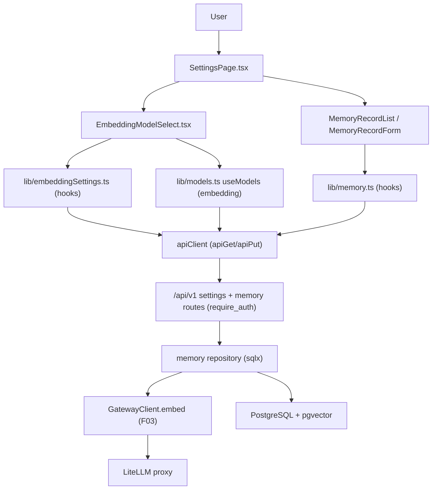

# Technical Specification: Embedding & Semantic Memory Configuration

**Complexity:** medium

## Section 1: Technical Overview

**What:** A per-user embedding configuration and semantic-memory store. Users pick a global embedding model (default for all retrieval), optionally attach a per-agent semantic profile that overrides the embedding model and memory scope for a single agent, and manage memory records — text blocks that are embedded via the F03 gateway on save and persisted as pgvector vectors in PostgreSQL. The frontend exposes a settings panel (global model dropdown plus a memory-records list with add/edit/delete) and surfaces embedding-in-progress → stored/ready states.

**Why:** F06 (Vector Retrieval / RAG) needs (a) a configured embedding model per user and per agent, and (b) a body of pre-embedded memory vectors to match against by cosine similarity. F05 provides both: the model-selection settings and the embedded record store. It builds directly on the F03 gateway's `embed()` service (vector generation) and provider/model catalog (embedding-model list), and on F02's per-user record scoping (`users.id` FK, `ensure_owner`).

**Scope:**

**Included** (full feature scope — F05 has no Core/Full split):
- Global per-user embedding-model setting (get/set), validated against the F03 embedding-model catalog.
- Optional per-agent semantic profile: overrides embedding model + memory scope for one agent.
- Memory records CRUD: create (embed-on-save), list, edit (re-embed), delete — each ≤8,000 chars.
- Each stored record retains source text, embedding vector, embedding model used, and owner.
- Embedding-model dropdown sourced from F03 (`mode == "embedding"` models).
- Settings-panel UI with embedding-in-progress → stored/ready states.
- Error handling: embedding-failure-not-stored, embedding-model-changed warning, size-limit message.

**Excluded** (per PRD Section 7 "Memory management" and deferred to F06):
- Cosine-similarity retrieval / RAG query execution (F06).
- Automatic re-embedding or migration when the global model changes — the change is *flagged* to the user; re-embedding is a manual per-record edit.
- Bulk import / ETL of memory records from external sources.

## Section 2: Architecture Impact

**Affected components (file paths):**

Backend (`backend/src/`):
- `migrations/0003_embedding_memory.sql` — new tables `user_embedding_settings`, `agent_semantic_profiles`, `memory_records`.
- `routes/settings.rs` — new: global embedding-setting + semantic-profile endpoints.
- `routes/memory.rs` — new: memory-record CRUD endpoints.
- `routes/mod.rs` — modified: mount the new protected routes.
- `memory/mod.rs`, `memory/store.rs`, `memory/settings.rs` — new: sqlx repository layer for settings, profiles, and records (embed-on-save orchestration).
- `memory/types.rs` — new: domain DTOs (settings, profile, record).
- `error.rs` — modified: add F05 error variant (oversized record); reuse existing gateway error variants.
- `lib.rs` — modified: declare `pub mod memory;`.
- `app.rs` / `state.rs` — unchanged (reuse existing `AppState.db`, `AppState.gateway`).

Frontend (`frontend/src/`):
- `lib/apiClient.ts` — modified: add `apiPost`/`apiPut`/`apiDelete` helpers (only `apiGet` exists today).
- `lib/embeddingSettings.ts` — new: hooks for the global setting + semantic profiles.
- `lib/memory.ts` — new: hooks for memory-record CRUD.
- `lib/models.ts` — reused: `useModels` filtered to `mode === "embedding"`.
- `pages/SettingsPage.tsx` — new: the settings panel container.
- `components/EmbeddingModelSelect.tsx` — new: global embedding-model dropdown.
- `components/MemoryRecordList.tsx`, `components/MemoryRecordForm.tsx` — new: list + add/edit form with in-progress/ready states.
- `components/NavBar.tsx` — modified: add a "Settings" nav link.
- `routes/router.tsx` — modified: add the protected `/settings` route.



## Section 3: Technical Decisions

| Decision | Chosen Approach | Alternative Considered | Trade-off |
|----------|-----------------|------------------------|-----------|
| Vector column type / dimension | `vector` column with **no fixed dimension** (`vector` not `vector(N)`); dimension varies by model (`text-embedding-3-small`=1536, others differ) | Fixed `vector(1536)` | Flexible across models F05 must support; F06 must filter by `embedding_model` before similarity (cross-model vectors are not comparable). PRD F06 already excludes mismatched records. |
| Binding `Vec<f32>` ↔ `vector` | Add the **`pgvector`** Rust crate (`pgvector = { version = "0.4", features = ["sqlx"] }`) for native sqlx encode/decode | Serialize the vector to a `[..]` text literal by hand | Crate is the maintained, type-safe path matching the existing sqlx-first style; one new dependency (auto-accepted, documented below). |
| Vector index | **No ANN index in F05** (no `ivfflat`/`hnsw`); add it in F06 when query patterns are known | Create `hnsw` index now | F05 only writes records; an ANN index on an unbounded `vector` (no dim) is invalid anyway. F06 owns retrieval + its index. Documented assumption. |
| Embed-on-save orchestration | Repository calls `gateway.embed()` **before** the DB insert; insert only on success → failed embedding is never stored | Insert row then embed asynchronously | Satisfies PRD "record is not stored on embedding failure"; simplest, matches the synchronous request/response style of F03/F04. |
| Global setting storage | One-row-per-user table `user_embedding_settings`, upserted (mirrors `users` upsert idiom) | Column on `users` | Keeps F02's `users` table owned by F02; F05 owns its own table; upsert idiom already established. |
| Embedding-model-changed warning | Computed in the **frontend** by comparing the newly selected global model against the embedding models present in the user's records (exposed via `models_in_use`) | Persist a flag server-side | No server state needed; the warning is advisory only (PRD defers actual re-embedding). |
| Endpoint validation of model | Backend validates the chosen embedding model exists in the F03 catalog with `mode == "embedding"` before persisting the setting | Trust the client dropdown | Prevents invalid model strings; reuses `gateway.list_models`. |

## Section 4: Component Overview

**Backend:**

| File Path | New/Modified | Purpose | Key Responsibilities |
|-----------|--------------|---------|----------------------|
| `backend/src/memory/types.rs` | New | F05 domain DTOs | `EmbeddingSetting`, `SemanticProfile`, `MemoryRecord` (+ request payloads); `sqlx::FromRow` + `Serialize` |
| `backend/src/memory/settings.rs` | New | Settings repository | Upsert/get global embedding setting; upsert/get/delete per-agent semantic profile; validate model against F03 catalog |
| `backend/src/memory/store.rs` | New | Memory-record repository | Embed-on-save (calls `gateway.embed`), insert/list/update/delete scoped by owner; distinct-model list for the change warning |
| `backend/src/memory/mod.rs` | New | Module wiring | Re-export repos/types; shared char-limit constant (8,000) |
| `backend/src/routes/settings.rs` | New | Settings endpoints | `GET/PUT /settings/embedding`; `GET/PUT/DELETE /agents/{agent_id}/semantic-profile` |
| `backend/src/routes/memory.rs` | New | Memory endpoints | `GET/POST /memory`, `PUT/DELETE /memory/{id}`; size-limit guard; owner guard |
| `backend/src/routes/mod.rs` | Modified | Mount routes | Add the new routes to the protected router |
| `backend/src/error.rs` | Modified | Error variants | Add `MemoryRecordTooLarge` + `NoEmbeddingModel`; reuse `GatewayUnavailable`/`ProviderError`/`InvalidModelForProvider`/`NotFound` |
| `backend/src/lib.rs` | Modified | Module declaration | `pub mod memory;` |

**Frontend:**

| File Path | New/Modified | Purpose | Key Responsibilities |
|-----------|--------------|---------|----------------------|
| `frontend/src/lib/apiClient.ts` | Modified | REST helpers | Add `apiPost`, `apiPut`, `apiDelete` mirroring `apiGet` envelope handling |
| `frontend/src/lib/embeddingSettings.ts` | New | Settings hooks | `useEmbeddingSetting`, `useSetEmbeddingSetting`, `useSemanticProfile`, `useSetSemanticProfile`, `useDeleteSemanticProfile` |
| `frontend/src/lib/memory.ts` | New | Memory hooks | `useMemoryRecords`, `useCreateMemoryRecord`, `useUpdateMemoryRecord`, `useDeleteMemoryRecord` |
| `frontend/src/pages/SettingsPage.tsx` | New | Settings panel container | Compose model select + record list; route target `/settings` |
| `frontend/src/components/EmbeddingModelSelect.tsx` | New | Global model dropdown | Lists embedding-mode models; emits change warning when records exist in another model |
| `frontend/src/components/MemoryRecordList.tsx` | New | Record list | Render records, ready/in-progress badge, edit/delete actions |
| `frontend/src/components/MemoryRecordForm.tsx` | New | Add/edit form | Char counter (≤8,000), in-progress state on submit, surfaces embed errors |
| `frontend/src/components/NavBar.tsx` | Modified | Nav | Add "Settings" link |
| `frontend/src/routes/router.tsx` | Modified | Routing | Add protected `/settings` child route |

**Database:**

| Migration File | Tables Affected | Operation | Notes |
|----------------|-----------------|-----------|-------|
| `backend/migrations/0003_embedding_memory.sql` | `user_embedding_settings`, `agent_semantic_profiles`, `memory_records` | CREATE | pgvector extension already enabled in `0001_init.sql`; no extension change needed |

## Section 5: API Contracts

All endpoints are mounted under `/api/v1`, behind `require_auth`. All responses use the platform envelope `{ "status": "success", "data": ... }` or `{ "status": "error", "error": { "code", "message" } }`. Owner scoping is implicit: every query filters by `AuthUser.id`; cross-user access returns `404 NOT_FOUND` via `ensure_owner`.

### Endpoint: Get Global Embedding Setting
- **Method:** GET
- **Path:** `/api/v1/settings/embedding`
- **Authentication:** JWT Bearer

**Response (200):**

| Field | Type | Description |
|-------|------|-------------|
| `data.embedding_model` | `string \| null` | Selected global model; `null` if never set |

```json
{ "status": "success", "data": { "embedding_model": "text-embedding-3-small" } }
```

### Endpoint: Set Global Embedding Setting
- **Method:** PUT
- **Path:** `/api/v1/settings/embedding`
- **Authentication:** JWT Bearer

**Request:**

| Field | Type | Required | Validation | Description |
|-------|------|----------|------------|-------------|
| `embedding_model` | `string` | Yes | must exist in F03 catalog with `mode == "embedding"` | Global default model |

```json
{ "embedding_model": "text-embedding-3-small" }
```

**Response (200):** same shape as Get.

**Error Codes:**

| Code | HTTP Status | Description |
|------|-------------|-------------|
| `GW002` | 422 | Model not an available embedding model |
| `GW001` | 503 | Gateway unreachable while validating model |

### Endpoint: Get / Set / Delete Per-Agent Semantic Profile
- **Methods:** GET / PUT / DELETE
- **Path:** `/api/v1/agents/{agent_id}/semantic-profile`
- **Authentication:** JWT Bearer

**PUT Request:**

| Field | Type | Required | Validation | Description |
|-------|------|----------|------------|-------------|
| `embedding_model` | `string` | Yes | F03 embedding model | Overrides global model for this agent |
| `memory_scope` | `string` | No | enum: `all`, `own` (default `all`) | Memory scope for this agent's retrieval (consumed by F06) |

```json
{ "embedding_model": "text-embedding-3-large", "memory_scope": "own" }
```

**GET Response (200):**

| Field | Type | Description |
|-------|------|-------------|
| `data.agent_id` | `uuid` | Agent reference |
| `data.embedding_model` | `string` | Override model |
| `data.memory_scope` | `string` | `all` or `own` |

**Error Codes:**

| Code | HTTP Status | Description |
|------|-------------|-------------|
| `NOT_FOUND` | 404 | No profile for this agent, or agent owned by another user |
| `GW002` | 422 | Override model not an embedding model |

### Endpoint: List Memory Records
- **Method:** GET
- **Path:** `/api/v1/memory`
- **Authentication:** JWT Bearer

**Response (200):** `data.records` — array of records (vector omitted from the list payload for size; `embedding_model` + char count included); `data.models_in_use` — distinct embedding models across the user's records (drives the change warning).

```json
{
  "status": "success",
  "data": {
    "records": [
      {
        "id": "660e8400-e29b-41d4-a716-446655440001",
        "text": "Our return policy allows 30 days…",
        "embedding_model": "text-embedding-3-small",
        "char_count": 34,
        "created_at": "2026-06-08T12:00:00Z",
        "updated_at": "2026-06-08T12:00:00Z"
      }
    ],
    "models_in_use": ["text-embedding-3-small"]
  }
}
```

### Endpoint: Create Memory Record (embed-on-save)
- **Method:** POST
- **Path:** `/api/v1/memory`
- **Authentication:** JWT Bearer

**Request:**

| Field | Type | Required | Validation | Description |
|-------|------|----------|------------|-------------|
| `text` | `string` | Yes | 1–8,000 chars | Source text to embed and store |

```json
{ "text": "Our return policy allows 30 days for unopened items." }
```

**Response (201):** the created record (without the raw vector array) plus `embedding_model` used.

```json
{
  "status": "success",
  "data": {
    "id": "660e8400-e29b-41d4-a716-446655440001",
    "text": "Our return policy allows 30 days for unopened items.",
    "embedding_model": "text-embedding-3-small",
    "char_count": 52,
    "created_at": "2026-06-08T12:00:00Z",
    "updated_at": "2026-06-08T12:00:00Z"
  }
}
```

**Error Codes:**

| Code | HTTP Status | Description |
|------|-------------|-------------|
| `MEM001` | 422 | Memory record must be 8,000 characters or fewer |
| `MEM002` | 409 | No global embedding model set (set one first) |
| `GW003` | 502 | Embedding generation failed → record not stored |
| `GW001` | 503 | Gateway unreachable → record not stored |

### Endpoint: Update Memory Record (re-embed)
- **Method:** PUT
- **Path:** `/api/v1/memory/{id}`
- **Authentication:** JWT Bearer

Same request/validation as Create. Re-embeds with the user's current global model and replaces text + vector + `embedding_model`. `404` if not owned.

### Endpoint: Delete Memory Record
- **Method:** DELETE
- **Path:** `/api/v1/memory/{id}`
- **Authentication:** JWT Bearer

**Response (200):** `{ "status": "success", "data": { "id": "…" } }`. `404` if not owned.

## Section 6: Data Model

**Table: `user_embedding_settings`**

| Column | Type | Nullable | Default | Description |
|--------|------|----------|---------|-------------|
| `user_id` | `text` | No | - | PK + FK → `users(id)`; one row per user |
| `embedding_model` | `text` | No | - | Selected global embedding model id |
| `created_at` | `timestamptz` | No | `now()` | Row creation |
| `updated_at` | `timestamptz` | No | `now()` | Last change |

**Table: `agent_semantic_profiles`**

| Column | Type | Nullable | Default | Description |
|--------|------|----------|---------|-------------|
| `agent_id` | `uuid` | No | - | PK + FK → `agents(id)` (F04) |
| `user_id` | `text` | No | - | FK → `users(id)`; owner scope |
| `embedding_model` | `text` | No | - | Per-agent override model |
| `memory_scope` | `text` | No | `'all'` | `all` or `own` (consumed by F06) |
| `created_at` | `timestamptz` | No | `now()` | |
| `updated_at` | `timestamptz` | No | `now()` | |

**Table: `memory_records`**

| Column | Type | Nullable | Default | Description |
|--------|------|----------|---------|-------------|
| `id` | `uuid` | No | `gen_random_uuid()` | PK |
| `user_id` | `text` | No | - | FK → `users(id)`; owner scope |
| `text` | `text` | No | - | Source text (≤8,000 chars, enforced in app + CHECK) |
| `embedding` | `vector` | No | - | pgvector embedding (dimension varies by model) |
| `embedding_model` | `text` | No | - | Model used to embed this record |
| `created_at` | `timestamptz` | No | `now()` | |
| `updated_at` | `timestamptz` | No | `now()` | |

**Indexes:**

| Index Name | Columns | Type | Purpose |
|------------|---------|------|---------|
| `ix_memory_records_user` | `user_id` | btree | Owner-scoped listing |
| `ix_memory_records_user_model` | `user_id, embedding_model` | btree | F06 filters comparable vectors by model |
| `ix_agent_semantic_profiles_user` | `user_id` | btree | Owner scope |

*No ANN (ivfflat/hnsw) index in F05 — added by F06 with its retrieval query shape.*

**Constraints:**

| Constraint | Type | Definition | Purpose |
|------------|------|------------|---------|
| `pk_user_embedding_settings` | PRIMARY KEY | `user_id` | One setting row per user |
| `fk_user_embedding_settings_user` | FOREIGN KEY | `user_id REFERENCES users(id) ON DELETE CASCADE` | Owner integrity |
| `pk_agent_semantic_profiles` | PRIMARY KEY | `agent_id` | One profile per agent |
| `fk_agent_semantic_profiles_agent` | FOREIGN KEY | `agent_id REFERENCES agents(id) ON DELETE CASCADE` | F04 coupling (see Assumptions) |
| `pk_memory_records` | PRIMARY KEY | `id` | Unique record |
| `fk_memory_records_user` | FOREIGN KEY | `user_id REFERENCES users(id) ON DELETE CASCADE` | Owner integrity |
| `ck_memory_records_text_len` | CHECK | `char_length(text) <= 8000` | DB-level size guard |

**Migration Example:**
```sql
-- pgvector + pgcrypto already enabled in 0001_init.sql.

CREATE TABLE user_embedding_settings (
    user_id         TEXT PRIMARY KEY REFERENCES users(id) ON DELETE CASCADE,
    embedding_model TEXT NOT NULL,
    created_at      TIMESTAMPTZ NOT NULL DEFAULT now(),
    updated_at      TIMESTAMPTZ NOT NULL DEFAULT now()
);

CREATE TABLE agent_semantic_profiles (
    agent_id        UUID PRIMARY KEY REFERENCES agents(id) ON DELETE CASCADE,
    user_id         TEXT NOT NULL REFERENCES users(id) ON DELETE CASCADE,
    embedding_model TEXT NOT NULL,
    memory_scope    TEXT NOT NULL DEFAULT 'all',
    created_at      TIMESTAMPTZ NOT NULL DEFAULT now(),
    updated_at      TIMESTAMPTZ NOT NULL DEFAULT now()
);
CREATE INDEX ix_agent_semantic_profiles_user ON agent_semantic_profiles(user_id);

CREATE TABLE memory_records (
    id              UUID PRIMARY KEY DEFAULT gen_random_uuid(),
    user_id         TEXT NOT NULL REFERENCES users(id) ON DELETE CASCADE,
    text            TEXT NOT NULL CHECK (char_length(text) <= 8000),
    embedding       VECTOR NOT NULL,
    embedding_model TEXT NOT NULL,
    created_at      TIMESTAMPTZ NOT NULL DEFAULT now(),
    updated_at      TIMESTAMPTZ NOT NULL DEFAULT now()
);
CREATE INDEX ix_memory_records_user ON memory_records(user_id);
CREATE INDEX ix_memory_records_user_model ON memory_records(user_id, embedding_model);
```

*Cross-DB note: the project is PostgreSQL-only (sqlx `postgres` feature, pgvector). `vector`, `gen_random_uuid()`, and `timestamptz` are used directly with no SQLite fallback, consistent with F01–F04.*

## Section 7: Testing Strategy

**Test File Structure:**

| Test File | Test Type | Target | Coverage Goal |
|-----------|-----------|--------|---------------|
| `backend/tests/memory_test.rs` | Integration | settings + memory endpoints | 80% |
| `backend/src/memory/store.rs` (inline `#[cfg(test)]`) | Unit | size-limit guard | char-limit boundary |
| `frontend/src/lib/embeddingSettings.test.ts` | Unit | settings hooks | request paths + payloads |
| `frontend/src/lib/memory.test.ts` | Unit | memory hooks | request paths + payloads |
| `frontend/src/components/MemoryRecordForm.test.tsx` | Unit | form states | size guard + in-progress/ready |

Integration tests follow the `gateway_test.rs` idiom: an in-process axum mock stands in for the LiteLLM proxy (`/embeddings`, `/model/info`), tests soft-skip when no `DATABASE_URL`/`REDIS_URL` is reachable, and authenticated requests use the RS256 `make_token` helper.

**`backend/tests/memory_test.rs`:**

| Test Function | Description | Assertions |
|---------------|-------------|------------|
| `settings_endpoints_require_auth` | No token | 401 `AUTH001` |
| `set_and_get_global_embedding_model` | PUT then GET | model persisted, success envelope |
| `set_global_model_rejects_non_embedding_model` | PUT a chat-mode model | 422 `GW002` |
| `create_memory_record_embeds_and_stores` | POST valid text | 201, vector stored, mock `/embeddings` hit once |
| `create_memory_record_too_large_rejected` | POST >8,000 chars | 422 `MEM001`, no DB row |
| `create_memory_without_global_model_rejected` | POST before setting model | 409 `MEM002` |
| `create_memory_record_embedding_failure_not_stored` | mock returns 500 | 502 `GW003`, no DB row |
| `list_memory_returns_only_owner_records` | two users | each sees only its own, no leakage |
| `update_memory_record_reembeds` | PUT changed text | text + model updated, embed re-called |
| `delete_memory_record` | DELETE own / other's | 200 own, 404 other |
| `set_semantic_profile_overrides_model` | PUT profile | stored with override model + scope |

**Acceptance tests (PRD Section 9, F05):**

| Test Function | Maps to AC | Assertions |
|---------------|------------|------------|
| `set_and_get_global_embedding_model` | "set a global embedding model from the catalog" | persisted + readable |
| `set_semantic_profile_overrides_model` | "attach a per-agent semantic profile that overrides the global model" | override stored per agent |
| `create_memory_record_embeds_and_stores` + `create_memory_record_too_large_rejected` | "saving embeds and stores text/vector/model; oversized rejected" | stored fields + 422 |
| `create_memory_record_embedding_failure_not_stored` | "if embedding fails, record not stored and error shown" | 502 + zero rows |

**Cross-Feature Integration tests (PRD Section 9):**

| Test Function | Maps to | Assertions |
|---------------|---------|------------|
| `embedding_model_dropdown_lists_only_embedding_models` (frontend `EmbeddingModelSelect` test) | Line 557: F03 catalog populates F05 selectors | dropdown shows only `mode === "embedding"` models |
| `stored_records_retain_vector_and_model_for_f06` (`memory_test.rs`) | Line 558: F05 vectors + model used by F06 | stored row exposes `embedding` + `embedding_model` queryable by `(user_id, embedding_model)` |
| `list_memory_returns_only_owner_records` (`memory_test.rs`) | Line 563: F02 identity scopes F05 records | cross-user list/get/delete returns only owner data / 404 |

## Assumptions & Decisions (Batch Auto-Accept)

Recorded per the spec-writer Batch Mode Auto-Accept Policy. The PRD did not answer these; defaults are best-practice and reviewable.

1. **F04 agents coupling (FK to `agents`).** The PRD couples the per-agent semantic profile to an agent, but F04 (Agents Dashboard) is being spec'd in the *same batch* and the `agents` table does not yet exist. *Assumption:* F05's `agent_semantic_profiles.agent_id` references `agents(id)` with `ON DELETE CASCADE`, and F04 will create an `agents` table with a `uuid` `id` PK owned by `users(id)`. If F04 lands a different PK type or table name, migration `0003` must be aligned before it runs. *(Policy row: "Feature requires new technology not present in the codebase" / dependency satisfied in-batch.)*

2. **New dependency `pgvector` crate.** No Rust crate currently binds `Vec<f32>` to a pgvector column. *Decision:* add `pgvector = { version = "0.4", features = ["sqlx"] }` to `backend/Cargo.toml`. *(Policy row: "Feature requires new technology not present in the codebase" — auto-confirm + document.)*

3. **Unbounded `vector` column (no fixed dimension).** F05 must support multiple embedding models with different dimensionalities. *Decision:* use `VECTOR` (no `(N)`), and store `embedding_model` alongside so F06 can group comparable vectors. No ANN index in F05.

4. **No global model set → memory creation blocked (`MEM002`, 409).** The PRD says records use the global model but doesn't define the "no model yet" path. *Decision:* require a global model before any record is created; surface a clear 409 so the UI can prompt the user to pick a model first.

5. **`memory_scope` enum = `all` | `own`, default `all`.** PRD names "memory scope" as part of the per-agent profile but does not enumerate values. *Decision:* two values (`all` = all of the user's records, `own` = records scoped to this agent), default `all`; F06 consumes the field. Minimal, extensible.

6. **Embedding-model-changed warning is client-side + advisory.** PRD defers automatic re-embedding (Section 7). *Decision:* the list endpoint returns `models_in_use`; the frontend warns when the newly selected global model differs from models present in existing records. No server-side flag or migration.

7. **Edit re-embeds with the current global model.** PRD lists edit/delete but not re-embed semantics. *Decision:* editing a record's text re-embeds it with the user's *current* global model and updates `embedding_model`, keeping the record self-consistent.

8. **Settings panel route = `/settings`, added to nav.** PRD says "a settings panel" without a route. *Decision:* new protected `/settings` route + a NavBar link, mirroring the existing `/agents`/`/flows` shell pattern.

9. **Add `apiPost`/`apiPut`/`apiDelete`.** The frontend client currently exposes only `apiGet`. *Decision:* extend `apiClient.ts` with the three write helpers using the identical envelope/error handling, since F05 is the first write-capable feature on the client.

**Traceability (PRD → spec):** Consumes (F03 catalog/embed) → Section 5 model-validation + embed-on-save; Provides (global/per-agent model selection + stored vectors) → Section 6 tables + Section 5 endpoints; Capabilities → Sections 5–6; Experience (settings panel, in-progress/ready) → Section 4 frontend components; Error Handling (embed-fail-not-stored, model-changed warning, size limit) → Section 5 error codes + Decisions 4/6; Section 9 ACs + cross-feature criteria (557/558/563) → Section 7.
