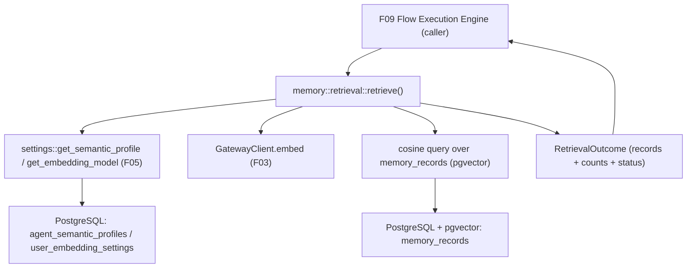

# Technical Specification: Vector Retrieval (RAG)

**Complexity:** simple

## Section 1: Technical Overview

**What:** An internal retrieval service that, given an agent and an input prompt, embeds the prompt via the F03 gateway, runs a cosine-similarity search over the user's stored F05 memory vectors, and returns the top-K most similar records as a structured outcome. It resolves which embedding model to use (the agent's per-agent semantic profile override if present, otherwise the user's global model), filters to the comparable embedding space, and degrades gracefully — any internal failure yields a "skipped" outcome rather than an error, so a flow run never fails because of retrieval.

**Why:** F09 (Flow Execution Engine) needs relevant memory context for each node it executes. F06 is that retrieval step: it turns the node's prompt plus the agent's Top-K override into a ranked set of memory records that F09 injects into the node's input ahead of the forwarded upstream output, and it reports counts so F09 can surface retrieval in the node's execution event. F06 builds directly on F03's `GatewayClient.embed()` (vector generation) and F05's `memory_records` store (the embedded corpus + `embedding_model`) and `agent_semantic_profiles` / `user_embedding_settings` (model selection), all scoped to the F02 user identity.

**Scope:**

**Included** (full feature scope — F06 has no Core/Full split):
- A `retrieve(...)` service in the `memory` module that F09 calls in-process: embed prompt → cosine search → ranked top-K.
- Embedding-model resolution: per-agent semantic profile override (F05) if set, else the user's global embedding model (F05).
- Cosine-similarity search over `memory_records` filtered by `(user_id, embedding_model)` so only comparable vectors are ranked; Top-K honors the agent's `top_k` override (0–50; `0` disables retrieval).
- A structured `RetrievalOutcome` (ranked records with similarity scores, retrieved count, mismatched-excluded count, and an OK/Skipped status with reason) for F09 to consume and to emit in execution events.
- Graceful degradation: embedding failure, search failure, or no-model-configured → a flagged Skipped outcome with zero records; never an error to the caller.
- Exclusion of embedding-space mismatches (records embedded with a different model), with the excluded count reported.

**Excluded:**
- Any HTTP/REST endpoint — F06 is consumed in-process by F09; there is no user-facing retrieval API (consistent with the PRD, which scopes F06 as a system capability).
- Prompt assembly / injection ordering — F06 returns the ranked records; F09 owns assembling them ahead of the forwarded upstream output and emitting the execution event.
- The actual node execution, DAG traversal, and event emission (F09).
- `memory_scope = "own"` behavior — not actionable yet (see Assumptions); F06 retrieves across all of the user's records in the resolved model space.
- An ANN (ivfflat/hnsw) index — not possible on the unbounded `vector` column; exact cosine scan is used (see Decisions).

## Section 2: Architecture Impact

**Affected components (file paths):**

Backend (`backend/src/`):
- `memory/retrieval.rs` — new: the `retrieve()` orchestration, `RetrievalOutcome` / `RetrievedRecord` / `RetrievalStatus` types, model resolution, the cosine query, and graceful-degradation handling.
- `memory/mod.rs` — modified: declare `pub mod retrieval;` and re-export the retrieval types + function.
- `memory/settings.rs` — reused (read-only): `get_embedding_model` (global) and `get_semantic_profile` (per-agent override).
- `gateway/embedding.rs` — reused: `GatewayClient.embed()` for the prompt vector.
- `error.rs`, `state.rs`, `routes/` — unchanged (no new errors, no new state, no new routes).
- `backend/tests/retrieval_test.rs` — new: integration tests calling `retrieve()` directly against a live DB + mock embeddings proxy.



## Section 3: Technical Decisions

| Decision | Chosen Approach | Alternative Considered | Trade-off |
|----------|-----------------|------------------------|-----------|
| Interface | Internal Rust service `memory::retrieval::retrieve()` consumed in-process by F09; no REST endpoint | A protected `POST /memory/search` debug endpoint | The PRD scopes F06 as a system capability with no UI; F09 consumes it in-process. A REST endpoint would be dead surface until F09 and add an unspecified contract. Tested by calling the function directly (the F03 `embed`/`complete` tests already use this idiom). |
| Failure handling | `retrieve()` is infallible to the caller: it returns a `RetrievalOutcome` whose `status` is `Skipped(reason)` on any internal failure (embedding error, search error, no model) | Return `Result<_, AppError>` and let F09 catch | Matches the PRD ("retrieval failure → node proceeds without context, flagged"); keeps the never-fail-the-run guarantee at the retrieval boundary instead of relying on every caller to handle it. |
| Similarity search | Exact cosine scan via pgvector's `<=>` operator, `ORDER BY embedding <=> $query LIMIT k`, filtered by `(user_id, embedding_model)` | ANN index (ivfflat/hnsw) | The `memory_records.embedding` column is unbounded `vector` (dimension varies by model), which pgvector ANN indexes do not support. Exact scan is correct for F05's per-user corpus scale; the existing `ix_memory_records_user_model` index serves the equality filter. ANN remains deferred until a fixed-dimension, per-model strategy exists. |
| Model resolution | Per-agent `agent_semantic_profiles.embedding_model` (F05) if a profile exists for the agent, else `user_embedding_settings.embedding_model` (global); neither → Skipped | Always use the global model | Honors the PRD ("using the agent's semantic profile model if set, else the global model") and F05's override design. |
| Embedding-space mismatch | The cosine query filters `embedding_model = <resolved>`; records under other models are excluded by construction and counted via a separate `COUNT` for the execution-event note | Compare across models | Cross-model vectors are not comparable (different spaces/dimensions); the PRD requires excluding them and noting the exclusion. |
| Top-K = 0 | Short-circuit before embedding: return `Skipped("retrieval disabled (top_k = 0)")` with zero records and no gateway call | Embed then return empty | PRD: `top_k` of 0 disables retrieval for that node; avoids a wasted embedding call. |

## Section 4: Component Overview

| File Path | New/Modified | Purpose | Key Responsibilities |
|-----------|--------------|---------|----------------------|
| `backend/src/memory/retrieval.rs` | New | Retrieval service | `retrieve()` orchestration; `RetrievalOutcome`/`RetrievedRecord`/`RetrievalStatus`; model resolution; cosine query; mismatch count; graceful degradation |
| `backend/src/memory/mod.rs` | Modified | Module wiring | `pub mod retrieval;` + re-export the retrieval types and function |
| `backend/src/memory/settings.rs` | Reused | Model resolution inputs | `get_embedding_model`, `get_semantic_profile` (read-only) |
| `backend/src/gateway/embedding.rs` | Reused | Prompt embedding | `GatewayClient.embed()` |
| `backend/tests/retrieval_test.rs` | New | Integration tests | Direct-call tests over live DB + mock `/embeddings`: ranking, top-K, top-K=0, mismatch exclusion, failure-skip, owner scoping, profile-over-global |

## Section 5: Internal Service Contract

F06 exposes no HTTP API. Its contract is the in-process function and the value it returns, consumed by F09.

**Function:**
```
memory::retrieval::retrieve(
    db: &PgPool,
    gateway: &GatewayClient,
    user_id: &str,
    agent_id: Uuid,
    top_k: i32,
    prompt: &str,
) -> RetrievalOutcome
```
- Infallible to the caller: always returns a `RetrievalOutcome` (no `Result`); internal failures are captured as `status = Skipped(reason)`.
- `top_k` is the agent's Top-K override (F04, validated 0–50); F06 clamps defensively to `[0, 50]`.
- `agent_id` + `user_id` resolve the embedding model via the F05 profile/global lookup, owner-scoped.

**Returned types:**

| Type | Field | Type | Description |
|------|-------|------|-------------|
| `RetrievedRecord` | `id` | `Uuid` | Memory record id |
| | `text` | `String` | Record source text (to inject) |
| | `score` | `f32` | Cosine similarity `1 - (embedding <=> query)`, higher = more similar |
| `RetrievalOutcome` | `records` | `Vec<RetrievedRecord>` | Ranked most-similar first; length ≤ `top_k` |
| | `retrieved_count` | `usize` | `records.len()` — emitted in the F09 execution event |
| | `excluded_mismatched` | `usize` | Count of the user's records in a different embedding model (excluded) |
| | `status` | `RetrievalStatus` | `Ok` or `Skipped(reason)` |
| `RetrievalStatus` | — | enum | `Ok` \| `Skipped(String)` where reason ∈ {`"retrieval disabled (top_k = 0)"`, `"no embedding model"`, `"embedding failed"`, `"search error"`} |

**Behavioral contract:**
- `top_k == 0` → `status = Skipped("retrieval disabled (top_k = 0)")`, `records = []`, no embedding call.
- No resolvable model (no profile, no global) → `Skipped("no embedding model")`, no embedding call.
- `gateway.embed()` errors → `Skipped("embedding failed")`.
- Cosine query errors → `Skipped("search error")`.
- Success → `status = Ok`, `records` = top-K by cosine similarity within the resolved model space, `excluded_mismatched` = count of the user's records under other models.

## Section 6: Data Model

**No schema changes.** F06 is read-only over F05's tables:
- `memory_records (user_id, text, embedding vector, embedding_model, …)` — the search corpus.
- `agent_semantic_profiles (agent_id, user_id, embedding_model, …)` — per-agent override lookup.
- `user_embedding_settings (user_id, embedding_model, …)` — global model lookup.

**Indexes (reused):** `ix_memory_records_user_model (user_id, embedding_model)` serves the equality filter that precedes the cosine ordering. No ANN index is added (the `vector` column is unbounded-dimension; see Decisions).

**Query shape:**
```sql
SELECT id, text, 1 - (embedding <=> $1) AS score
FROM memory_records
WHERE user_id = $2 AND embedding_model = $3
ORDER BY embedding <=> $1
LIMIT $4;
```
The query vector `$1` is bound as a `pgvector::Vector` (same crate/idiom as F05's writes). The mismatch count is a companion query:
```sql
SELECT count(*) FROM memory_records
WHERE user_id = $1 AND embedding_model <> $2;
```

## Section 7: Testing Strategy

**Test File Structure:**

| Test File | Test Type | Target | Coverage Goal |
|-----------|-----------|--------|---------------|
| `backend/tests/retrieval_test.rs` | Integration | `memory::retrieval::retrieve` | 85% |
| `backend/src/memory/retrieval.rs` (inline `#[cfg(test)]`) | Unit | top-K clamp + skip-reason mapping | branch coverage of the skip paths |

Integration tests follow the `gateway_test.rs` / `memory_test.rs` idiom: an in-process axum mock stands in for the LiteLLM proxy. To make cosine ranking deterministic, the mock `/embeddings` returns a vector **encoded from the input** (e.g. a prompt of the form `vec:1,0,0` yields `[1,0,0]`), and records are seeded with known vectors (via the F05 `store` path or direct SQL) so similarity ordering is controllable. Tests soft-skip when no `DATABASE_URL`/`REDIS_URL` is reachable, and each uses a freshly nonced owner so the suite is rerunnable.

**`backend/tests/retrieval_test.rs`:**

| Test Function | Description | Assertions |
|---------------|-------------|------------|
| `returns_topk_by_cosine_similarity` | Seed several records with known vectors; query a vector closest to one | `records` ranked most-similar first, length ≤ `top_k`, `status == Ok` |
| `topk_zero_disables_retrieval` | `top_k = 0` | `Skipped("retrieval disabled (top_k = 0)")`, empty records, mock embed not called |
| `no_model_configured_skips` | User with no global model and no profile | `Skipped("no embedding model")`, empty records |
| `embedding_failure_skips_not_errors` | Mock `/embeddings` returns 500 | `Skipped("embedding failed")`, empty records, no panic/Err |
| `excludes_mismatched_model_records` | Seed records under model A and model B; resolve to A | only A's records ranked; `excluded_mismatched` counts B's records |
| `uses_agent_profile_model_over_global` | Global = A, agent profile = B; seed under A and B | results drawn from B; A counted as mismatched-excluded |
| `scoped_to_owner` | Two users with records | retrieval returns only the caller's records |

**Acceptance tests (PRD Section 9, F06):**

| Test Function | Maps to AC | Assertions |
|---------------|------------|------------|
| `returns_topk_by_cosine_similarity` | "prompt is embedded and matched against stored vectors by cosine similarity" + "returned records honor the agent's top-K" | ranked by similarity, count ≤ top-K |
| `topk_zero_disables_retrieval` | "top-K of 0 disables retrieval" | skipped, no records, no embed call |
| `embedding_failure_skips_not_errors` | "a retrieval/search failure lets the node proceed without context and is flagged rather than failing the run" | `Skipped` status with reason, no error |
| (consumer-side, F09) | "retrieved texts are injected ahead of forwarded upstream output" | covered in F09 via the `RetrievalOutcome.records` contract asserted in `returns_topk_by_cosine_similarity` |

**Cross-Feature Integration tests (PRD Section 9):**

| Test Function | Maps to | Assertions |
|---------------|---------|------------|
| `returns_topk_by_cosine_similarity` + `excludes_mismatched_model_records` | Line 558: F03 embed + F05 stored vectors/model → F06 cosine matches | embedding (F03 mock) + stored F05 vectors produce ranked cosine matches; mismatched-model records excluded |

## Assumptions & Decisions

1. **Interface is an internal module, not a REST endpoint** (clarified with the user). F06 is consumed in-process by F09; no HTTP surface is added. Tested by calling `retrieve()` directly, mirroring the F03 gateway tests.
2. **`retrieve()` is infallible to the caller** (clarified with the user). All internal failures (embedding, search, no model) degrade to `Skipped(reason)`; F09 never has to handle a retrieval error to keep a run alive.
3. **Structured `RetrievalOutcome` return** (clarified with the user). Returns ranked records + scores + counts + status so F09 can assemble the prompt and emit the retrieved-count/exclusion note in the execution event; F06 does not concatenate or own injection order.
4. **No ANN index; exact cosine scan** (technical necessity). The `memory_records.embedding` column is unbounded `vector`, which pgvector ANN indexes do not support; exact scan filtered by `(user_id, embedding_model)` is used. This supersedes F05's tentative note that F06 would add an ANN index.
5. **`memory_scope = "own"` is not actionable yet** (dependency gap). `agent_semantic_profiles.memory_scope` exists (F05) but `memory_records` have no agent association column, so there is no way to scope a record to a single agent. F06 retrieves across all of the user's records in the resolved model space (equivalent to `"all"`); honoring `"own"` is deferred until memory records can be linked to agents. Documented so it can be revisited when that linkage exists.
6. **Top-K is clamped to `[0, 50]`** (defensive). F04 already validates the agent's `top_k` to this range; F06 clamps as a backstop in case it is called with an out-of-range value.
7. **Deterministic test embeddings** (test design). The mock `/embeddings` returns a vector derived from the input so cosine ordering is controllable; records are seeded with known vectors. No real provider is contacted.

**Traceability (PRD → spec):** Consumes (F03 embed, F05 vectors/model) → Sections 1–2 + the resolution/query in Section 5–6; Capabilities (embed prompt, cosine top-K honoring override, inject context) → Section 5 contract + Section 6 query; Experience (transparent retrieval, top-K=0 off, retrieved count in event) → `RetrievalOutcome` counts + skip behavior; Error Handling (search failure → skip+flag, mismatch → exclude+note) → Decisions + `RetrievalStatus`; Section 9 ACs + cross-feature line 558 → Section 7.
