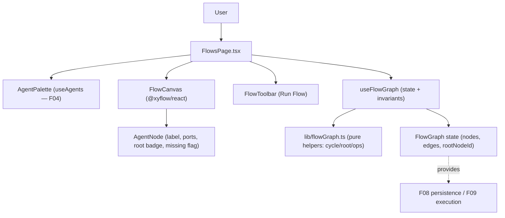

# Technical Specification: Flow Canvas

**Complexity:** medium

## Section 1: Technical Overview

**What:** A React Flow–based canvas where a user composes a flow as a directed acyclic graph of agent nodes. Agents from the F04 registry are dragged from a palette onto the canvas to instantiate nodes (each referencing an agent by id); the user connects an upstream node's output port to a downstream node's input port to create forwarding edges, marks exactly one node as the Root Agent, and performs node operations (delete, duplicate, detach). Graph validation enforces a DAG — self-loops and cycle-forming connections are rejected inline and never drawn. A floating toolbar hosts a "Run Flow" control that stays disabled until a root is assigned and at least one node exists (execution itself is F09).

**Why:** F07 is where users author the structure that F09 executes and F08 persists. It is a pure frontend feature: it consumes F02's authenticated session (the page already lives behind `RequireAuth`) and F04's agent profiles (via the existing `useAgents` hook), and it *provides* a serializable graph state — nodes (agent references), edges (output→input connections), and the root assignment — that F08 will persist verbatim and F09 will translate into an execution DAG. F07 itself adds no backend: there are no new endpoints, no migration, and no server state.

**Scope:**

**Included** (full feature scope — F07 has no Core/Full split):
- A React Flow canvas (`@xyflow/react`) rendering a directed graph of agent nodes with input/output ports.
- An agent palette listing the caller's F04 agents, draggable onto the canvas to instantiate a node referencing the agent by id.
- Edge creation by connecting an output port to an input port; DAG validation rejecting self-loops and cycle-forming connections with an inline message (edge not drawn).
- Single Root Agent invariant via a per-node toggle (assigning a new root clears the previous).
- Node operations: delete (removes connected edges), duplicate, detach (removes connected edges only).
- A floating global toolbar with "Run Flow" disabled until a root is assigned and ≥1 node exists; the run action is a seam wired by F09.
- "Agent missing" handling: a node whose referenced agent was deleted from the registry is flagged and blocks running.
- A serializable graph model (`FlowGraph`) exposed for F08 (persistence) and F09 (execution).

**Excluded:**
- Persistence / load of the graph (save, list, reload) — F08.
- Flow execution, DAG traversal, output forwarding, execution events — F09 (the "Run Flow" click is a deferred seam here).
- Any backend endpoint, database table, or migration.
- Real-time streaming / conversational monitor — F10.

## Section 2: Architecture Impact

**Affected components (file paths):**

Frontend (`frontend/src/`):
- `package.json` — modified: add `@xyflow/react` (v12).
- `lib/flowGraph.ts` — new: the `FlowGraph`/`FlowNodeData` types and pure graph helpers (cycle detection, connection validation, add/remove/duplicate/detach, set-root, can-run, missing-agent detection).
- `lib/flowGraph.test.ts` — new: unit tests for the pure helpers.
- `lib/useFlowGraph.ts` — new: a hook wrapping React Flow node/edge state plus the domain invariants (validated connect, single root, node ops).
- `components/flow/FlowCanvas.tsx` — new: the `<ReactFlow>` canvas, drop target, `onConnect`/`isValidConnection`, custom node types.
- `components/flow/AgentNode.tsx` — new: custom node (agent name + model label, input/output handles, root badge, "Agent missing" flag, per-node actions).
- `components/flow/AgentPalette.tsx` — new: registry agents (from `useAgents`) rendered as draggable items.
- `components/flow/FlowToolbar.tsx` — new: floating toolbar with the "Run Flow" control and disabled-state messaging.
- `pages/FlowsPage.tsx` — modified: compose palette + canvas + toolbar, own the graph state via `useFlowGraph`, surface inline validation messages.
- `components/flow/*.test.tsx` — new: component tests for the node, toolbar, and palette.
- `test/setup.ts` — modified: add a `ResizeObserver` mock (React Flow requires it under jsdom).
- `lib/agents.ts` — reused: `useAgents` for the palette and agent-missing detection.



## Section 3: Technical Decisions

| Decision | Chosen Approach | Alternative Considered | Trade-off |
|----------|-----------------|------------------------|-----------|
| Canvas library (new dependency) | `@xyflow/react` (v12) — the current React Flow package | `reactflow` (v11, legacy package name) | v12 is the maintained, React 18–compatible release; the PRD names React Flow explicitly. One new frontend dependency, documented in Assumptions. |
| Scope / state ownership | Client-only `FlowGraph` state owned by the Flows page; no backend in F07 | Persist to a backend on every change | The PRD assigns persistence to F08 and execution to F09; F07 exposes a serializable graph as the seam. Keeps F07 free of endpoints/migrations. |
| State management | React Flow's `useNodesState`/`useEdgesState` for canvas positions/selection, wrapped by `useFlowGraph` that enforces domain invariants (single root, validated connects, node ops) via pure helpers | A bespoke reducer replacing React Flow's state | Uses the library for what it's good at (interactive node/edge state) while keeping invariants and validation in pure, unit-testable functions. |
| DAG validation | Pure `wouldCreateCycle`/`isValidConnection` helpers run in React Flow's `isValidConnection` and `onConnect`; reject self-loops and any edge that would introduce a cycle | Validate only at run time (F09) | Matches the PRD ("connection that would create a cycle are rejected", edge not drawn); gives immediate inline feedback and a clean, testable core. |
| Root assignment | Single `rootNodeId` on the graph; a per-node toggle sets it (replacing any previous); nodes badge themselves when `id === rootNodeId` | An `isRoot` boolean per node | A single id makes the "exactly one root" invariant trivial and serializes cleanly for F08. |
| "Run Flow" action | Toolbar renders the control with the PRD's disabled rules; the actual `onRun` is a deferred prop/seam left unwired until F09 | Implement a stub execution in F07 | Keeps execution wholly in F09 while delivering the toolbar UX and disabled-state rules now. |
| Agent-missing detection | Derived: join each node's `agentId` against `useAgents`; flag the node and block run when absent | Persist a snapshot of agent settings on the node | The registry stays the source of truth (PRD: node "references an agent by ID"); deletion surfaces immediately. |

## Section 4: Component Overview

| File Path | New/Modified | Purpose | Key Responsibilities |
|-----------|--------------|---------|----------------------|
| `frontend/package.json` | Modified | Dependency | Add `@xyflow/react` |
| `frontend/src/lib/flowGraph.ts` | New | Graph model + pure helpers | `FlowGraph`/`FlowNodeData` types; `wouldCreateCycle`, `isValidConnection`, `addAgentNode`, `removeNode`, `duplicateNode`, `detachNode`, `setRoot`, `canRun`, `missingAgentIds` |
| `frontend/src/lib/useFlowGraph.ts` | New | Stateful hook | Wrap React Flow node/edge state; expose validated `connect`, `setRoot`, node ops, and the derived `FlowGraph` |
| `frontend/src/components/flow/FlowCanvas.tsx` | New | Canvas | `<ReactFlow>` with custom node types, drop handling, `onConnect`/`isValidConnection` |
| `frontend/src/components/flow/AgentNode.tsx` | New | Custom node | Name+model label, input/output `Handle`s, root badge, "Agent missing" flag, per-node actions |
| `frontend/src/components/flow/AgentPalette.tsx` | New | Palette | List `useAgents` agents as draggable items carrying the agent id |
| `frontend/src/components/flow/FlowToolbar.tsx` | New | Toolbar | "Run Flow" disabled rules + inline messages ("Assign a Root Agent before running.") |
| `frontend/src/pages/FlowsPage.tsx` | Modified | Container | Compose palette + canvas + toolbar; own graph state; surface validation messages |
| `frontend/src/test/setup.ts` | Modified | Test env | Add a `ResizeObserver` mock for React Flow under jsdom |

## Section 5: Internal Model Contract

F07 exposes **no HTTP API**. Its contract is the serializable graph model that F08 will persist and F09 will execute.

```
// lib/flowGraph.ts
interface FlowNodeData {
  agentId: string;          // references an F04 agent by id
}
type FlowNode = Node<FlowNodeData>;   // @xyflow/react Node: { id, position {x,y}, data }
type FlowEdge = Edge;                  // { id, source, target, sourceHandle?, targetHandle? }

interface FlowGraph {
  nodes: FlowNode[];
  edges: FlowEdge[];
  rootNodeId: string | null;           // the single Root Agent (null until assigned)
}
```

**Pure helper contract (the testable core):**

| Helper | Signature (conceptual) | Behavior |
|--------|------------------------|----------|
| `wouldCreateCycle` | `(edges, source, target) → boolean` | `true` for a self-loop (`source === target`) or any edge that would make the graph cyclic |
| `isValidConnection` | `(graph, connection) → boolean` | `false` when the connection self-loops, duplicates an edge, or would create a cycle |
| `addAgentNode` | `(graph, agentId, position) → FlowGraph` | Append a node referencing the agent |
| `removeNode` | `(graph, nodeId) → FlowGraph` | Remove the node and all connected edges; clear `rootNodeId` if it was root |
| `duplicateNode` | `(graph, nodeId) → FlowGraph` | Add a new node with the same `agentId` (no edges, not root) |
| `detachNode` | `(graph, nodeId) → FlowGraph` | Remove only the node's connected edges |
| `setRoot` | `(graph, nodeId) → FlowGraph` | Set `rootNodeId = nodeId` (replaces any previous root) |
| `canRun` | `(graph) → boolean` | `rootNodeId !== null && nodes.length > 0` |
| `missingAgentIds` | `(graph, availableAgentIds) → string[]` | Node-referenced agent ids not present in the registry |

## Section 6: Data Model

**No database changes.** F07 holds the `FlowGraph` in client state only. The model above is intentionally serializable (plain ids, positions, and edge endpoints) so F08 can persist and rehydrate it without transformation, and F09 can translate it into an execution DAG. No persistence, indexes, or migrations are introduced by this feature.

## Section 7: Testing Strategy

**Test File Structure:**

| Test File | Test Type | Target | Coverage Goal |
|-----------|-----------|--------|---------------|
| `frontend/src/lib/flowGraph.test.ts` | Unit | pure graph helpers | 90% |
| `frontend/src/components/flow/FlowToolbar.test.tsx` | Component | Run-Flow disabled rules | 85% |
| `frontend/src/components/flow/AgentPalette.test.tsx` | Component | registry → draggable list | 85% |
| `frontend/src/components/flow/AgentNode.test.tsx` | Component | label, root badge, missing flag | 80% |

React Flow relies on layout measurement that jsdom does not provide; `test/setup.ts` gains a `ResizeObserver` mock, and component tests that mount a node wrap it in `ReactFlowProvider`. Pointer-driven canvas interactions (actual drag-drop, edge-drawing gestures) are not exercised in jsdom — they are covered indirectly through the pure helpers (`addAgentNode`, `isValidConnection`, `setRoot`, node ops), which hold the real logic.

**`frontend/src/lib/flowGraph.test.ts`:**

| Test | Assertions |
|------|------------|
| `rejects self-loop` | `wouldCreateCycle(edges, n, n) === true` |
| `rejects cycle-forming edge` | direct (A→B then B→A) and indirect (A→B→C then C→A) both `true`; a valid forward edge `false` |
| `rejects duplicate edge` | `isValidConnection` returns `false` for an existing edge |
| `setRoot replaces previous root` | after two `setRoot` calls, only the latest `rootNodeId` holds |
| `removeNode clears edges and root` | connected edges gone; `rootNodeId` nulled if it was the removed node |
| `detachNode keeps node, drops its edges` | node present, its edges removed |
| `duplicateNode copies agentId only` | new node, same `agentId`, no edges, not root |
| `canRun requires root and a node` | `false` with no root or no nodes; `true` otherwise |
| `missingAgentIds flags deleted agents` | returns ids absent from the registry list |

**Acceptance tests (PRD Section 9, F07):**

| Maps to AC | Test |
|------------|------|
| "dragging a registry agent creates a labeled node referencing that agent" | `AgentPalette.test` (agents rendered as draggable, carry id) + `AgentNode.test` (renders name+model) + `addAgentNode` unit |
| "connecting output→input creates a forwarding edge" | `isValidConnection` unit (valid forward edge accepted) |
| "exactly one node can be marked Root; new root clears previous" | `setRoot replaces previous root` unit + `AgentNode.test` (root badge) |
| "self-loops and cycle-forming connections rejected with inline message, no edge" | `wouldCreateCycle`/`isValidConnection` units + `FlowsPage` inline message |
| "Run Flow disabled until a root and ≥1 node" | `FlowToolbar.test` + `canRun` unit |

**Cross-Feature Integration tests (PRD Section 9):**

| Maps to | Test |
|---------|------|
| Line 559: agent profiles from the registry (F04) appear as draggable nodes carrying their settings on the canvas | `AgentPalette.test` mocks `useAgents` and asserts each agent renders as a draggable item carrying its id; `AgentNode.test` asserts the node shows the agent's name + model |

## Assumptions & Decisions

1. **`@xyflow/react` v12 added as a new frontend dependency** (clarified with the user). The PRD names React Flow; v12 is the current package (the older name was `reactflow`). Documented per the new-technology rule.
2. **F07 is frontend-only; no backend** (clarified with the user). Graph state is client-only; persistence is F08 and execution is F09. No endpoints, tables, or migrations.
3. **"Run Flow" is present but disabled per the AC; the run action is a deferred seam** (clarified with the user). F07 wires the disabled rules and inline messaging; F09 supplies the actual execution handler.
4. **Single `rootNodeId` on the graph** (technical decision). Encodes the "exactly one root" invariant directly and serializes cleanly for F08.
5. **Agent-missing is derived, not snapshotted** (best-practice default). Nodes reference agents by id (PRD); a node whose agent is absent from `useAgents` is flagged and blocks run, keeping the registry authoritative.
6. **`ResizeObserver` mock in the test setup** (test-env necessity). React Flow needs it under jsdom; canvas pointer interactions aren't unit-tested, so the pure helpers carry the logic coverage.
7. **Delete removes connected edges; detach removes only edges** (partial-spec default). The PRD lists delete/duplicate/detach without exact edge semantics; delete removes the node + its edges, detach keeps the node and drops its edges, duplicate copies the agent reference only.

**Traceability (PRD → spec):** Consumes (F02 identity, F04 agents) → Section 2 (`useAgents`, page behind `RequireAuth`); Provides (graph state for F08/F09) → Section 5 `FlowGraph` model; Capabilities (canvas, drag-instantiate, connect, single root, node ops, DAG validation, toolbar) → Sections 3–5 + helpers; Experience (labeled nodes, inline rejection, root badge, immediate edge updates, Run disabled rules) → Components + Section 7; Error Handling (cycle message, no-root message, agent-missing flag) → `isValidConnection`/`FlowToolbar`/`missingAgentIds`; Section 9 ACs + cross-feature line 559 → Section 7.
