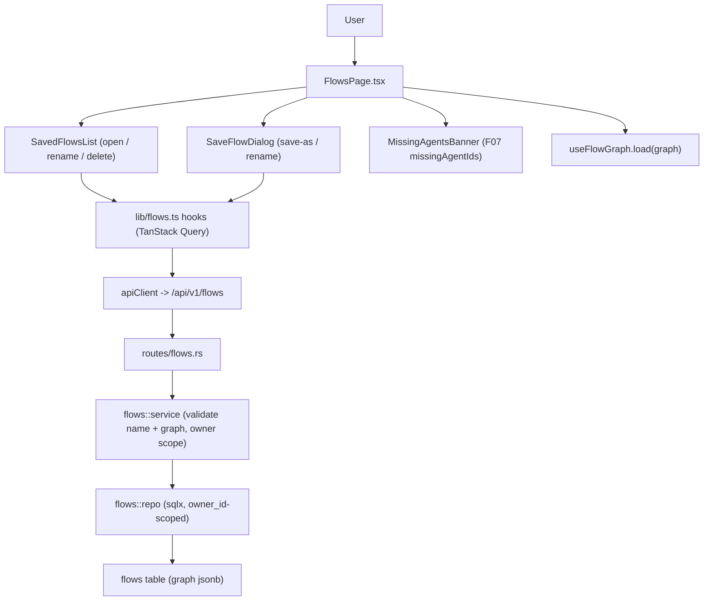

# Technical Specification: Flow Persistence

**Complexity:** medium

## Section 1: Technical Overview

**What:** A per-user CRUD service for saved flows. The authenticated user saves the current canvas as a named flow, lists their saved flows, opens (reloads) one to restore the canvas exactly as saved, renames a flow (uniqueness enforced), and deletes one. A flow is a name plus the complete F07 `FlowGraph` — nodes (agent references + positions), edges, and the root assignment — persisted verbatim in a single `jsonb` column so it round-trips with zero transformation. The frontend gains a saved-flows list, a save/rename dialog, a delete confirmation, an unsaved-changes guard when opening over a dirty canvas, and a banner that flags nodes whose referenced agent was deleted from the registry.

**Why:** F08 is the persistence seam between F07 (which produces the in-memory `FlowGraph`) and F09 (which executes a saved/active graph). It consumes F07's graph state and F02's authenticated identity (the `/flows` page already lives behind `RequireAuth`), and it provides durable, owner-scoped storage and retrieval of that graph. The backend follows the established F04 agents pattern exactly: a module-per-feature (`model`/`repo`/`service`) plus `routes/flows.rs`, an `owner_id`-scoped table with a case-insensitive unique name index, the `AppError::{Validation,Conflict,NotFound}` envelope, and integration tests in `backend/tests/`. The frontend follows the F04 TanStack Query hook pattern (`lib/agents.ts` → `lib/flows.ts`) and reuses F07's pure helpers (`missingAgentIds`) for the agent-missing banner.

**Scope:**

**Included** (F08 has no Core/Full split — full feature scope):
- A `flows` table (`owner_id`-scoped, case-insensitive unique `name`, `graph jsonb`) and migration `0005_flows.sql`.
- A backend `flows` module (`model`, `repo`, `service`) and `routes/flows.rs` exposing CRUD + a dedicated rename.
- REST endpoints: `POST /flows` (save new), `GET /flows` (list summaries), `GET /flows/{id}` (open — full graph), `PUT /flows/{id}` (save the open flow), `PATCH /flows/{id}` (rename), `DELETE /flows/{id}`.
- Server-side validation: name (1–80 chars, unique per user, case-insensitive) and light structural validation of the graph (well-formed `nodes`/`edges` arrays, `rootNodeId` null or a known node id) under a payload size cap; DAG enforcement stays in F07.
- Owner scoping on every query so a caller can only read/mutate their own flows (cross-user access returns `NOT_FOUND`).
- Frontend `lib/flows.ts` TanStack Query hooks; a saved-flows list, a save/rename dialog, a delete-confirmation dialog, an unsaved-changes confirmation on open, and a missing-agents banner.
- A `load(graph)` capability added to `useFlowGraph` so an opened flow replaces the live canvas state, plus dirty-state tracking on the Flows page.

**Excluded:**
- Flow execution / DAG traversal / output forwarding / execution events — F09.
- Graph authoring (canvas, drag-instantiate, connect, node ops, DAG validation) — F07 (already implemented; F08 reuses it).
- Real-time streaming / conversational monitor — F10.
- Versioning/history of saved flows, sharing, or export/import.

## Section 2: Architecture Impact

**Affected components (file paths):**

Backend (`backend/`):
- `migrations/0005_flows.sql` — new: `flows` table, unique index, owner index.
- `src/flows/mod.rs` — new: module exports (mirrors `agents/mod.rs`).
- `src/flows/model.rs` — new: `Flow`, `FlowSummary`, `FlowGraph` payload, `CreateFlowInput`, `RenameInput`, field-limit constants.
- `src/flows/repo.rs` — new: `owner_id`-scoped sqlx queries (insert, list summaries, get, update, rename, delete, name_exists).
- `src/flows/service.rs` — new: name + graph validation, per-user uniqueness, owner scope; unit tests for validation.
- `src/routes/flows.rs` — new: handlers rendering the success envelope.
- `src/routes/mod.rs` — modified: mount the `/flows` routes (incl. `patch`).
- `src/lib.rs` — modified: declare `pub mod flows;`.
- `tests/flows_test.rs` — new: integration tests (CRUD, round-trip, uniqueness, cross-user isolation).

Frontend (`frontend/src/`):
- `lib/flows.ts` — new: `Flow`/`FlowSummary` types and TanStack Query hooks (`useFlows`, `useFlow`, `useCreateFlow`, `useUpdateFlow`, `useRenameFlow`, `useDeleteFlow`).
- `lib/flows.test.ts` — new: hook/serialization unit tests.
- `lib/useFlowGraph.ts` — modified: add `load(graph)` to replace nodes/edges/root at runtime.
- `components/flow/SavedFlowsList.tsx` — new: list of the user's flows with open/rename/delete and a last-updated indicator.
- `components/flow/SaveFlowDialog.tsx` — new: name-entry dialog reused for "save as" and "rename" (mode-driven), with inline name validation and the duplicate-name message.
- `components/flow/DeleteFlowDialog.tsx` — new: delete confirmation.
- `components/flow/MissingAgentsBanner.tsx` — new: banner listing missing agents on open (reuses F07 `missingAgentIds`).
- `pages/FlowsPage.tsx` — modified: compose the list + dialogs + banner, own the open/dirty/save flows, wire the toolbar Save/Save As.
- `components/flow/SavedFlowsList.test.tsx`, `SaveFlowDialog.test.tsx`, `MissingAgentsBanner.test.tsx` — new: component tests.
- `lib/apiClient.ts` — modified: add an `apiPatch` helper (the client currently has GET/POST/PUT/DELETE only) for the rename call.
- `lib/flowGraph.ts` — reused: `FlowGraph` type + `missingAgentIds`. `apiClient.ts` — reused: `apiGet/apiPost/apiPut/apiDelete`.



## Section 3: Technical Decisions

| Decision | Chosen Approach | Alternative Considered | Trade-off |
|----------|-----------------|------------------------|-----------|
| Graph storage | Single `jsonb` column holding the whole `FlowGraph` verbatim | Normalized `flow_nodes` / `flow_edges` tables | Verbatim jsonb matches F07's serializable seam and F09 rehydration with zero transformation and no join/reassembly logic; F08 has no per-node query need. Accepts that node/edge contents aren't independently queryable in SQL. |
| Rename API | Dedicated `PATCH /flows/{id} {name}` for rename; `PUT /flows/{id} {name, graph}` for save | One full-replacement `PUT` for both (F04 agents shape) | Rename happens from the saved-flows list with no graph loaded; a name-only endpoint avoids resending (or re-fetching) the graph. Adds one endpoint beyond the agents template. |
| Graph validation depth | Light structural validation (`nodes`/`edges` arrays present; `rootNodeId` null or a known node id) + payload size cap; name 1–80 unique | Re-run full DAG/cycle validation server-side | Keeps cycle/self-loop enforcement in F07 (single source of truth) instead of duplicating it in Rust; the server still rejects malformed/oversized payloads that would break F09. Accepts that a client bypassing F07 could persist a graph that's well-formed but not a DAG. |
| List vs open payload | `GET /flows` returns summaries (id, name, timestamps — no graph); `GET /flows/{id}` returns the full graph | Always return the full graph in the list | Keeps the list light and fast; the heavy `jsonb` is fetched only when a flow is opened. |
| Error codes | Reuse `AppError::Validation`/`Conflict` with new codes `FLOW_VALIDATION` / `FLOW_NAME_TAKEN`; reuse `NotFound` | New bespoke `AppError` variants | Matches the F04 agents convention exactly; no new error machinery, consistent envelope and HTTP status mapping. |
| Canvas reload | Add `load(graph)` to `useFlowGraph` to replace nodes/edges/root in place | Remount the canvas with a new `initial` key | A `load` method keeps React Flow state stable and lets the page manage dirty/saved snapshots without forcing a remount. |

## Section 4: Component Overview

**Backend:**

| File Path | New/Modified | Purpose | Key Responsibilities |
|-----------|--------------|---------|----------------------|
| `backend/migrations/0005_flows.sql` | New | Schema | `flows` table; case-insensitive unique `(owner_id, lower(name))`; `ix_flows_owner` |
| `backend/src/flows/model.rs` | New | Types | `Flow`, `FlowSummary`, `FlowGraph` payload, `CreateFlowInput`, `RenameInput`; `NAME_MIN`/`NAME_MAX`/`GRAPH_MAX_BYTES` |
| `backend/src/flows/repo.rs` | New | Data access | `owner_id`-scoped `insert`, `list_summaries_by_owner`, `get`, `update`, `rename`, `delete`, `name_exists` |
| `backend/src/flows/service.rs` | New | Business logic | Validate name + graph structure/size; enforce uniqueness; owner scope; `NotFound` mapping |
| `backend/src/flows/mod.rs` | New | Module | Re-export model/service like `agents/mod.rs` |
| `backend/src/routes/flows.rs` | New | HTTP | `create`, `list`, `get`, `update`, `rename`, `delete`; success envelope |
| `backend/src/routes/mod.rs` | Modified | Routing | Mount `/flows` and `/flows/{id}` (incl. `patch`) on the protected router |
| `backend/src/lib.rs` | Modified | Module decl | `pub mod flows;` |

**Frontend:**

| File Path | New/Modified | Purpose | Key Responsibilities |
|-----------|--------------|---------|----------------------|
| `frontend/src/lib/flows.ts` | New | API hooks | `Flow`/`FlowSummary` types; `useFlows`/`useFlow`/`useCreateFlow`/`useUpdateFlow`/`useRenameFlow`/`useDeleteFlow` with query invalidation |
| `frontend/src/lib/useFlowGraph.ts` | Modified | Canvas state | Add `load(graph)` to replace nodes/edges/root |
| `frontend/src/components/flow/SavedFlowsList.tsx` | New | List UI | Render the user's flows; open/rename/delete actions; last-updated indicator |
| `frontend/src/components/flow/SaveFlowDialog.tsx` | New | Dialog | Name entry for save-as and rename; inline validation + duplicate-name message |
| `frontend/src/components/flow/DeleteFlowDialog.tsx` | New | Dialog | Delete confirmation |
| `frontend/src/components/flow/MissingAgentsBanner.tsx` | New | Banner | List missing agents on open (reuses `missingAgentIds`) |
| `frontend/src/pages/FlowsPage.tsx` | Modified | Container | Compose list/dialogs/banner; own open/dirty/save state; unsaved-changes guard; toolbar Save/Save As |

**Database:**

| Migration File | Tables Affected | Operation | Notes |
|----------------|-----------------|-----------|-------|
| `0005_flows.sql` | `flows` | CREATE | jsonb graph; unique `(owner_id, lower(name))`; owner index |

## Section 5: API Contracts

All endpoints are under `/api/v1`, on the protected router (JWT Bearer via `require_auth`), and scoped to the authenticated caller. Responses use the platform envelope: success `{ "status": "success", "data": ... }`, error `{ "status": "error", "error": { "code", "message" } }`.

The `graph` object is the F07 `FlowGraph`:
```json
{
  "nodes": [{ "id": "node-1", "type": "agent", "position": { "x": 120, "y": 80 }, "data": { "agentId": "<uuid>" } }],
  "edges": [{ "id": "edge-node-1-node-2", "source": "node-1", "target": "node-2" }],
  "rootNodeId": "node-1"
}
```

### Endpoint: Save new flow
- **Method:** POST
- **Path:** `/api/v1/flows`
- **Authentication:** JWT Bearer

**Request:**

| Field | Type | Required | Validation | Description |
|-------|------|----------|------------|-------------|
| `name` | `string` | Yes | trimmed 1–80 chars, unique per user (case-insensitive) | Flow name |
| `graph` | `object` | Yes | well-formed: `nodes[]`, `edges[]`; `rootNodeId` null or a node id; serialized size ≤ cap | The full canvas graph |

**Request Example:**
```json
{ "name": "Research pipeline", "graph": { "nodes": [], "edges": [], "rootNodeId": null } }
```

**Response (Success — 201):**

| Field | Type | Description |
|-------|------|-------------|
| `status` | `string` | Always `"success"` |
| `data.id` | `uuid` | New flow id |
| `data.name` | `string` | Stored name |
| `data.graph` | `object` | Stored graph (verbatim) |
| `data.created_at` | `timestamptz` | Creation time |
| `data.updated_at` | `timestamptz` | Last update time |

**Response Example:**
```json
{
  "status": "success",
  "data": {
    "id": "660e8400-e29b-41d4-a716-446655440001",
    "name": "Research pipeline",
    "graph": { "nodes": [], "edges": [], "rootNodeId": null },
    "created_at": "2026-06-10T14:00:00Z",
    "updated_at": "2026-06-10T14:00:00Z"
  }
}
```

**Error Codes:**

| Code | HTTP Status | Description |
|------|-------------|-------------|
| `FLOW_VALIDATION` | 422 | Name empty/over 80, or malformed/oversized graph |
| `FLOW_NAME_TAKEN` | 409 | Caller already has a flow with this name |

### Endpoint: List flows
- **Method:** GET
- **Path:** `/api/v1/flows`
- **Authentication:** JWT Bearer

**Response (Success — 200):** `data.flows` is an array of summaries (no graph), ordered by `updated_at` descending.

| Field | Type | Description |
|-------|------|-------------|
| `data.flows[].id` | `uuid` | Flow id |
| `data.flows[].name` | `string` | Flow name |
| `data.flows[].created_at` | `timestamptz` | Creation time |
| `data.flows[].updated_at` | `timestamptz` | Last update (the list's last-updated indicator) |

**Response Example:**
```json
{ "status": "success", "data": { "flows": [ { "id": "660e8400-e29b-41d4-a716-446655440001", "name": "Research pipeline", "created_at": "2026-06-10T14:00:00Z", "updated_at": "2026-06-10T14:05:00Z" } ] } }
```

### Endpoint: Open flow
- **Method:** GET
- **Path:** `/api/v1/flows/{id}`
- **Authentication:** JWT Bearer

**Response (Success — 200):** the full flow, including `graph`, in the same shape as the POST response. Restoring `data.graph` reproduces nodes, edges, positions, and root exactly as saved.

**Error Codes:**

| Code | HTTP Status | Description |
|------|-------------|-------------|
| `NOT_FOUND` | 404 | No such flow for this caller (absent or owned by another user) |

### Endpoint: Save the open flow
- **Method:** PUT
- **Path:** `/api/v1/flows/{id}`
- **Authentication:** JWT Bearer

**Request:** same body as POST (`name`, `graph`). Full replacement; refreshes `updated_at`. The uniqueness check excludes the flow's own row so re-saving under the same name is fine.

**Response (Success — 200):** the updated flow (same shape as POST).

**Error Codes:** `FLOW_VALIDATION` (422), `FLOW_NAME_TAKEN` (409), `NOT_FOUND` (404).

### Endpoint: Rename flow
- **Method:** PATCH
- **Path:** `/api/v1/flows/{id}`
- **Authentication:** JWT Bearer

**Request:**

| Field | Type | Required | Validation | Description |
|-------|------|----------|------------|-------------|
| `name` | `string` | Yes | trimmed 1–80 chars, unique per user (case-insensitive, excluding self) | New name |

**Request Example:**
```json
{ "name": "Research pipeline v2" }
```

**Response (Success — 200):** the updated flow summary (id, name, timestamps). The graph is untouched.

**Error Codes:** `FLOW_VALIDATION` (422), `FLOW_NAME_TAKEN` (409), `NOT_FOUND` (404).

### Endpoint: Delete flow
- **Method:** DELETE
- **Path:** `/api/v1/flows/{id}`
- **Authentication:** JWT Bearer

**Response (Success — 200):** `{ "status": "success", "data": { "id": "<uuid>" } }`.

**Error Codes:** `NOT_FOUND` (404).

## Section 6: Data Model

**Table: `flows`**

| Column | Type | Nullable | Default | Description |
|--------|------|----------|---------|-------------|
| `id` | `uuid` | No | `gen_random_uuid()` | Primary key |
| `owner_id` | `text` | No | - | FK to `users(id)` ON DELETE CASCADE; per-user scope |
| `name` | `varchar(80)` | No | - | Flow name; unique per owner (case-insensitive) |
| `graph` | `jsonb` | No | - | The full `FlowGraph` (`nodes`, `edges`, `rootNodeId`) |
| `created_at` | `timestamptz` | No | `now()` | Creation time |
| `updated_at` | `timestamptz` | No | `now()` | Last update time (set on PUT/PATCH) |

**Indexes:**

| Index Name | Columns | Type | Purpose |
|------------|---------|------|---------|
| `ux_flows_owner_name` | `(owner_id, lower(name))` | unique btree | Enforce per-user case-insensitive name uniqueness |
| `ix_flows_owner` | `owner_id` | btree | Fast per-user listing |

**Constraints:**

| Constraint | Type | Definition | Purpose |
|------------|------|------------|---------|
| `flows_pkey` | PRIMARY KEY | `id` | Unique identifier |
| `flows_owner_fk` | FOREIGN KEY | `owner_id REFERENCES users(id) ON DELETE CASCADE` | Per-user ownership; cascade on user removal |

**Migration Example:**
```sql
-- F08 Flow Persistence: named, per-user saved flows. Stores the complete F07
-- FlowGraph (nodes with agent references + positions, edges, root) verbatim in a
-- jsonb column so it round-trips for F07 reload and F09 execution with no
-- transformation. Per-user scoped; name uniqueness is case-insensitive.
CREATE TABLE flows (
    id         UUID PRIMARY KEY DEFAULT gen_random_uuid(),
    owner_id   TEXT NOT NULL REFERENCES users(id) ON DELETE CASCADE,
    name       VARCHAR(80) NOT NULL,
    graph      JSONB NOT NULL,
    created_at TIMESTAMPTZ NOT NULL DEFAULT now(),
    updated_at TIMESTAMPTZ NOT NULL DEFAULT now()
);

CREATE UNIQUE INDEX ux_flows_owner_name ON flows (owner_id, lower(name));
CREATE INDEX ix_flows_owner ON flows (owner_id);
```

**Notes:** `graph` is bound via sqlx `Json<FlowGraph>` (or `serde_json::Value`); flows is the project's first `jsonb` column. A payload size cap (`GRAPH_MAX_BYTES`, e.g. 1 MiB) is enforced in the service before insert/update; the protected router may also carry a request-body size limit as a transport-level backstop.

## Section 7: Testing Strategy

**Test File Structure:**

| Test File | Test Type | Target | Coverage Goal |
|-----------|-----------|--------|---------------|
| `backend/src/flows/service.rs` (`#[cfg(test)]`) | Unit | name + graph validation | 90% |
| `backend/tests/flows_test.rs` | Integration | `/flows` endpoints (live DB) | 85% |
| `frontend/src/lib/flows.test.ts` | Unit | hooks / request shaping | 85% |
| `frontend/src/components/flow/SaveFlowDialog.test.tsx` | Component | name validation + duplicate message | 85% |
| `frontend/src/components/flow/SavedFlowsList.test.tsx` | Component | list render + open/rename/delete actions | 85% |
| `frontend/src/components/flow/MissingAgentsBanner.test.tsx` | Component | missing-agents banner | 80% |

**`backend/src/flows/service.rs` unit tests:**

| Test | Assertions |
|------|------------|
| `accepts_a_valid_input` | A 1–80 char name with a well-formed graph validates |
| `rejects_empty_and_whitespace_name` | Blank/whitespace name → `FLOW_VALIDATION` |
| `rejects_name_over_limit` / `accepts_name_at_limit` | 81 chars rejected; 80 accepted |
| `rejects_malformed_graph` | Missing `nodes`/`edges`, or `rootNodeId` not a node id → `FLOW_VALIDATION` |
| `rejects_oversized_graph` | Serialized graph over `GRAPH_MAX_BYTES` → `FLOW_VALIDATION` |

**`backend/tests/flows_test.rs` integration tests (live DB + Redis + mock gateway, per project convention):**

| Test | Assertions |
|------|------------|
| `create_then_get_round_trips_graph` | POST a graph, GET `/{id}` returns the identical `graph` (nodes/positions/edges/root) |
| `list_returns_summaries_without_graph` | GET `/flows` returns summaries ordered by `updated_at` desc; no `graph` field |
| `duplicate_name_is_rejected` | Second POST with a same/case-variant name → 409 `FLOW_NAME_TAKEN` |
| `update_saves_graph_and_refreshes_updated_at` | PUT replaces graph; `updated_at` advances; same-name re-save allowed |
| `rename_enforces_uniqueness` | PATCH to a free name succeeds; PATCH to an existing name → 409 |
| `delete_removes_flow` | DELETE then GET → 404 |
| `cross_user_isolation` | User B GET/PUT/PATCH/DELETE of user A's flow → 404; B's list excludes A's flows |

**Acceptance tests (PRD Section 9, F08):**

| Maps to AC | Test |
|------------|------|
| "Saving stores the full graph under a unique per-user name" | `create_then_get_round_trips_graph` + `duplicate_name_is_rejected` + service name units |
| "List shows the user's flows; opening restores nodes/edges/positions/root exactly" | `list_returns_summaries_without_graph` + `create_then_get_round_trips_graph` + `SavedFlowsList.test` |
| "Flows can be renamed (uniqueness enforced) and deleted (with confirmation)" | `rename_enforces_uniqueness` + `delete_removes_flow` + `SaveFlowDialog.test` (rename mode) + `DeleteFlowDialog` confirmation |
| "Opening a flow whose referenced agent was deleted flags the node and shows a banner listing missing agents" | `MissingAgentsBanner.test` + reused F07 `missingAgentIds` unit + `AgentNode` missing flag (F07) |

**Cross-Feature Integration tests (PRD Section 9):**

| Maps to | Test |
|---------|------|
| Line 560: the canvas graph state — nodes, edges, root (F07) — is persisted and restored intact by F08 | `create_then_get_round_trips_graph` asserts byte-for-byte graph equality on save→open; frontend round-trip via `useFlowGraph.load` of an opened flow |
| Line 563: authenticated user identity (F02) scopes all flows so no cross-user data is returned | `cross_user_isolation` |

## Assumptions & Decisions

1. **Graph stored verbatim in a single `jsonb` column** (clarified with the user). Matches F07's serializable seam; F09 rehydrates with no transformation. Flows is the project's first `jsonb` column.
2. **Dedicated rename endpoint** `PATCH /flows/{id} {name}` plus full-replacement `PUT /flows/{id} {name, graph}` for save (clarified with the user). Rename from the list needs no graph payload.
3. **Light structural validation + size cap** server-side (clarified with the user): name 1–80 unique; graph must have `nodes`/`edges` arrays and a `rootNodeId` that is null or a present node id; serialized size ≤ `GRAPH_MAX_BYTES`. DAG/cycle enforcement remains in F07 — not re-implemented in Rust.
4. **List returns summaries; open returns the full graph** (best-practice default) to keep the list light.
5. **Error codes `FLOW_VALIDATION` / `FLOW_NAME_TAKEN`** reuse `AppError::Validation`/`Conflict`; `NOT_FOUND` reused for missing/cross-user (F04 convention, never reveals other users' data).
6. **Agent-missing is derived on the client** (F07 best-practice carryover): `missingAgentIds(graph, agentIds)` joins the opened graph against `useAgents`; the backend stores/returns the graph unchanged and has no agent-missing logic.
7. **`useFlowGraph` gains a `load(graph)` method** (technical decision) to replace canvas state on open; the page tracks a saved snapshot to drive the unsaved-changes guard and the toolbar Save state.
8. **Integration tests run against the live dev stack** (project convention): DB + Redis + mock gateway are reachable, so DB-backed `flows_test.rs` cases execute rather than skip.

**Traceability (PRD → spec):** Consumes (F07 graph state) → Section 1 + Section 5 `graph` contract; Capabilities (save/list/open/rename/delete, persist complete graph, restore exactly) → Sections 4–6 + endpoints; Experience (save prompts for name, list shows name+last-updated, open replaces canvas after unsaved-changes confirm, rename validates uniqueness, delete confirms) → frontend components + `useFlowGraph.load`; Error Handling (duplicate name, agent-missing banner, save failure preserves local state, unsaved-changes confirm) → Section 5 error codes + `MissingAgentsBanner` + page dirty handling; Section 9 F08 ACs + cross-feature lines 560 & 563 → Section 7.
