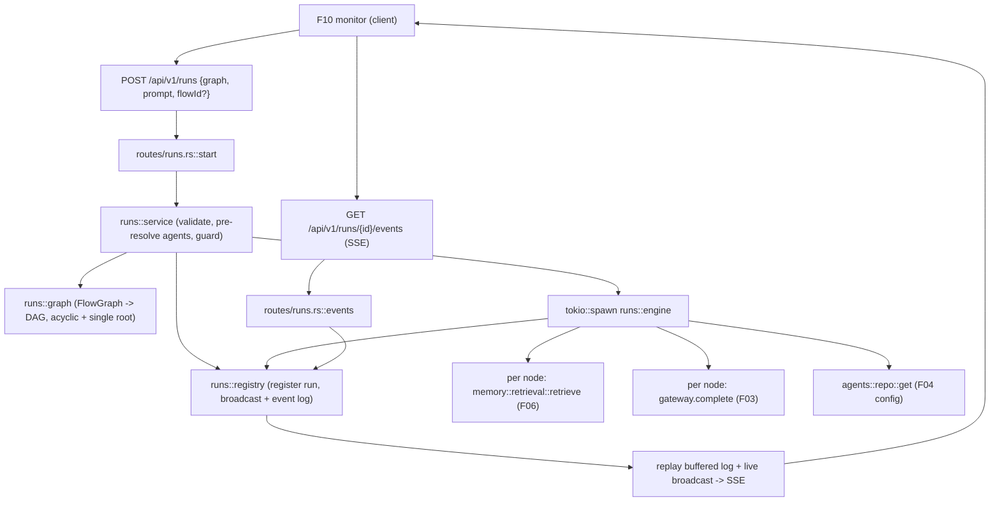

# Technical Specification: Flow Execution Engine

**Complexity:** complex

## Section 1: Technical Overview

**What:** A backend engine that takes a flow graph plus a user prompt, translates the graph into a DAG, executes its agent nodes in dependency order, forwards each node's output to its downstream nodes, and streams ordered execution events over SSE. A run is started by `POST /api/v1/runs` (with the live canvas `graph`, the `prompt`, and an optional `flowId`), which validates the graph, spawns the run as a background Tokio task, and returns a `run_id` immediately. The caller then opens `GET /api/v1/runs/{run_id}/events`, an SSE stream that replays the buffered event log from the beginning and then streams live until the terminal `run.finished` event. Independent branches execute concurrently; a node failure skips only its transitive downstream nodes and is reported, while unaffected branches continue. Run state (ordered event log + a broadcast channel + status) lives in an in-memory registry held in `AppState`, so a dropped SSE client can re-subscribe and recover the full ordered event history (including the terminal state) on reconnect.

**Why:** F09 is the execution seam between F07's graph state and F10's conversational monitor. It consumes the F07 `FlowGraph` (nodes referencing F04 agents, edges, root assignment), the F03 gateway completion service (one call per node using that agent's provider/model/prompts), and F06 retrieval (top-K memory injected per node). It provides the execution event stream that F10 renders. The engine follows the codebase's module-per-feature convention (a new `runs` module with `model`/`graph`/`registry`/`engine`/`service` plus `routes/runs.rs`), reuses the platform `AppError` envelope and the existing `axum::response::sse` plumbing established by `src/sse.rs`, resolves agents through `agents::repo`, retrieves context through `memory::retrieval::retrieve`, and completes through `gateway::GatewayClient::complete`. No new database table is introduced — runs are ephemeral, matching the PRD's out-of-scope stance on background jobs and run history.

**Scope:**

**Included** (Core Scope + Full Scope additions — user selected Core + Full):
- A new backend `runs` module: `model` (run identity, statuses, the execution-event contract), `graph` (FlowGraph → DAG translation + acyclic/single-root validation, in-degree/adjacency/terminal-node derivation), `registry` (in-memory run store: event log buffer, broadcast sender, status, per-flow in-progress guard), `engine` (topological concurrent scheduler + per-node execution + event emission + partial-failure skip propagation), and `service` (request validation, agent pre-resolution, run spawning, SSE subscription assembly).
- `routes/runs.rs` exposing `POST /runs` (start, returns `run_id`), `GET /runs/{run_id}/events` (SSE replay + live stream), and `GET /runs/{run_id}` (terminal/status snapshot for reconnect after completion).
- DAG translation and run-time validation: cycle rejection, single-root requirement, terminal-node (no outgoing edge) detection; a non-DAG / rootless / empty graph rejects the run synchronously before any node executes.
- Dependency-ordered execution: a node runs only after all upstream nodes complete; its generated text forwards as entry context to every connected downstream node; multiple upstream outputs concatenate deterministically.
- Per-node execution via F03 using the agent's preamble, system prompt, provider, model, recent-N (history depth), and top-K (F06 retrieval breadth), with retrieved context injected ahead of forwarded upstream output.
- The ordered event contract: `run.started`, `node.started`, `node.partial`, `node.completed`, `node.failed`, `node.skipped`, `run.finished`, each carrying a per-run monotonic `seq` used as the SSE event id for `Last-Event-ID` reconnect.
- **Full Scope:** concurrent execution of independent branches (all currently-ready nodes run together, bounded by a concurrency cap); partial-failure handling — a failed node's transitive downstream is marked skipped and the run continues for unaffected branches, with overall success/failure reported in `run.finished`.
- In-progress concurrency guard keyed by `flowId` (when present): a second run for the same flow is rejected with a 409.
- Terminal-state recovery: the events stream replays the buffered log (honoring `Last-Event-ID`) so a reconnecting client resumes mid-run or fetches the terminal result after completion.
- Integration tests in `backend/tests/runs_test.rs` plus unit tests in the `runs` submodules.

**Excluded:**
- The "Run Flow" button, prompt input bar, conversation history UI, live node highlighting, and SSE client rendering — all F10 (this spec only produces the event stream they consume).
- Token streaming from the provider: the F03 gateway completion is non-streaming, so each node emits a single `node.partial` carrying its full output (the contract permits multiple `node.partial` events for a future streaming gateway — see Decisions).
- Conditional/branch routing, loops, retries-as-edges — out of scope per PRD.
- Persisted run history, run replay/analytics, scheduled/programmatic execution — out of scope per PRD.
- Graph authoring/DAG enforcement in the editor (F07) and flow persistence (F08) — reused, not modified.

## Section 2: Architecture Impact

**Affected components (file paths):**

Backend (`backend/`):
- `src/runs/mod.rs` — new: module exports (mirrors `flows/mod.rs`).
- `src/runs/model.rs` — new: `RunId`, `RunStatus`, `ExecutionEvent` (+ payload structs), `RunRequest`, `NodeOutcome`, the SSE event-name/`seq` mapping.
- `src/runs/graph.rs` — new: `Dag` translation from `FlowGraph` (adjacency, in-degrees, root, terminal nodes), acyclic + single-root validation; pure, unit-tested.
- `src/runs/registry.rs` — new: `RunRegistry` (in-memory `HashMap<RunId, RunHandle>`), event-log buffering + `tokio::sync::broadcast` fan-out, status transitions, per-`flowId` in-progress guard, subscription helper.
- `src/runs/engine.rs` — new: the executor — topological concurrent scheduler, per-node message assembly (F06 retrieval + forwarded inputs), F03 completion, event emission, partial-failure skip propagation, aggregated terminal result.
- `src/runs/service.rs` — new: validate `RunRequest`, pre-resolve agents, enforce the in-progress guard, register + spawn the run, build the SSE response stream from a subscription; unit tests for validation/aggregation helpers.
- `src/routes/runs.rs` — new: `start`, `events` (SSE), `snapshot` handlers rendering the success envelope / event-stream.
- `src/routes/mod.rs` — modified: mount `/runs`, `/runs/{id}`, `/runs/{id}/events` on the protected router.
- `src/state.rs` — modified: add `runs: Arc<RunRegistry>` to `AppState`.
- `src/app.rs` — modified: construct the `RunRegistry` at boot and place it in `AppState`.
- `src/lib.rs` — modified: declare `pub mod runs;`.
- `src/error.rs` — modified: add `RunInvalidGraph`, `RunInProgress`, `RunAgentMissing` variants with codes `RUN001`/`RUN002`/`RUN003`.
- `tests/runs_test.rs` — new: integration tests (start → stream → finish, forwarding, partial failure, invalid-DAG rejection, in-progress 409, reconnect replay, cross-user isolation).

Reused unchanged: `gateway::GatewayClient::complete` (F03), `memory::retrieval::retrieve` (F06), `agents::repo::get` (F04), `flows::model::{FlowGraph, FlowNode}` (F07/F08), `auth::AuthUser` (F02), `sse` plumbing (F01).



## Section 3: Technical Decisions

| Decision | Chosen Approach | Alternative Considered | Trade-off |
|----------|-----------------|------------------------|-----------|
| Run dispatch + stream | Two resources: `POST /runs` spawns the run and returns `run_id`; `GET /runs/{id}/events` is an SSE stream that replays the buffered log then streams live | Single `POST /runs` returning the SSE stream inline | The two-resource split makes the run a first-class addressable object whose event log survives a dropped client, satisfying "recoverable on reconnect"; a reconnecting client re-subscribes and replays. Costs one extra endpoint and an in-memory registry vs the simpler inline stream. |
| Run state storage | In-memory `RunRegistry` (`Arc<RunRegistry>` in `AppState`): per-run ordered event log + `tokio::sync::broadcast` sender + status | A `runs`/`run_events` table persisted to Postgres | Matches the PRD (no jobs outliving the session beyond terminal recovery; run history is out of scope); zero new schema/migration. Accepts that runs are lost on restart and the registry needs simple eviction (bounded retention of finished runs). |
| Graph source | Inline `graph` in the request body (the live canvas, possibly unsaved) + optional `flowId` for the concurrency guard only | Execute a saved flow by id (`POST /flows/{id}/runs`) | Lets users run an unsaved canvas and decouples F09 from F08 persistence; the backend re-validates the graph independently. The in-progress guard only applies when `flowId` is supplied (unsaved canvases aren't guarded per-flow). |
| DAG validation at run time | Re-validate acyclic + single-root + non-empty in `runs::graph` before spawning; reject synchronously with `RUN001` | Trust F07's client-side DAG enforcement | The engine must not loop or run a rootless graph even if a client bypasses F07; server-side validation is the execution-time source of truth. Duplicates the acyclicity check that also exists in F07 (different layer, intentionally). |
| Branch concurrency | Topological scheduler runs all currently-ready (in-degree 0) nodes concurrently via a `JoinSet`, bounded by a concurrency cap; successors unlock as predecessors complete | Strictly sequential topological order | Fulfils the Full-Scope "parallel independent branches" goal and shortens wall-clock for wide graphs. Adds scheduler/bookkeeping complexity (in-degree tracking, skip propagation) over a simple sequential loop. |
| Partial-failure handling | A failed node marks its transitive downstream `skipped` (emitting `node.skipped`); unaffected branches finish; `run.finished` reports `failed` if any node failed | Abort the whole run on the first node failure | Matches the F09 acceptance criteria ("skips dependent downstream nodes, and is reported") and Full Scope. Accepts a partially-successful run whose terminal output may be incomplete. |
| Node "partial output" events | One `node.partial` carrying the node's full generated text immediately before `node.completed`, since `gateway.complete` is non-streaming | Stream provider tokens as deltas | Keeps F03 untouched while honoring the event contract F10 depends on; the `seq`/`delta` shape already supports many partial events when a streaming gateway lands later. Accepts that "intermediate streaming" is coarse in this version. |
| Agent resolution timing | Pre-resolve every node's `agentId` in the service before spawning; a missing agent rejects the run with `RUN003` | Resolve lazily per node, failing that node mid-run | Mirrors F07/F08 "Agent missing" semantics and avoids a half-run that can never reach the terminal node; the user fixes the graph before any node executes. Costs N agent lookups up front. |
| Reconnect semantics | SSE event id = per-run monotonic `seq`; the events endpoint honors `Last-Event-ID` to replay only newer events, else replays the whole log | Always replay the entire log | Supports true mid-run resume without duplicate rendering in F10; falls back to a full replay when the header is absent (fresh subscriber or terminal fetch). |

## Section 4: Component Overview

**Backend:**

| File Path | New/Modified | Purpose | Key Responsibilities |
|-----------|--------------|---------|----------------------|
| `backend/src/runs/model.rs` | New | Types | `RunId`, `RunStatus`, `RunRequest`, `ExecutionEvent` enum + payload structs, `NodeOutcome`; event-name + `seq` mapping for SSE |
| `backend/src/runs/graph.rs` | New | DAG | Translate `FlowGraph` → `Dag` (adjacency, in-degrees, root, terminals); validate acyclic + exactly-one-root + non-empty; pure + unit-tested |
| `backend/src/runs/registry.rs` | New | Run state | In-memory `HashMap<RunId, RunHandle>`; append events to the per-run log + broadcast; status transitions; per-`flowId` in-progress guard; `subscribe`/`snapshot`/`replay` |
| `backend/src/runs/engine.rs` | New | Executor | Concurrent topological scheduler; per-node message assembly (preamble+system, recent-N history, F06 retrieval ahead of forwarded upstream output); `gateway.complete`; emit events; skip-propagate on failure; aggregate terminal output |
| `backend/src/runs/service.rs` | New | Orchestration | Validate `RunRequest`; pre-resolve agents (`RUN003`); enforce in-progress guard (`RUN002`); register + `tokio::spawn` the engine; build the SSE stream from a subscription |
| `backend/src/runs/mod.rs` | New | Module | Re-export submodules like `flows/mod.rs` |
| `backend/src/routes/runs.rs` | New | HTTP | `start` (POST, returns `run_id`), `events` (GET SSE), `snapshot` (GET status/terminal); success/error envelope |
| `backend/src/routes/mod.rs` | Modified | Routing | Mount `/runs`, `/runs/{id}`, `/runs/{id}/events` on the protected router |
| `backend/src/state.rs` | Modified | State | Add `runs: Arc<RunRegistry>` |
| `backend/src/app.rs` | Modified | Boot | Build `RunRegistry`, inject into `AppState` |
| `backend/src/lib.rs` | Modified | Module decl | `pub mod runs;` |
| `backend/src/error.rs` | Modified | Errors | `RunInvalidGraph` (`RUN001`), `RunInProgress` (`RUN002`), `RunAgentMissing` (`RUN003`) |

**Database:** None. F09 introduces no migration; run state is in-memory only.

## Section 5: API Contracts

All endpoints are under `/api/v1`, on the protected router (JWT Bearer via `require_auth`), scoped to the authenticated caller. JSON responses use the platform envelope: success `{ "status": "success", "data": ... }`, error `{ "status": "error", "error": { "code", "message" } }`. The SSE endpoint returns `text/event-stream`.

The `graph` object is the F07 `FlowGraph` (nodes carry `data.agentId`):
```json
{
  "nodes": [{ "id": "n1", "type": "agent", "position": { "x": 0, "y": 0 }, "data": { "agentId": "<uuid>" } }],
  "edges": [{ "id": "e1", "source": "n1", "target": "n2" }],
  "rootNodeId": "n1"
}
```

### Endpoint: Start a run
- **Method:** POST
- **Path:** `/api/v1/runs`
- **Authentication:** JWT Bearer

**Request:**

| Field | Type | Required | Validation | Description |
|-------|------|----------|------------|-------------|
| `prompt` | `string` | Yes | non-empty after trim; ≤ 32,000 chars | The user's initial message, mapped to the root agent |
| `graph` | `object` | Yes | well-formed `FlowGraph`; non-empty; exactly one root; acyclic; every node's `data.agentId` resolves to one of the caller's agents | The canvas graph to execute |
| `flowId` | `uuid` | No | valid UUID owned by caller | Keys the per-flow in-progress guard; omitted for an unsaved canvas |
| `history` | `array` | No | each item `{ role, content }`; applied up to each agent's recent-N | Prior conversation turns for history-depth context |

**Request Example:**
```json
{
  "prompt": "Summarize the latest design review.",
  "flowId": "550e8400-e29b-41d4-a716-446655440000",
  "graph": {
    "nodes": [
      { "id": "n1", "data": { "agentId": "11111111-1111-1111-1111-111111111111" } },
      { "id": "n2", "data": { "agentId": "22222222-2222-2222-2222-222222222222" } }
    ],
    "edges": [{ "id": "e1", "source": "n1", "target": "n2" }],
    "rootNodeId": "n1"
  }
}
```

**Response (Success - 201):**

| Field | Type | Description |
|-------|------|-------------|
| `status` | `string` | Always "success" |
| `data.runId` | `uuid` | Identifier for the spawned run |
| `data.status` | `string` | `"running"` on accept |
| `data.nodeCount` | `integer` | Number of nodes the run will execute |

**Response Example:**
```json
{ "status": "success", "data": { "runId": "660e8400-e29b-41d4-a716-446655440001", "status": "running", "nodeCount": 2 } }
```

**Error Codes:**

| Code | HTTP Status | Description |
|------|-------------|-------------|
| `RUN001` | 422 | Flow is not a valid DAG (cycle, no/multiple roots, or empty); "Flow is not a valid DAG; fix the graph and rerun." |
| `RUN002` | 409 | A run is already in progress for this flow |
| `RUN003` | 422 | A node references an agent that no longer exists |
| `FLOW_VALIDATION` reuse / `RUN001` | 422 | Malformed graph body |
| `AUTH001` | 401 | Missing/expired token |

### Endpoint: Stream run events (SSE)
- **Method:** GET
- **Path:** `/api/v1/runs/{run_id}/events`
- **Authentication:** JWT Bearer
- **Response:** `text/event-stream`. Each SSE message has an `event:` name, a JSON `data:` payload, and an `id:` equal to the run-monotonic `seq`. The stream first replays buffered events (only those with `seq` greater than `Last-Event-ID` when that header is present), then streams live until `run.finished`, after which it closes. Requesting events for an unknown/other-user run returns 404.

**Event sequence (names + payloads):**

| `event:` | Payload fields | Emitted when |
|----------|----------------|--------------|
| `run.started` | `runId`, `flowId?`, `nodeCount`, `rootNodeId`, `startedAt` | Run accepted, before any node |
| `node.started` | `runId`, `nodeId`, `agentId`, `agentName`, `model`, `startedAt` | A node begins executing |
| `node.partial` | `runId`, `nodeId`, `seq`, `delta` | Node produced output (one event, full text, in this version) |
| `node.completed` | `runId`, `nodeId`, `output`, `retrieval` `{ retrievedCount, excludedMismatched, status }`, `usage` `{ promptTokens, completionTokens, costUsd, cached }`, `completedAt` | Node finished successfully |
| `node.failed` | `runId`, `nodeId`, `error` `{ code, message }`, `failedAt` | Node's model call (or setup) failed |
| `node.skipped` | `runId`, `nodeId`, `reason`, `upstreamNodeId` | An upstream node failed |
| `run.finished` | `runId`, `status` (`succeeded`/`failed`), `output` (aggregated terminal text), `failedNodes[]`, `skippedNodes[]`, `finishedAt` | Terminal event; stream closes |

**Stream Example:**
```
id: 1
event: run.started
data: {"runId":"660e...","flowId":"550e...","nodeCount":2,"rootNodeId":"n1","startedAt":"2026-06-11T12:00:00Z"}

id: 2
event: node.started
data: {"runId":"660e...","nodeId":"n1","agentId":"1111...","agentName":"Researcher","model":"gpt-4o","startedAt":"2026-06-11T12:00:00Z"}

id: 4
event: node.completed
data: {"runId":"660e...","nodeId":"n1","output":"...","retrieval":{"retrievedCount":3,"excludedMismatched":0,"status":{"kind":"ok"}},"usage":{"promptTokens":820,"completionTokens":210,"costUsd":0.004,"cached":false},"completedAt":"2026-06-11T12:00:02Z"}

id: 8
event: run.finished
data: {"runId":"660e...","status":"succeeded","output":"...","failedNodes":[],"skippedNodes":[],"finishedAt":"2026-06-11T12:00:05Z"}
```

### Endpoint: Run snapshot (reconnect/terminal fetch)
- **Method:** GET
- **Path:** `/api/v1/runs/{run_id}`
- **Authentication:** JWT Bearer

**Response (Success - 200):**

| Field | Type | Description |
|-------|------|-------------|
| `data.runId` | `uuid` | Run id |
| `data.status` | `string` | `running` / `succeeded` / `failed` |
| `data.output` | `string \| null` | Aggregated terminal output when finished |
| `data.events` | `array` | The full buffered event log (each with `seq`, `event`, payload) |

**Error Codes:**

| Code | HTTP Status | Description |
|------|-------------|-------------|
| `NOT_FOUND` | 404 | Unknown run id, or owned by another user |

## Section 6: Data Model

No database tables. F09's "data model" is the in-memory run state and the wire shape of execution events.

**In-memory: `RunHandle` (one per active/recent run, keyed by `RunId` in `RunRegistry`)**

| Field | Type | Description |
|-------|------|-------------|
| `run_id` | `Uuid` | Run identifier |
| `owner_id` | `String` | Caller's user id (scopes `GET /runs/{id}` + events) |
| `flow_id` | `Option<Uuid>` | Set when the request carried `flowId`; keys the in-progress guard |
| `status` | `RunStatus` | `Running` / `Succeeded` / `Failed` |
| `events` | `Vec<SeqEvent>` | Ordered buffered log; each entry is `{ seq, event }` |
| `tx` | `broadcast::Sender<SeqEvent>` | Live fan-out to subscribed SSE streams |
| `output` | `Option<String>` | Aggregated terminal output once finished |

**`RunRegistry` behavior**

| Concern | Rule |
|---------|------|
| In-progress guard | Reject start (`RUN002`) when an existing handle has the same `flow_id` and `status == Running` |
| Append | Push `SeqEvent` to `events` and `tx.send` it atomically under the run's lock |
| Subscribe | Return the current `events` snapshot (for replay) + a `broadcast::Receiver` (for live) |
| Ownership | `GET /runs/{id}` and `/events` return `NotFound` when `owner_id` ≠ caller |
| Eviction | Bounded retention of finished runs (cap count and/or evict oldest finished) so the map doesn't grow unbounded; the cap is documented in `registry.rs` |

**`ExecutionEvent` (serialized into SSE `data`)** — a tagged enum mirroring the event table in Section 5. Each variant serializes with `runId` and a per-run monotonic `seq`. Retrieval metadata reuses F06's `RetrievalOutcome` fields (`retrieved_count`, `excluded_mismatched`, `status`); usage reuses F03's `CompletionResult` fields (`prompt_tokens`, `completion_tokens`, `cost_usd`, `cached`).

**`Dag` (derived in `runs::graph`, not persisted)**

| Field | Type | Description |
|-------|------|-------------|
| `nodes` | `Vec<NodeId>` | Node ids in the graph |
| `agent_of` | `Map<NodeId, Uuid>` | Resolved `data.agentId` per node |
| `adjacency` | `Map<NodeId, Vec<NodeId>>` | Downstream successors per node |
| `in_degree` | `Map<NodeId, usize>` | Upstream count per node (scheduler readiness) |
| `root` | `NodeId` | The single root (validated) |
| `terminals` | `Vec<NodeId>` | Nodes with no outgoing edge (aggregated output) |

**Per-node message assembly (engine):** `messages = [system] + recent_n(history) + [user]` where `system.content = preamble + "\n\n" + system_prompt`, and `user.content = retrieved_context + "\n\n" + forwarded_input`. `forwarded_input` is the run `prompt` at the root, otherwise the deterministic concatenation (by edge/source order) of upstream node outputs. `retrieved_context` is the concatenation of F06 records (top-K = agent's `top_k`, query = `forwarded_input`), placed ahead of the forwarded output per F06. The completion uses the agent's `model`; `recent_n`/`top_k` come from the agent config.

## Section 7: Testing Strategy

**Test File Structure:**

| Test File | Test Type | Target | Coverage Goal |
|-----------|-----------|--------|---------------|
| `backend/src/runs/graph.rs` (`#[cfg(test)]`) | Unit | DAG translation + validation | 90% |
| `backend/src/runs/engine.rs` (`#[cfg(test)]`) | Unit | Scheduler order, forwarding, skip propagation, aggregation (pure helpers) | 85% |
| `backend/src/runs/registry.rs` (`#[cfg(test)]`) | Unit | Append/replay/subscribe, in-progress guard, ownership | 85% |
| `backend/src/runs/service.rs` (`#[cfg(test)]`) | Unit | Request validation, agent pre-resolution mapping | 85% |
| `backend/tests/runs_test.rs` | Integration | `/runs` endpoints end-to-end against a mock LiteLLM proxy | 80% |

**Unit test functions:**

| Test Function | Description | Assertions |
|---------------|-------------|------------|
| `translates_linear_graph_to_dag` | n1→n2→n3 | root=n1, terminals=[n3], in-degrees correct |
| `rejects_cycle` | n1→n2→n1 | `RUN001` validation error |
| `rejects_missing_or_multiple_roots` | no root / two roots | `RUN001` |
| `rejects_empty_graph` | zero nodes | `RUN001` |
| `derives_terminals_for_diamond` | n1→{n2,n3}→n4 | terminals=[n4]; n2,n3 independent (both in-degree 1) |
| `forwards_single_upstream_output` | n1 output → n2 input | n2's forwarded_input equals n1's output |
| `concatenates_multiple_upstream_outputs` | n2,n3 → n4 | n4 forwarded_input concatenates n2+n3 deterministically |
| `assembles_messages_with_retrieval_ahead_of_forwarded` | retrieval + upstream | user content = context then forwarded input |
| `skips_transitive_downstream_on_failure` | n1 fails in n1→n2→n3 | n2,n3 marked skipped; sibling branch unaffected |
| `aggregates_terminal_outputs` | two terminals | run output aggregates both |
| `in_progress_guard_rejects_same_flow` | second run, same flowId, running | `RUN002` |
| `guard_allows_when_no_flow_id` | unsaved canvas | second run allowed |
| `replay_honors_last_event_id` | subscribe with Last-Event-ID=k | only events with seq>k replayed |
| `snapshot_scoped_to_owner` | other user's run id | `NotFound` |

**Integration test functions (`runs_test.rs`, mock proxy like `gateway_test.rs`/`flows_test.rs`):**

| Test Function | Description | Assertions |
|---------------|-------------|------------|
| `start_returns_run_id` | POST valid graph+prompt | 201, `data.runId`, `status:"running"` |
| `events_stream_emits_ordered_lifecycle` | start then GET events | `run.started` → `node.*` → `run.finished`; increasing `seq`; `text/event-stream` |
| `linear_flow_forwards_output_to_final` | n1→n2 | `run.finished.output` reflects n2 consuming n1's output |
| `node_failure_skips_downstream_and_reports` | mock proxy 500 on n1 | `node.failed` for n1, `node.skipped` for downstream, `run.finished.status:"failed"` |
| `independent_branch_continues_on_partial_failure` | diamond, one branch fails | unaffected branch completes; terminal reports failure |
| `invalid_dag_rejected_before_execution` | cyclic graph | 422 `RUN001`, no events stream created |
| `second_run_same_flow_rejected` | two POSTs with same flowId | second → 409 `RUN002` |
| `missing_agent_rejects_run` | node referencing deleted agent | 422 `RUN003` |
| `reconnect_replays_buffered_events` | open events after completion | full log replayed incl. `run.finished` |
| `events_require_ownership` | other user's token | 404 |
| `unauthenticated_run_rejected` | no token | 401 |

**Acceptance criteria coverage (PRD Section 9, F09):**
- Prompt maps to root + graph→DAG before execution → `start_returns_run_id`, `invalid_dag_rejected_before_execution`, `translates_linear_graph_to_dag`.
- Nodes run after upstream complete; output forwarded downstream → `linear_flow_forwards_output_to_final`, `forwards_single_upstream_output`, `concatenates_multiple_upstream_outputs`.
- Each node executes with its agent's provider/model/preamble/system prompt/recent-N/top-K → `assembles_messages_with_retrieval_ahead_of_forwarded` + integration node payloads carry `model`/`usage`.
- Ordered events emitted; non-DAG rejected before any node → `events_stream_emits_ordered_lifecycle`, `invalid_dag_rejected_before_execution`.
- Node failure emits failed, skips downstream, reported in terminal state → `node_failure_skips_downstream_and_reports`, `independent_branch_continues_on_partial_failure`.

**Cross-Feature Integration coverage:**
- Graph state (F07) + gateway completion (F03) + retrieved context (F06) consumed to run nodes in dependency order with per-agent settings and injected memory → engine unit tests + `linear_flow_forwards_output_to_final` (retrieval mocked/empty acceptable).
- Execution event stream (F09) drives F10 → the `events_stream_emits_ordered_lifecycle` contract is the F10 consumption surface.
- Authenticated identity (F02) scopes runs → `events_require_ownership`, `snapshot_scoped_to_owner`, `unauthenticated_run_rejected`.
- "Run in progress for this flow" rejection → `second_run_same_flow_rejected`.
- Terminal-state recovery on reconnect → `reconnect_replays_buffered_events`.
