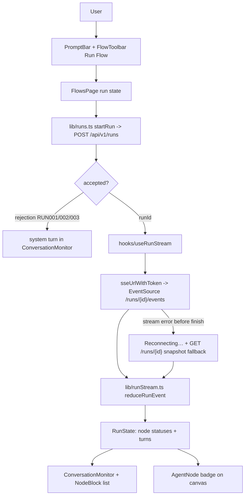

# Technical Specification: Conversational Monitor & Real-time Streaming

**Complexity:** medium

## Section 1: Technical Overview

**What:** A right-split conversational monitor inside the `/flows` workspace that turns the F09 execution event stream into a live, observable run. A prompt input bar submits the user's message; "Run Flow" dispatches `POST /api/v1/runs` with the live canvas graph and the prompt, receives a `runId`, then opens the `GET /api/v1/runs/{runId}/events` SSE stream. As ordered events arrive (`run.started`, `node.started`, `node.partial`, `node.completed`, `node.failed`, `node.skipped`, `run.finished`) a pure reducer folds them into a `RunState`: per-node status and streamed output, accumulated conversation turns, and a terminal status. Each agent block lights up by state (idle → running → complete/error) in **two surfaces at once** — the React Flow canvas nodes (via a status badge on `AgentNode`) and a per-node block list in the monitor panel that streams intermediate output. The run's aggregated terminal output renders as the assistant turn. Conversation turns accumulate in session-only React state.

**Why:** F10 is the consumption surface for the event stream F09 already provides; it adds **no backend code and no new endpoints**. It plugs into seams the prior waves deliberately left open: `FlowToolbar`'s `onRun?` prop (F07), the `sseUrlWithToken` helper and module-level token bridge (F02) that let a native `EventSource` authenticate via a `token` query parameter (the browser API cannot set an `Authorization` header), the `apiPost` envelope client (F01/F04), and the `FlowsPage` composition that owns the canvas graph (F07/F08). The streaming UI follows the established frontend conventions: pure, unit-tested logic in `lib/` (mirroring `lib/flowGraph.ts`), an `EventSource`-lifecycle hook in `hooks/` (mirroring `hooks/useEventSource.ts`), and presentational components under `components/` with co-located React Testing Library tests.

**Scope:**

**Included** (F10 has no Core/Full split in the PRD — entire feature is in scope):
- A prompt input bar and submit control wired to the existing `FlowToolbar` "Run Flow" seam; submitting starts a run against the live canvas graph.
- Run dispatch from the client: `lib/runs.ts` with the execution-event payload types and a `startRun` call over `apiPost` (`POST /runs` → `{ runId, status, nodeCount }`).
- A pure run reducer (`lib/runStream.ts`): `(RunState, SeqEvent) → RunState`, folding the seven F09 event types into per-node status/output, conversation turns, and terminal status; idempotent on replayed `seq` so reconnect replay does not double-render.
- An SSE run hook (`hooks/useRunStream.ts`): opens the authenticated events stream, registers listeners for every named F09 event, feeds them through the reducer, and exposes `RunState` + connection status; the native `EventSource` auto-reconnects and resends `Last-Event-ID` so F09's buffered replay resumes mid-run.
- A conversational monitor panel (`components/monitor/ConversationMonitor.tsx`) shown as a right-split beside the canvas: turn-based history, the live per-node block list, a "Reconnecting…" indicator, and the final assistant turn.
- A per-node agent block (`components/monitor/NodeBlock.tsx`) that lights up by status and shows streamed intermediate + final output.
- Live status on the canvas: `AgentNode` (F07) renders an idle/running/complete/error badge driven by a per-node status map threaded through the existing `FlowNodeContextValue`.
- Reconnect / terminal recovery: on stream error before `run.finished`, show "Reconnecting…"; if the run already finished server-side, fetch `GET /runs/{runId}` and render the terminal result.
- Rejection handling: a rejected `POST /runs` (invalid DAG `RUN001`, run-in-progress `RUN002`, missing agent `RUN003`) renders its message as a system line in the conversation instead of opening a stream.
- Empty-output handling: a `run.finished` with no terminal output renders "The flow completed but produced no output." as the assistant turn.
- Co-located component/unit tests plus the reducer unit suite.

**Excluded:**
- Any backend change — the `runs` module, routes, registry, and engine (F09) are consumed unchanged.
- Token-level provider streaming — F09 emits one `node.partial` carrying the node's full text (the gateway completion is non-streaming); the reducer already supports many `node.partial` deltas for a future streaming gateway.
- Cross-session/persisted conversation history, run replay, or analytics — out of scope per PRD; turns live in session React state only.
- Multi-run concurrency UI — one active run at a time per workspace; a second dispatch while running is governed server-side (`RUN002`) and surfaced as a rejection line.
- Canvas authoring, flow persistence, agent CRUD — reused from F04/F07/F08, not modified beyond `AgentNode`'s status badge.

## Section 2: Architecture Impact

**Affected components (file paths):**

Frontend (`frontend/`):
- `src/lib/runs.ts` — new: execution-event TypeScript types (the F09 wire contract), `RunAccepted` type, `startRun(input)` over `apiPost`.
- `src/lib/runStream.ts` — new: `RunState`, `initialRunState`, `reduceRunEvent(state, event)` pure reducer + `parseRunEvent` (name + JSON → typed event); unit-tested.
- `src/hooks/useRunStream.ts` — new: `EventSource` lifecycle for `/runs/{id}/events`, per-event listeners, reducer wiring, connection/reconnect status, terminal snapshot fallback.
- `src/components/monitor/ConversationMonitor.tsx` — new: right-split panel composing the prompt bar, turn history, node-block list, reconnect indicator.
- `src/components/monitor/PromptBar.tsx` — new: prompt textarea + submit; disabled while a run is active.
- `src/components/monitor/NodeBlock.tsx` — new: one agent block; status light + streamed output.
- `src/components/monitor/ConversationTurns.tsx` — new: renders accumulated user/assistant/system turns.
- `src/pages/FlowsPage.tsx` — modified: own run state (current `runId`, prompt, node-status map, conversation turns), wire `FlowToolbar.onRun`, render the monitor right-split, feed node statuses into the canvas context.
- `src/components/flow/FlowToolbar.tsx` — modified: accept an `isRunning` flag to reflect run-in-progress on the "Run Flow" control (the `onRun?` seam already exists).
- `src/components/flow/AgentNode.tsx` — modified: read a per-node `status` from context and render the idle/running/complete/error badge.
- `src/components/flow/FlowCanvas.tsx` — modified: pass the `nodeStatuses` map through into the node context (no React Flow structural change).

Reused unchanged: `lib/apiClient.ts` `apiPost`/`apiGet` (F01/F04), `lib/authToken.ts` `sseUrlWithToken` (F02), `hooks/useEventSource.ts` pattern reference (F01), `lib/flowGraph.ts` `FlowGraph` type (F07), `lib/useFlowGraph.ts` graph ownership (F07), `FlowNodeContextValue` (F07). Backend: every F09 endpoint consumed as-is.



## Section 3: Technical Decisions

| Decision | Chosen Approach | Alternative Considered | Trade-off |
|----------|-----------------|------------------------|-----------|
| Status surface | Light up **both** the canvas `AgentNode` (status badge via context) and a node-block list in the monitor panel, from one shared per-node status map | Monitor-panel blocks only, or canvas nodes only | Matches the PRD's "on the canvas/monitor" wording and keeps the spatial graph and the streamed output in sync. Costs a small `AgentNode`/context change and threading a status map through `FlowsPage`. |
| Monitor placement | Right-split panel **inside `FlowsPage`**, beside the canvas, wired to the existing `FlowToolbar.onRun` seam | A separate `/monitor` route | Keeps canvas + chat together (PRD "right-split panel") and reuses the live graph the page already owns; no new route/nav. Accepts a denser `/flows` layout. |
| SSE client | A dedicated `useRunStream` hook registering listeners for each of the 7 named events, built on the `EventSource` lifecycle from `useEventSource` | Overload the existing single-`eventName` `useEventSource` | F10 needs seven distinct event names folded into one state; a single-event hook cannot. A purpose-built hook keeps `useEventSource` untouched. Adds one hook file. |
| SSE authentication | Append the session token as a `token` query param via the existing `sseUrlWithToken` | A fetch + `ReadableStream` SSE reader that sets a Bearer header | Native `EventSource` (and its free auto-reconnect + `Last-Event-ID`) cannot set headers; the backend already accepts the query-param token for SSE. Accepts the token appearing in the URL (already the codebase's chosen SSE auth). |
| Reconnect / terminal recovery | Rely on `EventSource` auto-reconnect (resends `Last-Event-ID`, F09 replays only newer `seq`); show "Reconnecting…" on error; if `run.finished` never arrived and the stream keeps failing, fetch `GET /runs/{id}` once and fold its event log | Custom backoff/manual re-subscribe loop | Leverages built-in reconnection and F09's buffered replay for true mid-run resume; the snapshot fallback covers the "run already finished, stream closed" case. Accepts the browser's fixed reconnect cadence. |
| Reducer idempotency | `reduceRunEvent` ignores any event whose `seq` ≤ the highest applied `seq` | Trust the stream to never re-deliver | Replay-on-reconnect re-sends buffered events; dropping already-applied `seq` prevents double-rendered turns/output. Costs tracking one `lastSeq` per run. |
| Conversation history | Session-only React state in `FlowsPage`; each run appends a user turn (the prompt) and, on `run.finished`, an assistant turn (aggregated output or the empty-output message) | Persist runs/turns to the backend | Matches PRD ("accumulates turns within the session") and the out-of-scope stance on run history; zero backend work. Accepts that history is lost on reload. |

## Section 4: Component Overview

**Frontend:**

| File Path | New/Modified | Purpose | Key Responsibilities |
|-----------|--------------|---------|----------------------|
| `src/lib/runs.ts` | New | Run dispatch + types | Execution-event payload types mirroring the F09 contract; `RunAccepted` (`runId`/`status`/`nodeCount`); `startRun(input)` via `apiPost('/runs', …)` |
| `src/lib/runStream.ts` | New | Pure run reducer | `RunState`, `initialRunState`, `parseRunEvent(name,data)`, `reduceRunEvent(state,event)`; node status/output map, turns, terminal status; `seq` idempotency |
| `src/hooks/useRunStream.ts` | New | SSE run hook | Build the authed events URL via `sseUrlWithToken`; open `EventSource`; add listeners for all 7 events; fold via reducer; expose `RunState` + `connection` status; snapshot fallback on terminal/error |
| `src/components/monitor/ConversationMonitor.tsx` | New | Monitor panel | Compose `PromptBar`, `ConversationTurns`, the `NodeBlock` list, and the reconnect indicator; surface rejection/empty-output lines |
| `src/components/monitor/PromptBar.tsx` | New | Prompt input | Textarea + submit; disabled while `isRunning`; emits the prompt on submit |
| `src/components/monitor/NodeBlock.tsx` | New | Agent block | Render one node's name/model, a status light (idle/running/complete/error), and its streamed intermediate + final text |
| `src/components/monitor/ConversationTurns.tsx` | New | Turn history | Render accumulated user/assistant/system turns in order |
| `src/pages/FlowsPage.tsx` | Modified | Workspace owner | Own `runId`/prompt/turns/node-status state; wire `onRun` to `startRun` + `useRunStream`; render the right-split monitor; feed `nodeStatuses` into the canvas context |
| `src/components/flow/FlowToolbar.tsx` | Modified | Run control | Accept `isRunning` to reflect an active run on the "Run Flow" button (existing `onRun?` seam) |
| `src/components/flow/AgentNode.tsx` | Modified | Canvas node | Read per-node `status` from context; render the status badge |
| `src/components/flow/FlowCanvas.tsx` | Modified | Canvas | Thread the `nodeStatuses` map into `FlowNodeContextValue` |

**Backend:** None. F10 consumes the F09 endpoints unchanged and introduces no migration.

## Section 5: API Contracts

F10 adds **no endpoints**; it consumes the three F09 endpoints (defined in `docs/F09-flow-execution-engine/spec.md`). All are under `/api/v1`, on the protected router, scoped to the authenticated caller, using the platform envelope (success `{ "status": "success", "data": … }`, error `{ "status": "error", "error": { "code", "message" } }`). Summarized here as the client-consumed contract:

### Consumed: Start a run
- **Method:** POST · **Path:** `/api/v1/runs` · **Auth:** JWT Bearer (via `apiPost`)

**Request (client sends):**

| Field | Type | Required | Validation (client-side) | Description |
|-------|------|----------|--------------------------|-------------|
| `prompt` | `string` | Yes | non-empty after trim; ≤ 32,000 chars | The user's message; submit is blocked when empty |
| `graph` | `object` | Yes | the live `FlowGraph` from `useFlowGraph` (nodes/edges/`rootNodeId`) | The canvas graph to execute |
| `flowId` | `string` (uuid) | No | the open flow's id when one is loaded | Keys F09's per-flow in-progress guard |

**Request Example:**
```json
{
  "prompt": "Summarize the latest design review.",
  "flowId": "550e8400-e29b-41d4-a716-446655440000",
  "graph": {
    "nodes": [
      { "id": "n1", "type": "agent", "position": { "x": 0, "y": 0 }, "data": { "agentId": "11111111-1111-1111-1111-111111111111" } },
      { "id": "n2", "type": "agent", "position": { "x": 240, "y": 0 }, "data": { "agentId": "22222222-2222-2222-2222-222222222222" } }
    ],
    "edges": [{ "id": "e1", "source": "n1", "target": "n2" }],
    "rootNodeId": "n1"
  }
}
```

**Response (Success - 201) — unwrapped by `apiPost` to `data`:**

| Field | Type | Description |
|-------|------|-------------|
| `runId` | `string` (uuid) | Identifier used to open the events stream |
| `status` | `string` | `"running"` on accept |
| `nodeCount` | `integer` | Number of nodes the run will execute |

**Response Example:**
```json
{ "status": "success", "data": { "runId": "660e8400-e29b-41d4-a716-446655440001", "status": "running", "nodeCount": 2 } }
```

**Error Codes (rendered as a conversation system line, no stream opened):**

| Code | HTTP Status | Client message shown |
|------|-------------|----------------------|
| `RUN001` | 422 | "Flow is not a valid DAG; fix the graph and rerun." |
| `RUN002` | 409 | "A run is already in progress for this flow." |
| `RUN003` | 422 | "A node references an agent that no longer exists." |
| `AUTH001` | 401 | Session-expired handling (shared auth redirect) |

### Consumed: Stream run events (SSE)
- **Method:** GET · **Path:** `/api/v1/runs/{runId}/events?token=…` · **Response:** `text/event-stream`

Each SSE message carries an `event:` name, an `id:` equal to the run-monotonic `seq`, and a JSON `data:` payload. The hook registers a listener per event name. The browser resends `Last-Event-ID` automatically on reconnect; F09 replays only `seq` greater than it.

| `event:` | Payload fields the client reads | Effect on `RunState` |
|----------|---------------------------------|----------------------|
| `run.started` | `runId`, `nodeCount`, `rootNodeId`, `startedAt` | Mark run running; seed known nodes idle |
| `node.started` | `nodeId`, `agentId`, `agentName`, `model`, `startedAt` | Node → running; record name/model |
| `node.partial` | `nodeId`, `seq`, `delta` | Append `delta` to that node's streamed output |
| `node.completed` | `nodeId`, `output`, `retrieval`, `usage`, `completedAt` | Node → complete; set final output |
| `node.failed` | `nodeId`, `error` `{ code, message }`, `failedAt` | Node → error; record message |
| `node.skipped` | `nodeId`, `reason`, `upstreamNodeId` | Node → skipped |
| `run.finished` | `runId`, `status` (`succeeded`/`failed`), `output`, `failedNodes[]`, `skippedNodes[]`, `finishedAt` | Terminal status; append assistant turn (`output` or empty-output message); close stream |

### Consumed: Run snapshot (terminal/reconnect fallback)
- **Method:** GET · **Path:** `/api/v1/runs/{runId}` · **Auth:** JWT Bearer (via `apiGet`)

Returns `{ runId, status, output, events[] }`. The hook calls this once when the stream errors and `run.finished` was never received, folding `events[]` through the reducer to recover the terminal state. A 404 (unknown/other-user run) ends the run as failed with a generic message.

## Section 6: Data Model

No database tables and no backend types. F10's "data model" is the **client-side `RunState`** produced by the reducer.

**`RunState` (in `lib/runStream.ts`)**

| Field | Type | Description |
|-------|------|-------------|
| `runId` | `string \| null` | Active run id, or `null` before dispatch |
| `status` | `'idle' \| 'running' \| 'succeeded' \| 'failed'` | Overall run status |
| `nodes` | `Record<string, NodeRunState>` | Per-node status + streamed/final output, keyed by `nodeId` |
| `lastSeq` | `number` | Highest applied `seq` (idempotency guard for replay) |
| `output` | `string \| null` | Aggregated terminal output once finished |

**`NodeRunState`**

| Field | Type | Description |
|-------|------|-------------|
| `nodeId` | `string` | Canvas node id |
| `agentName` | `string \| null` | From `node.started` |
| `model` | `string \| null` | From `node.started` |
| `status` | `'idle' \| 'running' \| 'complete' \| 'error' \| 'skipped'` | Drives both the canvas badge and the monitor block |
| `partial` | `string` | Accumulated `node.partial` deltas (intermediate output) |
| `output` | `string \| null` | Final text from `node.completed` |
| `error` | `string \| null` | Message from `node.failed` |

**`ConversationTurn` (session state in `FlowsPage`)**

| Field | Type | Description |
|-------|------|-------------|
| `id` | `string` | Stable key (the `runId`, suffixed by role) |
| `role` | `'user' \| 'assistant' \| 'system'` | Turn author; `system` carries rejection/empty-output notices |
| `content` | `string` | The prompt, the aggregated output, or the notice text |

**`nodeStatuses` map (threaded into the canvas):** `Record<nodeId, NodeRunState['status']>`, derived from `RunState.nodes`, passed through `FlowNodeContextValue` so `AgentNode` renders the badge. When no run is active the map is empty and every node renders the default (idle) appearance.

**Status → surface mapping:** `idle` (neutral), `running` (pulsing/active), `complete` (success), `error` (failure), `skipped` (muted). The same status value styles the canvas badge and the monitor `NodeBlock`, keeping the two surfaces consistent.

## Section 7: Testing Strategy

**Test File Structure:**

| Test File | Test Type | Target | Coverage Goal |
|-----------|-----------|--------|---------------|
| `src/lib/runStream.test.ts` | Unit | `reduceRunEvent` / `parseRunEvent` state folding | 90% |
| `src/lib/runs.test.ts` | Unit | `startRun` request shaping + envelope/error mapping | 85% |
| `src/components/monitor/ConversationMonitor.test.tsx` | Component | Panel render, prompt submit, turn + node-block rendering, reconnect/empty-output lines | 85% |
| `src/components/monitor/NodeBlock.test.tsx` | Component | Status light + streamed/final/error output per status | 85% |
| `src/components/flow/AgentNode.test.tsx` | Component (extend) | Status badge per `status` from context | existing + new cases |

**Unit test functions — `runStream.test.ts`:**

| Test Function | Description | Assertions |
|---------------|-------------|------------|
| `run_started_seeds_running_state` | apply `run.started` | status `running`, `runId` set |
| `node_started_marks_node_running` | apply `node.started` | node status `running`, name/model recorded |
| `node_partial_accumulates_delta` | two `node.partial` for a node | `partial` is the concatenation, in order |
| `node_completed_sets_output` | apply `node.completed` | node status `complete`, `output` set |
| `node_failed_records_error` | apply `node.failed` | node status `error`, `error` message set |
| `node_skipped_marks_skipped` | apply `node.skipped` | node status `skipped` |
| `run_finished_sets_terminal_output` | apply `run.finished` (succeeded) | status `succeeded`, `output` set |
| `run_finished_empty_output_flag` | finished with empty `output` | `output` empty → consumer renders the empty-output message |
| `ignores_already_applied_seq` | re-apply an event with `seq ≤ lastSeq` | state unchanged (replay idempotency) |
| `parse_run_event_maps_name_and_json` | name + raw JSON | returns the correctly typed event variant |

**Unit test functions — `runs.test.ts`:**

| Test Function | Description | Assertions |
|---------------|-------------|------------|
| `start_run_posts_prompt_and_graph` | call `startRun` | POSTs `/runs` with `prompt`/`graph`/`flowId`; returns `RunAccepted` |
| `start_run_surfaces_rejection_code` | server returns `RUN001`/`RUN002`/`RUN003` | throws `ApiClientError` with the code (consumer maps to a system line) |

**Component test functions:**

| Test Function | Description | Assertions |
|---------------|-------------|------------|
| `submitting_prompt_invokes_run` | type + submit in `PromptBar` | `onRun` called with the trimmed prompt; empty prompt blocks submit |
| `node_blocks_light_up_by_status` | render with mixed node statuses | each `NodeBlock` shows the right status light + output |
| `final_output_renders_as_assistant_turn` | state after `run.finished` | the aggregated output appears as the assistant turn |
| `empty_output_shows_completion_notice` | finished with no output | "The flow completed but produced no output." shown |
| `rejection_renders_system_line` | start rejected (`RUN002`) | "A run is already in progress for this flow." shown; no node blocks |
| `reconnecting_indicator_visible` | connection status `connecting` mid-run | "Reconnecting…" shown |
| `agent_node_badge_reflects_status` | `AgentNode` with `status` in context | running/complete/error badge rendered |

**Acceptance criteria coverage (PRD Section 9, F10):**
- Submitting a prompt + running opens an SSE stream and renders live execution → `submitting_prompt_invokes_run`, `useRunStream` opening the events stream, `node_started_marks_node_running`.
- Each agent block reflects live status within ~1s → `node_blocks_light_up_by_status`, `agent_node_badge_reflects_status` (reducer applies each event immediately on arrival).
- Intermediate/partial output streams per node; aggregated final output is the assistant turn → `node_partial_accumulates_delta`, `final_output_renders_as_assistant_turn`.
- Dropped SSE shows "Reconnecting…" and resumes or fetches the terminal result → `reconnecting_indicator_visible` + the snapshot-fallback path in `useRunStream`.

**Cross-Feature Integration coverage:**
- The F09 execution event stream drives the F10 node states and streamed output → the `runStream.test.ts` suite (the reducer is the consumption contract) plus `useRunStream` listening to all seven F09 events.
- Rejections from the engine (invalid DAG / run-in-progress) shown in chat rather than a partial stream → `rejection_renders_system_line`, `start_run_surfaces_rejection_code`.
- Authenticated identity (F02) scopes the stream → the events URL carries the session token via `sseUrlWithToken`; an unauthenticated/foreign run yields 404 handled as a failed run.
